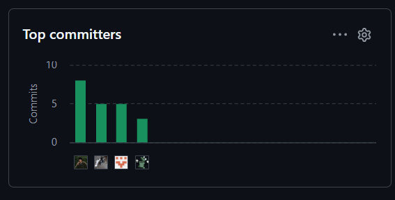

# Project Report Collaboration Insights

## Repositorio del Project Report

**URL:** [Report - TheSuccesfulOnes](https://github.com/TheSuccesfulOnes/Report)

## Desarrollo de las actividades de elaboración del informe - AV1

Durante el Avance 1, los seis integrantes trabajaron de manera colaborativa en la definición del problema, la investigación de usuarios, la especificación de requisitos, el diseño inicial de la solución y la integración de la evidencia de implementación. La coordinación del trabajo permitió consolidar los cinco capítulos del informe y mantener una presentación común para la versión AV1.

## Evidencia de colaboración en GitHub - AV1

La siguiente imagen presenta de forma agregada la actividad del equipo en el repositorio del informe durante el AV1.

{width=70%}

## Desarrollo de las actividades de elaboración del informe - Trabajo Parcial

[Completar con una síntesis de cómo se organizaron, elaboraron y revisaron en equipo los artefactos del informe parcial.]

## Evidencia de colaboración en GitHub - Trabajo Parcial

[Agregar aquí la captura agregada de la colaboración del repositorio del informe correspondiente al Trabajo Parcial.]

\newpage
