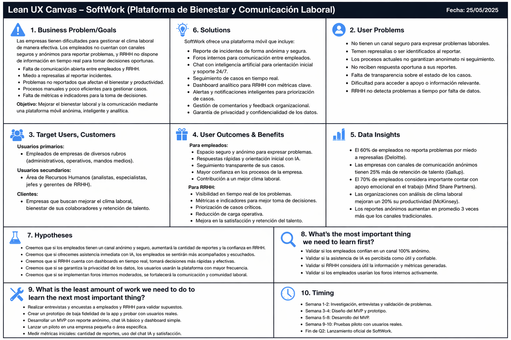

# Capítulo I: Introducción

## 1.1. Startup Profile

En esta sección se presenta la descripción de la startup **TheSuccesfulOnesCorp**, su misión, visión y los perfiles de los integrantes del equipo que participan en el desarrollo del proyecto **SafeSpace**. Esta información permite comprender el contexto en el que se desarrolla la solución propuesta y el enfoque adoptado para abordar la problemática identificada en el ámbito laboral.

### 1.1.1. Descripción de la Startup

**TheSuccesfulOnesCorp** es una startup orientada al desarrollo de soluciones tecnológicas para mejorar el clima laboral, la comunicación interna y el bienestar de los colaboradores dentro de las organizaciones. Su propuesta se centra en crear herramientas digitales que permitan a las empresas identificar oportunamente situaciones de malestar, conflictos internos o necesidades de apoyo que muchas veces no son comunicadas por los canales tradicionales.

De esta iniciativa nace **SafeSpace**, una plataforma digital diseñada para brindar a los trabajadores un espacio seguro, accesible y anónimo donde puedan reportar inquietudes, expresar experiencias laborales, participar en encuestas de pulso y recibir orientación inicial mediante asistencia digital. Al mismo tiempo, SafeSpace ofrece al área de Recursos Humanos información organizada y visualizaciones que facilitan el seguimiento del clima laboral y la toma de decisiones.

#### Misión

Transformar los entornos laborales mediante un espacio seguro y anónimo donde los empleados se sientan escuchados, mientras Recursos Humanos cuenta con herramientas e indicadores que apoyen la detección temprana de problemas y la ejecución de acciones de mejora.

#### Visión

Posicionarnos como una plataforma corporativa de referencia para la gestión del clima laboral en Latinoamérica, integrando comunicación segura, análisis de información y asistencia inteligente para promover ambientes de trabajo más empáticos, productivos y saludables.

#### Modelo de Negocio

SafeSpace se plantea como una solución SaaS dirigida a organizaciones que buscan fortalecer la comunicación con sus colaboradores y gestionar de manera más continua el bienestar laboral. El modelo prioriza una propuesta de valor basada en anonimato, seguimiento de casos, análisis del clima organizacional y soporte para decisiones del área de Recursos Humanos.

| Elemento | Descripción |
| :---- | :---- |
| Problema principal | Los colaboradores no siempre cuentan con canales seguros o confiables para comunicar problemas laborales, mientras Recursos Humanos suele recibir información tardía o incompleta. |
| Solución propuesta | Plataforma SafeSpace con reportes anónimos, encuestas de pulso, foros protegidos, asistencia digital y dashboards para seguimiento del clima laboral. |
| Segmentos clave | Empleados de organizaciones medianas o grandes y profesionales del área de Recursos Humanos. |
| Propuesta de valor | Brindar comunicación anónima y trazable para los empleados, junto con información útil para que Recursos Humanos pueda actuar de manera oportuna. |
| Canales | Landing page, contacto directo con empresas, demostraciones del producto y difusión digital. |
| Fuente de ingresos | Suscripción mensual por organización o por usuario, según el tamaño y necesidades de la empresa cliente. |
| Métricas clave | Participación de usuarios, cantidad de reportes gestionados, tiempo de respuesta, satisfacción de empleados y uso de dashboards por RRHH. |

---

### 1.1.2. Perfiles de integrantes del equipo

| Perfil del integrante | Código de alumno | Foto | Descripción |
| :---- | :---- | :----: | :---- |
| Mauricio Luis Pajés León | u202410093 | [PENDIENTE - Foto] | **Ingeniería de Software** - [PENDIENTE - Completar perfil del integrante: habilidades técnicas, intereses, experiencia y aporte dentro del proyecto.] |
| Milenko Ruben Cayanchi Avila | U202312566 | [PENDIENTE - Foto] | **Ingeniería de Software** - [PENDIENTE - Completar perfil del integrante: habilidades técnicas, intereses, experiencia y aporte dentro del proyecto.] |
| Diego Andrés Ávalos Cordova | U202313922 | { width=2.4cm } | **Ingeniería de Software** - Mi nombre es Diego Ávalos, tengo 19 años y actualmente estudio Ingeniería de Software. Me interesa especializarme en Ciberseguridad y Hacking Ético. Tengo experiencia usando sistemas operativos GNU/Linux y conocimientos en desarrollo web. También me interesan los temas relacionados con tecnología e inteligencia artificial, por lo que busco investigar y aprender constantemente sobre nuevas herramientas que aporten valor al proyecto. |
| Jose Gustavo Asto Jacome | U20241C630 | [PENDIENTE - Foto] | **Ingeniería de Software** - [PENDIENTE - Completar perfil del integrante: habilidades técnicas, intereses, experiencia y aporte dentro del proyecto.] |
| [Integrante 5 - Pendiente] | [Código - Pendiente] | [PENDIENTE - Foto] | **Ingeniería de Software** - [PENDIENTE - Completar cuando el integrante confirme sus datos.] |
| [Integrante 6 - Pendiente] | [Código - Pendiente] | [PENDIENTE - Foto] | **Ingeniería de Software** - [PENDIENTE - Completar cuando el integrante confirme sus datos.] |

---

## 1.2. Solution Profile

### 1.2.1. Antecedentes y problemática

Actualmente, muchas empresas presentan dificultades para gestionar el clima laboral de manera eficiente. Problemas como la falta de comunicación entre empleados y Recursos Humanos, el temor a represalias al reportar incidentes y la ausencia de canales anónimos afectan directamente el bienestar de los trabajadores y la productividad organizacional.

Los métodos tradicionales, como correos, reuniones, buzones físicos o reportes presenciales, no siempre garantizan privacidad ni seguimiento oportuno. Como consecuencia, algunos conflictos internos, situaciones de estrés o problemas de convivencia laboral no son reportados a tiempo, lo que limita la capacidad de la organización para intervenir de forma preventiva.

Ante esta problemática surge **SafeSpace**, una plataforma orientada a brindar un espacio seguro, anónimo y accesible donde los colaboradores puedan reportar incidentes, expresar inquietudes, participar en encuestas breves y recibir asistencia inicial. Al mismo tiempo, permite al área de Recursos Humanos visualizar información consolidada para identificar patrones, priorizar acciones y mejorar la toma de decisiones.

La solución busca responder a la siguiente pregunta:

> **¿Cómo mejorar la comunicación entre empleados y Recursos Humanos mediante una plataforma segura, anónima e inteligente que facilite el seguimiento del clima laboral?**

---

### 1.2.2. Lean UX Process

Para el desarrollo de **SafeSpace** se aplica la metodología **Lean UX**, enfocada en diseñar soluciones centradas en el usuario mediante ciclos rápidos de aprendizaje, validación e iteración. Este enfoque permite reducir incertidumbre, contrastar supuestos con usuarios reales y priorizar funcionalidades según el valor que aportan al problema identificado.

El proceso seguido considera los siguientes elementos:

- **Supuestos:** Los empleados necesitan un canal privado y confiable para reportar problemas laborales.
- **Hipótesis:** Si se implementa una plataforma anónima con soporte de asistencia digital, aumentará la confianza para comunicar inquietudes y se facilitará la detección temprana de problemas.
- **MVP:** Se propone una primera versión con reportes anónimos, encuestas de pulso, foro protegido y dashboard para Recursos Humanos.
- **Validación:** Se evaluará la utilidad, facilidad de uso, percepción de privacidad y claridad de la información presentada.
- **Iteración:** Con base en la retroalimentación, se ajustarán formularios, navegación, visualizaciones y flujos principales.

#### 1.2.2.1. Lean UX Problem Statements

En el entorno empresarial actual, muchas organizaciones enfrentan dificultades para gestionar de manera efectiva el bienestar y desempeño de sus empleados. Aunque existen áreas de Recursos Humanos encargadas de estos procesos, en la práctica suelen operar de manera reactiva, con información limitada y herramientas poco integradas.

Desde la perspectiva del empleado, los problemas relacionados con estrés, desmotivación, conflictos laborales o bajo rendimiento no siempre son comunicados oportunamente. En muchos casos, los colaboradores no cuentan con canales claros, confiables o confidenciales para expresar sus dificultades, lo que genera acumulación de problemas y disminución del compromiso con la organización.

Por otro lado, el área de Recursos Humanos enfrenta desafíos como la falta de visibilidad continua, la gestión de información dispersa y la dependencia de mecanismos tradicionales como encuestas esporádicas o reportes manuales. Estas limitaciones dificultan la detección temprana de riesgos y la implementación de acciones de mejora basadas en datos.

Las entrevistas e investigación inicial deberán evidenciar esta brecha: los empleados requieren mayor seguridad y confianza para comunicar sus problemas, mientras que Recursos Humanos necesita herramientas que permitan intervenir de manera más oportuna, continua y organizada.

---

#### 1.2.2.2. Lean UX Assumptions

A partir del análisis del problema y la investigación inicial, se plantean las siguientes suposiciones clave:

**Suposiciones sobre empleados:**

- Suponemos que los empleados experimentan dificultades relacionadas con estrés, motivación, convivencia o desempeño, pero no siempre las comunican.
- Suponemos que valoran la confidencialidad al momento de compartir problemas laborales.
- Suponemos que estarían dispuestos a usar una herramienta digital si esta les brinda seguridad, facilidad de uso y seguimiento.
- Suponemos que prefieren canales simples y rápidos en lugar de procesos formales extensos.
- Suponemos que necesitan acompañamiento continuo, no solo intervenciones puntuales.

**Suposiciones sobre Recursos Humanos:**

- Suponemos que Recursos Humanos necesita mayor visibilidad sobre el estado general del clima laboral.
- Suponemos que los procesos actuales son mayormente reactivos y dependen de información incompleta.
- Suponemos que existe una carga operativa que dificulta el seguimiento individual de cada caso.
- Suponemos que Recursos Humanos estaría dispuesto a adoptar soluciones tecnológicas que automaticen parte del registro y análisis de información.
- Suponemos que requieren métricas claras para medir el impacto de sus acciones de mejora.

**Suposiciones sobre la solución digital:**

- Suponemos que una plataforma centralizada puede integrar reportes, encuestas, seguimiento y análisis en un solo sistema.
- Suponemos que el uso de información organizada permitirá generar alertas o recomendaciones útiles para Recursos Humanos.
- Suponemos que una experiencia simple e intuitiva aumentará la adopción por parte de los usuarios.
- Suponemos que el anonimato percibido como seguro incrementará la participación de los colaboradores.

**User Outcomes:**

- Que los empleados se sientan seguros al comunicar problemas laborales.
- Que reciban orientación inicial y seguimiento sobre sus inquietudes.
- Que perciban mayor cercanía y respuesta por parte de la organización.
- Que Recursos Humanos pueda tomar decisiones más informadas y oportunas.

**Business Outcomes:**

- Mejorar la comunicación interna entre colaboradores y Recursos Humanos.
- Detectar tempranamente situaciones que afecten el clima laboral.
- Reducir la carga manual asociada al seguimiento de reportes.
- Incrementar la satisfacción y compromiso organizacional.

---

#### 1.2.2.3. Lean UX Hypothesis Statements

A partir de las suposiciones planteadas, se formulan las siguientes hipótesis:

1. Creemos que los empleados necesitan reportar sus problemas laborales de forma clara y confidencial porque actualmente no siempre cuentan con canales accesibles ni seguros para hacerlo; entonces, si les ofrecemos una plataforma con reportes anónimos y seguimiento, aumentará su disposición a comunicar inquietudes.

2. Creemos que el área de Recursos Humanos necesita visibilidad continua sobre el clima laboral porque actualmente depende de datos dispersos o reportes tardíos; entonces, si implementamos dashboards con información consolidada, podrán identificar patrones y priorizar acciones de mejora.

3. Creemos que los empleados valorarán un sistema de acompañamiento inicial porque no siempre saben a quién acudir o cómo explicar una situación laboral sensible; entonces, si incorporamos asistencia digital y flujos guiados, se reducirá la fricción para iniciar un reporte.

4. Creemos que la automatización del registro y seguimiento ayudará a Recursos Humanos a gestionar mejor su carga laboral porque actualmente muchas tareas se realizan de forma manual; entonces, si centralizamos reportes y estados de atención, se incrementará la eficiencia del proceso.

5. Creemos que una plataforma simple, anónima y orientada al usuario aumentará la adopción dentro de la empresa porque los colaboradores prefieren herramientas confiables y fáciles de usar; entonces, si diseñamos una experiencia centrada en sus necesidades, se logrará mayor participación.

#### 1.2.2.4. Lean UX Canvas

El Lean UX Canvas de SafeSpace resume el problema de negocio, los resultados esperados, los usuarios principales, los beneficios esperados para cada segmento, las soluciones iniciales, las hipótesis de trabajo y las preguntas prioritarias que el equipo debe validar durante el desarrollo del proyecto.

---

## 1.3. Segmentos objetivo

SafeSpace se dirige a dos segmentos principales relacionados con la gestión del clima laboral: los colaboradores que necesitan comunicar inquietudes en un entorno seguro y los profesionales de Recursos Humanos que requieren información clara para actuar oportunamente.

### Segmento 1: Empleado de una organización

**Sexo:** Masculino y femenino.  
**Edades:** Entre 19 y 50 años.  
**Ocupación:** Empleados de áreas administrativas, operativas, tecnológicas o de servicios dentro de empresas que desean mejorar su clima laboral.  

**Aspectos geográficos:**  
Personas ubicadas principalmente en zonas urbanas, donde se concentran empresas con estructuras organizacionales y áreas de Recursos Humanos definidas.

**Aspectos psicográficos:**

- Valoran la confidencialidad y la seguridad al expresar problemas laborales.
- Buscan espacios donde sus inquietudes sean escuchadas y gestionadas.
- Tienen interés en mejorar su bienestar, productividad y relación con la organización.
- Prefieren herramientas digitales simples, accesibles y disponibles en cualquier momento.

---

### Segmento 2: Profesional del área de Recursos Humanos

**Sexo:** Masculino y femenino.  
**Edades:** Entre 24 y 55 años.  
**Ocupación:** Analistas, coordinadores, especialistas, jefes o gerentes de Recursos Humanos encargados de monitorear y mejorar el clima laboral.

**Aspectos geográficos:**  
Profesionales que trabajan en empresas ubicadas en zonas urbanas, principalmente en organizaciones medianas o grandes con procesos formales de gestión del talento.

**Aspectos psicográficos:**

- Buscan mejorar la comunicación interna y la satisfacción de los colaboradores.
- Necesitan información organizada para detectar problemas y priorizar acciones.
- Valoran herramientas que reduzcan tareas manuales y faciliten el seguimiento.
- Tienen interés en soluciones tecnológicas que apoyen decisiones basadas en datos.

---

\newpage
