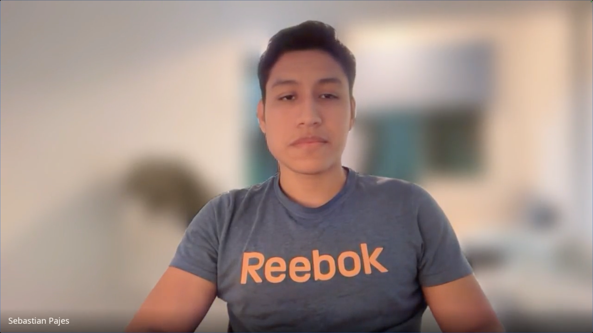
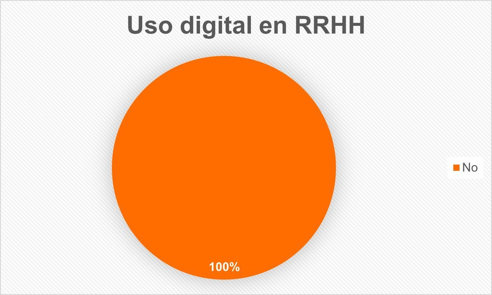
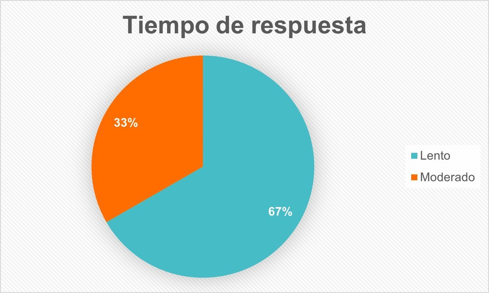
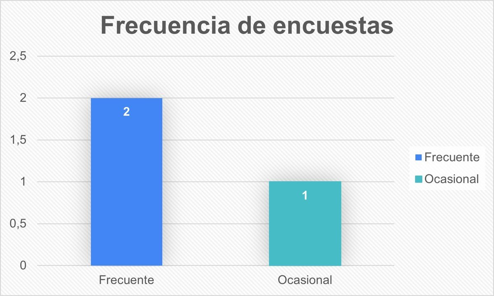
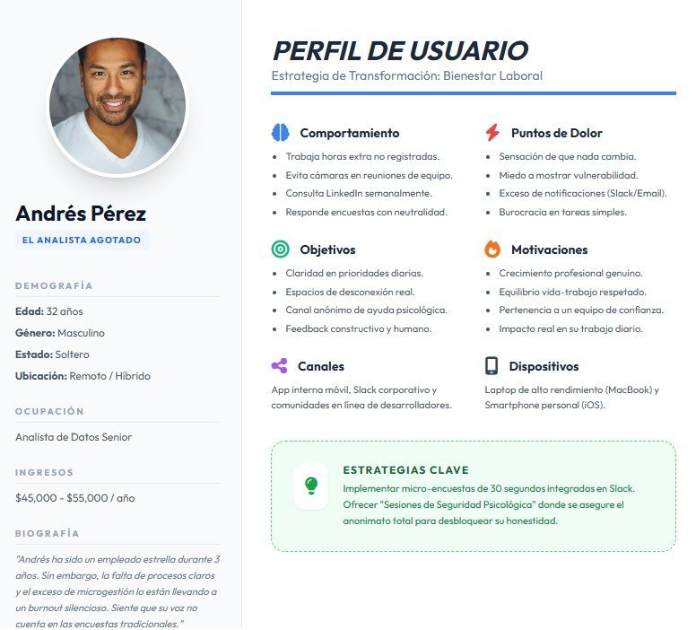
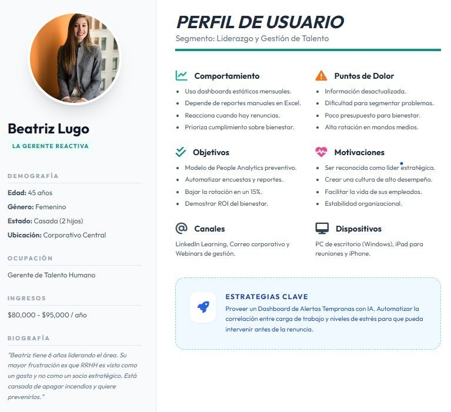
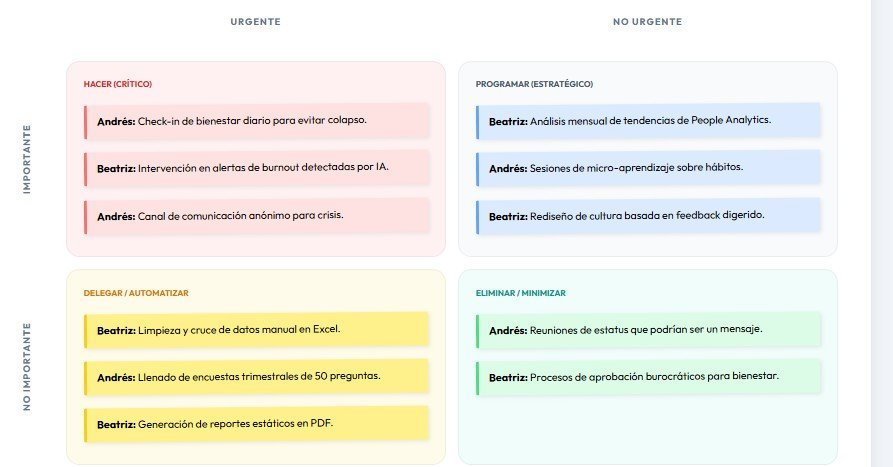
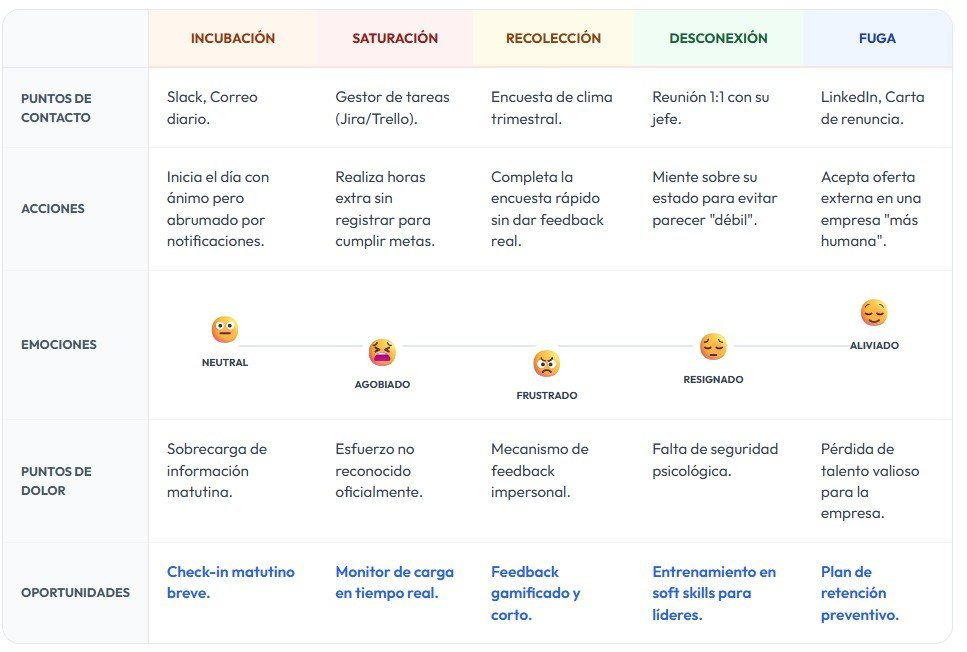
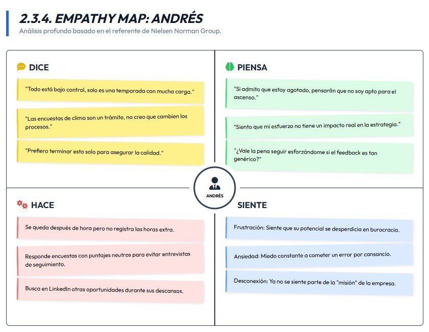
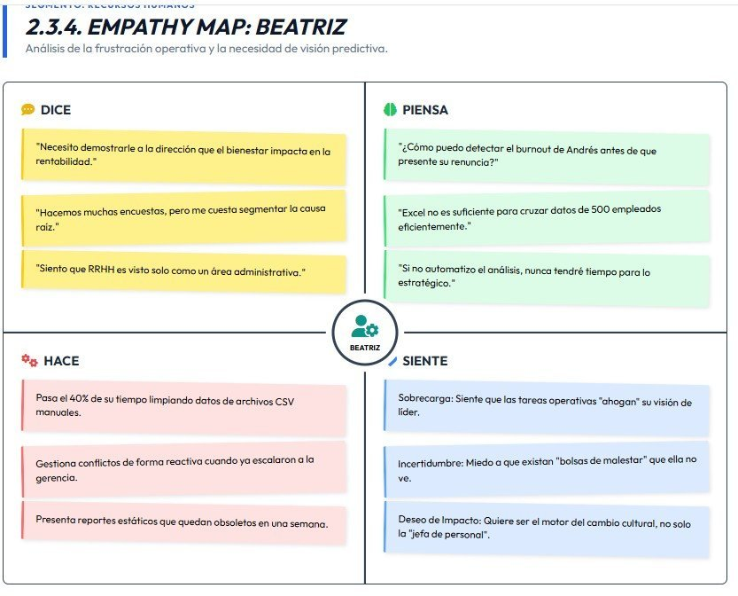

# Capítulo II: Requirements Elicitation & Analysis

## 2.1. Competidores

### 2.1.1. Análisis competitivo

| Sección       | Criterio                | SafeSpace                                                                                            | Officevibe                                                                | Culture Amp                                                                | 15Five                                                                     |
| :------------ | :---------------------- | :--------------------------------------------------------------------------------------------------- | :------------------------------------------------------------------------ | :------------------------------------------------------------------------- | :------------------------------------------------------------------------- |
| **Perfil**    | Overview                | Plataforma de contacto y análisis basada en encuestas, foro y análisis organizacional.               | Plataforma de engagement basada en encuestas rápidas y feedback continuo. | Plataforma avanzada de análisis de clima laboral y cultura organizacional. | Software de desempeño con enfoque en feedback continuo y objetivos (OKRs). |
|               | Ventaja competitiva     | Simplicidad y accesibilidad para empresas de distintas magnitudes.                                   | Simplicidad y facilidad de uso en encuestas semanales.                    | Potente analítica y benchmarking global.                                   | Integración de desempeño, objetivos y seguimiento del empleado.            |
| **Marketing** | Mercado objetivo        | Empresas medianas o grandes que buscan mejorar su clima laboral.                                     | Empresas medianas y grandes.                                              | Corporaciones globales.                                                    | Empresas que buscan analizar desempeño.                                    |
|               | Estrategia              | Branding y marketing direccionado a redes sociales y canales digitales.                              | Marketing digital enfocado en HR Tech.                                    | Branding y estudios organizacionales.                                      | Contenido educativo y enfoque en managers.                                 |
| **Producto**  | Servicios               | Encuestas, personalización de usuario, dashboards, foros de trabajo y canal de comunicación anónimo. | Encuestas, feedback anónimo y reportes básicos.                           | Encuestas, analítica avanzada y planes de acción.                          | Evaluaciones, seguimiento de objetivos y feedback continuo.                |
|               | Precios & Costos        | Suscripción por usuario u organización.                                                              | Suscripción por usuario.                                                  | SaaS con precios elevados.                                                 | Suscripción escalable por usuario.                                         |
|               | Canales de distribución | Aplicación móvil y plataforma web.                                                                   | Web y aplicación móvil.                                                   | Web y aplicación móvil.                                                    | Web y aplicación móvil.                                                    |
| **SWOT**      | Fortalezas              | Integración sencilla y enfoque en privacidad.                                                        | Fácil adopción.                                                           | Alto nivel de análisis.                                                    | Plataforma integral de talento.                                            |
|               | Debilidades             | Producto nuevo en proceso de validación.                                                             | Funcionalidad limitada.                                                   | Alto costo.                                                                | Complejidad para equipos pequeños.                                         |
|               | Oportunidades           | Monitoreo específico del clima laboral y acompañamiento a empresas locales.                          | Crecimiento del trabajo remoto.                                           | Expansión global.                                                          | Tendencia hacia OKRs.                                                      |
|               | Amenazas                | Mercado con competidores ya establecidos.                                                            | Competencia más completa.                                                 | Nuevas startups.                                                           | Mercado saturado.                                                          |

---

### 2.1.2. Estrategias y tácticas frente a competidores

Frente a los competidores existentes en el mercado de bienestar laboral y gestión de clima organizacional, **SafeSpace** busca diferenciarse mediante una propuesta centrada en la **privacidad, accesibilidad y análisis de información útil para Recursos Humanos**. A diferencia de otras plataformas, SafeSpace integra comunicación activa, feedback continuo y herramientas de acompañamiento para que los empleados puedan expresar problemas de forma segura.

Frente a diversos competidores ya establecidos en el mercado, SafeSpace adopta una estrategia basada en:

- Simplicidad y accesibilidad, facilitando su implementación en empresas medianas.
- Enfoque en acción inmediata, no solo medición, permitiendo atender problemas con mayor rapidez.
- Cercanía con el usuario, promoviendo comunicación directa entre empleados y Recursos Humanos.
- Adaptación al contexto local, considerando dinámicas laborales más informales o tradicionales.

De esta forma, SafeSpace busca diferenciarse como una herramienta práctica, humana y accesible para mejorar el entorno laboral de manera continua.

---

## 2.2. Entrevistas

### 2.2.1. Diseño de entrevistas

Para el diseño de entrevistas se han definido dos bloques de preguntas diferenciadas por segmento: empleados y área de Recursos Humanos (RRHH).

Se aplican buenas prácticas como:

- Uso de preguntas abiertas para obtener respuestas profundas.
- Lenguaje claro y cercano para generar confianza.
- Estructura flexible que permita explorar insights inesperados.
- Enfoque en experiencias reales más que en respuestas ideales.

El objetivo principal es recolectar información clave para construir arquetipos sólidos, considerando:

- Variables demográficas y laborales.
- Comportamiento dentro del entorno de trabajo.
- Uso de herramientas digitales.
- Motivaciones, frustraciones y necesidades.
- Percepción sobre apoyo organizacional.

---

#### Segmento 1: Empleados de la empresa

**Objetivo**

Comprender la experiencia del empleado dentro de la organización, su percepción sobre bienestar y desempeño laboral, cómo enfrenta dificultades y su disposición a usar herramientas digitales de apoyo.

**Introducción**

"Buenos días/tardes/noches, mi nombre es [Nombre del entrevistador]. Actualmente estamos desarrollando una aplicación orientada a mejorar el ambiente laboral con una mejor comunicación con Recursos Humanos. Nos gustaría conocer su experiencia y opinión a través de algunas preguntas."

**Preguntas**

1. ¿Cómo describirías el ambiente laboral en tu área actualmente?
2. ¿Has tenido alguna incomodidad o problema en algún trabajo que hayas tenido? ¿Cómo lo manejaste?
3. ¿Sientes que quizás estás un poco limitado para expresar tus opiniones o preocupaciones?
4. ¿Cuentas con un área de Recursos Humanos en tu empresa? De ser así, ¿qué tan accesible es?
5. ¿Qué medios utilizas actualmente para comunicar problemas laborales? Por ejemplo: jefe directo, RRHH, chat u otros.
6. ¿Has participado en encuestas de clima laboral? ¿Con qué frecuencia?
7. ¿Consideras que la comunicación en tu ambiente laboral ha mejorado?
8. ¿Qué tan útil sería para ti una app donde puedas comunicar problemas y recibir respuesta?
9. ¿Qué funcionalidades te gustaría que tenga una aplicación de este tipo?
10. ¿Te sentirías cómodo utilizando una app móvil para estos fines? ¿Por qué?
11. ¿Crees que mejorar el ambiente laboral impacta en tu productividad? ¿Cómo?

---

#### Segmento 2: Recursos Humanos

**Introducción**

"Buenos días/tardes/noches, mi nombre es [Nombre del entrevistador]. Estamos desarrollando una aplicación que busca mejorar el clima laboral mediante herramientas de feedback, comunicación directa y análisis de datos para RRHH. Nos gustaría conocer su experiencia para validar esta propuesta."

**Preguntas**

1. ¿Cómo evalúan actualmente el clima laboral en la empresa?
2. ¿Utilizan medios digitales para recopilar feedback de los empleados? De ser así, ¿podría mencionar estos medios?
3. ¿Con qué frecuencia realizan encuestas o evaluaciones de clima laboral?
4. ¿Considera que es complicado gestionar el clima laboral y lograr mejorarlo?
5. ¿Qué tan rápido pueden actuar frente a un problema detectado?
6. ¿Cómo gestionan la comunicación con empleados que presentan incomodidades?
7. ¿Qué tipo de indicadores consideran más importantes en sus análisis?
8. ¿Obtienen reportes visuales basados en los resultados de los indicadores mencionados?
9. ¿Qué tan útil sería tener un dashboard automatizado en tiempo real sobre el estado del clima laboral?
10. ¿Qué funcionalidades consideran indispensables en una solución como esta?
11. ¿Estarían dispuestos a invertir en implementar una herramienta digital para mejorar el clima laboral? ¿Por qué?

---

### Consideraciones clave

- Garantizar anonimato para obtener respuestas sinceras.
- Permitir profundización en respuestas relevantes durante la entrevista.
- Identificar patrones comunes entre ambos segmentos.
- Validar supuestos del problema planteado en el proyecto.

---

### Insight esperado

Se busca identificar la brecha entre:

- La percepción del empleado sobre el apoyo recibido.
- La capacidad real de RRHH para brindar soluciones efectivas.

Esto permitirá diseñar una solución más alineada a necesidades reales y no supuestas.

---

### 2.2.2. Registro de entrevistas

A continuación se registran las entrevistas por segmento, con sus enlaces de evidencia y resúmenes. El segmento de empleados incorpora la entrevista realizada por Mauricio Pajés a Sebastián Pajés el 13 de septiembre de 2026.

#### Segmento 1: Empleados

##### Entrevista 1: Sebastián Pajés

- **Edad:** 25 años.
- **Link:** [Ver entrevista](https://upcedupe-my.sharepoint.com/:v:/g/personal/u202410093_upc_edu_pe/IQBt9dRG2hvNRoUHIZSu33drAbFJEyXeEXmkQfBTUPdBuZU?e=WJSVtf).
- **Inicio:** 00:05.
- **Duración:** 06:07 (según la transcripción).

**Resumen de la Entrevista**

Sebastián describe su ambiente laboral como dinámico y colaborativo, con momentos de presión por entregas y problemas que requieren respuestas rápidas. Identifica dificultades cuando las prioridades no están claras o existen expectativas distintas sobre una tarea, y procura resolverlas mediante conversaciones y acuerdos por escrito. Señala que expresar opiniones técnicas le resulta natural, mientras que hablar de carga laboral o incomodidades depende de la confianza y de sentirse escuchado. Dispone de contacto con Recursos Humanos y utiliza Slack, correo, reuniones y conversaciones directas según la sensibilidad del asunto. Menciona encuestas sobre bienestar, carga laboral y comunicación; valora que sean anónimas, aunque no precisa su frecuencia, y considera importante conocer las mejoras derivadas de ellas. Una aplicación le resultaría útil si centraliza los reportes y permite conocer su estado, recibir respuestas y saber cuál es el siguiente paso. Solicita opciones de anonimato, claridad sobre quién puede acceder, adjuntos, conversación con el responsable, notificaciones y señalización de urgencia. Utilizaría una solución sencilla y privada tanto desde el celular como desde el escritorio. Finalmente, relaciona la confianza y las prioridades claras con mayor concentración y menos errores o repetición de trabajo.

#### Segmento 2: Recursos Humanos

##### Entrevista 1: Jorge Chumpitaz

- **Sexo:** Masculino.
- **Edad:** 24 años.
- **Link:** [Ver entrevista](https://upcedupe-my.sharepoint.com/:v:/g/personal/u202114548_upc_edu_pe/IQAwiQ2Xqz6QTava7w7OUGZwAUQ1yFUedJnl4dOKEeLhpDY?e=xlMhFY&nav=eyJyZWZlcnJhbEluZm8iOnsicmVmZXJyYWxBcHAiOiJTdHJlYW1XZWJBcHAiLCJyZWZlcnJhbFZpZXciOiJTaGFyZURpYWxvZy1MaW5rIiwicmVmZXJyYWxBcHBQbGF0Zm9ybSI6IldlYiIsInJlZmVycmFsTW9kZSI6InZpZXcifX0%3D)
- **Inicio:** 00:01.
- **Duración:** 07:25.

**Resumen de la Entrevista**

Jorge es administrador de Recursos Humanos en su empresa. En esta organización se aborda de manera moderada el tema del comportamiento y el bienestar emocional de los empleados. Él comenta que cuentan con protocolos diseñados para asegurarse de que los trabajadores se sientan cómodos y tengan un buen ambiente laboral. Asimismo, dispone de procedimientos específicos para actuar cuando surge algún problema con uno o más empleados. Ante este tipo de situaciones, se llevan a cabo reuniones con el fin de comprender mejor lo ocurrido y encontrar una solución adecuada. Jorge considera que en su empresa sería muy útil contar con una aplicación como la que estamos desarrollando, ya que permitiría gestionar estos procesos de forma más rápida y eficiente en comparación con el método actual.

##### Entrevista 2: Diego Salazar Huaman

- **Sexo:** Masculino.
- **Edad:** 29 años.
- **Link:** [Ver entrevista](https://upcedupe-my.sharepoint.com/personal/u202312566_upc_edu_pe/_layouts/15/stream.aspx?id=%2Fpersonal%2Fu202312566%5Fupc%5Fedu%5Fpe%2FDocuments%2Fentrevista1%5Fsegmento2%2Emp4&nav=eyJyZWZlcnJhbEluZm8iOnsicmVmZXJyYWxBcHAiOiJPbmVEcml2ZUZvckJ1c2luZXNzIiwicmVmZXJyYWxBcHBQbGF0Zm9ybSI6IldlYiIsInJlZmVycmFsTW9kZSI6InZpZXciLCJyZWZlcnJhbFZpZXciOiJNeUZpbGVzTGlua0NvcHkifX0&ga=1&referrer=StreamWebApp%2EWeb&referrerScenario=AddressBarCopied%2Eview%2E2e801207%2D7694%2D4a7e%2D8ebd%2Dfc3de9727f2d)
- **Inicio:** 00:00.
- **Duración:** 05:49.

**Resumen de la Entrevista**

Diego es Jefe de Recursos Humanos en una empresa de servicios logísticos de aproximadamente 180 colaboradores. En esta organización, el clima laboral se evalúa mediante una encuesta semestral y reuniones uno a uno entre jefes de área y colaboradores, aunque reconoce que es un proceso todavía artesanal. Cuentan con un canal de WhatsApp para temas de bienestar, pero su uso es bajo porque los empleados no lo perciben como anónimo. Renato comenta que el mayor reto no está en recolectar información, sino en procesarla y lograr que los jefes de área actúen a partir de ella. Frente a problemas graves, la respuesta suele ser rápida, pero ante situaciones más difusas el proceso puede tomar semanas. Considera que una herramienta digital con un canal verdaderamente anónimo, filtros por área y alertas automáticas sería muy útil, ya que actualmente los reportes se elaboran manualmente en Excel y consumen mucho tiempo que podría destinarse a diseñar acciones concretas. Está dispuesto a invertir en una solución así, pues considera que los problemas de clima laboral terminan generando costos más altos en rotación y productividad que los que implicaría una suscripción a la herramienta.

##### Entrevista 3: Julio Adolfo Guillen

- **Sexo:** Masculino.
- **Edad:** 25 años.
- **Link:** [Ver entrevista](https://upcedupe-my.sharepoint.com/personal/u202312566_upc_edu_pe/_layouts/15/stream.aspx?id=%2Fpersonal%2Fu202312566%5Fupc%5Fedu%5Fpe%2FDocuments%2Fentrevista2%5Fsegmento2%2Emp4&nav=eyJyZWZlcnJhbEluZm8iOnsicmVmZXJyYWxBcHAiOiJPbmVEcml2ZUZvckJ1c2luZXNzIiwicmVmZXJyYWxBcHBQbGF0Zm9ybSI6IldlYiIsInJlZmVycmFsTW9kZSI6InZpZXciLCJyZWZlcnJhbFZpZXciOiJNeUZpbGVzTGlua0NvcHkifX0&ga=1&referrer=StreamWebApp%2EWeb&referrerScenario=AddressBarCopied%2Eview%2Eba3ff320%2D0798%2D4aa5%2Da1f9%2D2b62e18261c2)
- **Inicio:** 00:00.
- **Duración:** 06:15.

**Resumen de la Entrevista**

Julio es Coordinador de Bienestar y Cultura Organizacional en una empresa manufacturera de alrededor de 350 colaboradores. En esta organización, el clima laboral se evalúa principalmente mediante una encuesta anual tercerizada, complementada con un buzón de sugerencias físico, dado que buena parte del personal es operario y no tiene acceso constante a herramientas digitales. Manuel señala que gestionar el clima laboral es complicado porque conviven dos realidades distintas dentro de la empresa —personal de planta y personal administrativo— que requieren estrategias de comunicación diferentes. La comunicación con empleados que presentan incomodidades se maneja mayormente de forma presencial, y muchas veces los problemas no llegan a tiempo a RRHH porque se quedan primero en manos de los supervisores de línea. Aunque la consultora externa entrega un informe visual completo una vez al año, en el día a día no cuentan con reportes actualizados, solo hojas de cálculo dispersas. Manuel considera que un dashboard automatizado representaría un cambio significativo frente a la actual "ceguera" entre encuesta y encuesta, y destaca que cualquier solución debería funcionar bien desde el celular y permitir segmentar por planta o turno. Está dispuesto a apoyar la inversión en una herramienta digital, aunque señala que tendría que sustentarla ante gerencia general con datos concretos sobre reducción de rotación o ausentismo.

---

### 2.2.3. Análisis de entrevistas

En este apartado se presentan los hallazgos de las entrevistas por segmento.

#### Segmento #1: Empleados

**Entrevistas registradas con evidencia en este segmento: 1.** El análisis corresponde a Sebastián Pajés y se basa en su transcripción del 13 de septiembre de 2026. Las referencias remiten a las preguntas de la transcripción proporcionada por el entrevistador.

| Tema | Hallazgo de la entrevista | Implicación para explorar en SafeSpace | Evidencia |
| :--- | :--- | :--- | :--- |
| Prioridades y coordinación | Las expectativas divergentes y los cambios de prioridad pueden generar confusiones; el entrevistado recurre a acuerdos escritos. | Explorar cómo conservar el contexto y los acuerdos asociados a un caso. | Preguntas 1, 2 y 7. |
| Confianza y privacidad | Hablar de carga laboral o incomodidades es más delicado que discutir temas técnicos. | Permitir elegir entre reporte anónimo o identificado y explicar quién puede acceder a la información. | Preguntas 3, 5, 9 y 10. |
| Seguimiento | Comunicar por chat no siempre permite saber en qué quedó el asunto. La utilidad de una app depende de recibir respuesta y conocer el siguiente paso. | Explorar estados visibles, conversación con el responsable y notificaciones de respuesta. | Preguntas 5, 8 y 9. |
| Evidencia y urgencia | Solicita adjuntar información e indicar si un problema requiere atención urgente. | Evaluar adjuntos y señalización de urgencia; falta definir su tratamiento con RRHH. | Pregunta 9. |
| Encuestas | Valora el anonimato y conocer las acciones posteriores; no especifica frecuencia. | Explorar cómo comunicar mejoras derivadas del feedback. | Pregunta 6. |
| Acceso y productividad | Prefiere disponibilidad móvil y de escritorio. Asocia confianza y claridad con concentración y menor repetición del trabajo. | Considerar ambos contextos de uso y validar posteriormente el impacto; la entrevista no mide productividad. | Preguntas 10 y 11. |

La principal oportunidad identificada es mejorar el seguimiento y la confianza en la gestión de los problemas, dado que el entrevistado ya cuenta con canales de comunicación. Su disposición a utilizar una aplicación está condicionada a la privacidad, sencillez y respuesta efectiva. Estos hallazgos orientan nuevas validaciones; no representan a todos los empleados ni confirman por sí solos los requisitos del producto.

**Base del análisis:** [transcripción y lectura por pregunta](entrevistas/2026-09-13-sebastian-pajes.md). No se presentan porcentajes ni gráficos agregados: el registro de este segmento contiene una sola entrevista y no permite sustentar resultados atribuidos a tres empleados. No se asignan escalas de accesibilidad o clima laboral que el entrevistado no utilizó.

#### Segmento #2

Total de entrevistas: 3

Datos sobre preguntas:

- El 100% de personal de RRHH utiliza una app para desempeñarse en su entorno laboral.
- Ante un problema, el 67% de entrevistados considera que el tiempo de respuesta es lento mientras que el 33% lo considera moderado.
- 2 entrevistados realizan encuestas frecuentemente mientras que uno lo hace ocasionalmente.

En el gráfico 1 se puede observar que el 100% del personal de RRHH entrevistado utiliza una aplicación para desempeñarse en su entorno laboral. Esto indica que la adopción de herramientas digitales es común en esta área, lo cual podría facilitar la integración de SafeSpace como una solución adicional para mejorar la gestión del clima laboral.

En el gráfico 2 se muestra que el 67% de los entrevistados considera que el tiempo de respuesta ante un problema es lento, mientras que el 33% restante lo percibe como moderado. Esto sugiere que existe una percepción generalizada de que la gestión de problemas en el área de Recursos Humanos no es lo suficientemente ágil, lo cual podría ser un aspecto clave a mejorar con la implementación de SafeSpace para agilizar la comunicación y la resolución de problemas.

En el gráfico 3 se destaca que el 67% de los entrevistados realizan encuestas de clima laboral con frecuencia, mientras que el 33% restante lo hace ocasionalmente. Esto indica que la recopilación de feedback a través de encuestas es una práctica común en el área de Recursos Humanos, aunque también sugiere que podría haber oportunidades para mejorar la frecuencia y la efectividad de estas encuestas, lo cual podría ser abordado con las funcionalidades de SafeSpace para facilitar la recolección y el análisis de datos en tiempo real.

---

## 2.3. Needfinding

### 2.3.1. User Personas

En base a las entrevistas realizadas, se han identificado dos perfiles de usuario principales que representan a los segmentos clave para el proyecto.

- **Andrés (El Empleado):** Representa a los trabajadores que enfrentan dificultades en su ambiente laboral pero sienten miedo o inseguridad para expresarlo. Busca una forma segura y efectiva de comunicar sus problemas y recibir apoyo.

- **Beatriz (La Gerente):** Representa a los profesionales de Recursos Humanos que necesitan herramientas más efectivas para detectar y abordar problemas laborales. Busca soluciones que le permitan actuar de forma proactiva y mejorar el clima organizacional.

---

### 2.3.2. User Task Matrix

La matriz de tareas permite visualizar qué acciones realizan los usuarios y con qué frecuencia o importancia. Esto es crucial para priorizar las funcionalidades de la solución tecnológica.

| Tarea / Acción                            | Frecuencia | Prioridad | Beatriz (RRHH)   | Andrés (Empleado) |
| :---------------------------------------- | :--------- | :-------- | :--------------- | :---------------- |
| Reportar estado de ánimo                  | Diaria     | Alta      | -                | Acción principal  |
| Consolidación de datos/reportes           | Semanal    | Alta      | Acción principal | -                 |
| Solicitud de ayuda/soporte                | Ocasional  | Crítica   | -                | Acción necesaria  |
| Identificación de patrones de agotamiento | Mensual    | Alta      | Acción principal | -                 |
| Intervención ante conflicto               | Eventual   | Crítica   | Acción principal | -                 |
| Consumo de contenido de apoyo             | Diario     | Media     | -                | Acción deseada    |

---

### 2.3.3. User Journey Mapping

Este mapa visualiza el proceso actual de detección de malestar. Ayuda a identificar los puntos de fricción donde el sistema actual, basado principalmente en encuestas o comunicación directa, falla para ambos perfiles.

Podemos observar que el proceso actual es reactivo, con largos periodos de espera entre la detección del problema y la acción de RRHH. Esto genera frustración en Andrés, quien siente que su malestar no es atendido a tiempo, y en Beatriz, quien se entera de los problemas cuando ya es demasiado tarde para intervenir efectivamente.

---

### 2.3.4. Empathy Mapping

Esta herramienta permite ir más allá de lo que hacen los usuarios, entendiendo qué los motiva y qué los frena.

Con esta información, se pueden diseñar soluciones que no solo resuelvan el problema funcional, sino que también aborden las emociones y pensamientos subyacentes de los usuarios. Para Andrés, es crucial crear un espacio seguro donde pueda expresar su malestar sin temor a represalias.

Para Beatriz, es fundamental contar con datos actualizados y herramientas de análisis que le permitan detectar patrones de malestar antes de que se conviertan en problemas graves. Esto mejoraría su capacidad de respuesta y le permitiría implementar soluciones más efectivas.

#### Para Andrés (El Empleado)

- **¿Qué dice?** "Estoy bien, solo es una semana pesada."
- **¿Qué piensa?** "Si pido ayuda, pensarán que no soy capaz de manejar mi carga."
- **¿Qué hace?** Trabaja horas extra en silencio y evita reuniones de feedback.
- **¿Qué siente?** Ansiedad, miedo al juicio y desilusión profesional.

#### Para Beatriz (La Gerente)

- **¿Qué dice?** "Necesito más datos para tomar decisiones estratégicas."
- **¿Qué piensa?** "Siempre me entero de los conflictos cuando ya es difícil intervenir."
- **¿Qué hace?** Exporta datos a Excel e intenta cruzar variables manualmente.
- **¿Qué siente?** Frustración por su falta de proactividad y estrés por la incertidumbre.

---

### 2.3.5. As-is Scenario Mapping

El As-is Scenario Mapping permite representar la experiencia actual de los usuarios antes de implementar SafeSpace, identificando actividades, pensamientos y emociones asociadas a la problemática.

#### As-is Scenario Map - Andrés (Empleado)

| Fases        | Fase 1: Identificación del malestar                                   | Fase 2: Evaluación de canales disponibles                                                    | Fase 3: Intento de comunicación                                      | Fase 4: Retención del reporte y silencio                                    |
| :----------- | :-------------------------------------------------------------------- | :------------------------------------------------------------------------------------------- | :------------------------------------------------------------------- | :-------------------------------------------------------------------------- |
| **Doing**    | Experimenta un conflicto continuo o sobrecarga de trabajo en su área. | Busca en la intranet corporativa o consulta con compañeros si existe un medio para quejarse. | Redacta un borrador de correo para RRHH, pero duda en enviarlo.      | Borra el borrador y decide guardar silencio mientras evalúa otras opciones. |
| **Thinking** | "Esto está afectando mi salud mental y mi rendimiento diario."        | "Si envío un correo directo a RRHH, mi jefe podría enterarse."                               | "¿Realmente me garantizan que este reporte no tendrá consecuencias?" | "No vale la pena arriesgar mi trabajo; mejor no digo nada."                 |
| **Feeling**  | Frustración e impotencia.                                             | Miedo a represalias y desconfianza.                                                          | Ansiedad e incertidumbre.                                            | Desolación y desvinculación laboral.                                        |

**Evaluación del escenario:**

- **Área negativa principal:** Ausencia de un mecanismo de privacidad garantizada.
- **Blank area:** Necesidad de un canal guiado que permita al empleado reportar situaciones de forma confidencial.

#### As-is Scenario Map - Beatriz (Gerente de RRHH)

| Fases        | Fase 1: Planificación de evaluación                              | Fase 2: Recolección de encuestas                                    | Fase 3: Procesamiento de datos                         | Fase 4: Presentación de resultados                |
| :----------- | :--------------------------------------------------------------- | :------------------------------------------------------------------ | :----------------------------------------------------- | :------------------------------------------------ |
| **Doing**    | Diseña un formulario de clima laboral.                           | Envía correos solicitando participación de los colaboradores.       | Consolida manualmente los datos para generar gráficos. | Elabora un reporte para presentar a la dirección. |
| **Thinking** | "Espero que las respuestas reflejen la realidad de los equipos." | "Necesito más participación para tener información representativa." | "Esto consume mucho tiempo y retrasa las acciones."    | "Los datos ya pueden estar desactualizados."      |
| **Feeling**  | Optimismo inicial.                                               | Frustración por baja participación.                                 | Agotamiento y sobrecarga manual.                       | Impotencia ante resultados reactivos.             |

**Evaluación del escenario:**

- **Área negativa principal:** Procesamiento reactivo y manual que consume tiempo de trabajo.
- **Área positiva:** Voluntad de RRHH de tomar decisiones basadas en datos.
- **Blank area:** Implementación de un dashboard con información organizada y seguimiento de reportes.

---

## 2.4. Ubiquitous Language

A continuación, se define el lenguaje ubicuo (*Ubiquitous Language*) del proyecto **SafeSpace**. Este vocabulario compartido garantiza un entendimiento común entre los miembros del equipo de desarrollo, los expertos en el dominio y los usuarios finales.

**1. Stakeholders & Roles**

- **User / UserAccount:** Entidad que representa la cuenta y perfil de acceso de un usuario registrado en el sistema.
- **Role (Rol):** Nivel de autorización en la aplicación. Existen principalmente dos: `ANONYMOUS_USER` y `RRHH_MANAGER`.
- **Anonymous User (Trabajador):** Tipo de usuario que representa al empleado de una empresa. Su identidad se mantiene oculta para garantizar que pueda expresar sus problemas, quejas e ideas laborales libremente sin miedo a represalias.
- **RRHH Manager (Recursos Humanos):** Usuario administrador que monitorea el feedback de los empleados. Tiene la facultad de ver métricas organizacionales y enviar propuestas, soluciones y comunicados para mejorar el clima laboral.

**2. Funcionalidades de la Plataforma**

- **Department Category (Categoría de Departamento):** Clasificación que permite organizar y agrupar los hilos de discusión según las distintas áreas o departamentos de una empresa.
- **Thread (Hilo de discusión):** Espacio virtual donde los usuarios publican y discuten sobre problemáticas o temas específicos del ambiente laboral de manera anónima.
- **Message (Mensaje):** Publicación textual que expresa el feedback, problema u opinión de un empleado dentro de un hilo o en la interacción asistida por inteligencia artificial.
- **Dashboard (Panel de Control):** Interfaz exclusiva para los perfiles de `RRHH_MANAGER`, donde pueden visualizar de forma resumida el estado emocional y problemático de las áreas de trabajo a través de métricas y gráficos.
- **Activity Widget:** Componente visual dentro del panel de control, como gráficos de barras, gráficos circulares o mapas de calor, que traduce los datos en representaciones gráficas interactivas.
- **Analytic System (Sistema Analítico):** Módulo que evalúa los datos recopilados para identificar temas frecuentes, respuestas conductuales y puntajes de sentimiento laboral.
- **Announcement Manager (Gestor de Anuncios):** Módulo que permite al gestor u oficial de Recursos Humanos emitir mensajes públicos masivos y plantear encuestas de satisfacción.

**3. Otros conceptos del dominio**

- **Collected Data (Datos Recopilados):** Conjunto de mensajes y comportamientos recolectados como materia prima para ser analizados posteriormente.
- **Notification (Notificación):** Alerta del sistema sobre nuevos comentarios, cambios o anuncios emitidos.
- **Membership (Membresía):** Suscripción adquirida por las empresas cliente que determina el servicio contratado, con estados de validación como `ACTIVE`, `CANCELLED` o `EXPIRED`.
- **Membership Plan:** Paquete que ofrece distintos niveles de funcionalidades dependiendo de la necesidad empresarial.
- **Payment (Transacción):** Modelo de liquidación implementado mediante diversos procesadores y estrategias de pago en la contratación de los servicios de TheSuccesfulOnesCorp.

\newpage
