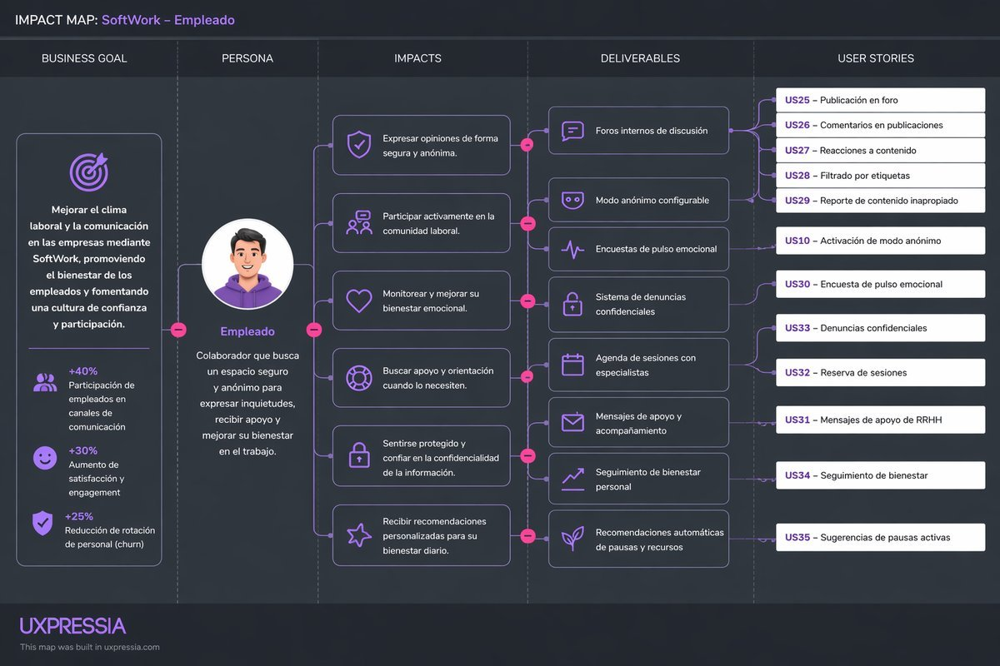
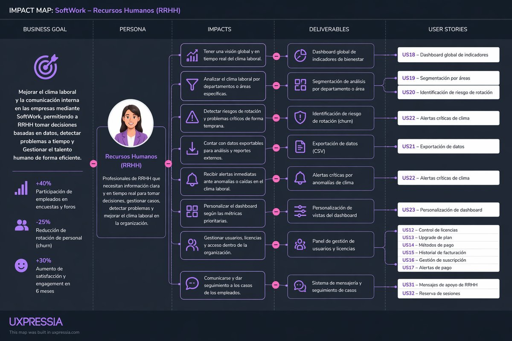

# Capítulo III: Requirements Specification

En este capítulo se detallan los requisitos funcionales y no funcionales del sistema SafeSpace, así como las historias de usuario que guiarán el desarrollo de la aplicación móvil. Se presentan los escenarios To-Be que describen la experiencia ideal para los usuarios finales, segmentados por tipo de usuario (empleados y RRHH). Además, se organizan los requisitos en Epics y User Stories con criterios de aceptación claros para asegurar una implementación alineada con las necesidades del negocio y las expectativas de los usuarios.

## 3.1. To-Be Scenario Mapping

En esta sección se describen los escenarios To-Be para los principales segmentos de usuarios de SafeSpace, enfocándose en las acciones, pensamientos y emociones que experimentan a lo largo de su interacción con la aplicación. Estos escenarios ayudan a visualizar la experiencia ideal y a identificar oportunidades clave para mejorar el bienestar laboral mediante la tecnología.

### 1. Segmento: Empleados de la empresa

**Objetivo:** Brindar una experiencia proactiva, personalizada y continua que permita al empleado identificar, entender y mejorar su bienestar y desempeño laboral con apoyo tecnológico y acompañamiento estructurado.

| Fase                         | Acciones (Doing)                                                                                               | Pensamientos (Thinking)                                                                | Emociones (Feeling)     |
| :--------------------------- | :------------------------------------------------------------------------------------------------------------- | :------------------------------------------------------------------------------------- | :---------------------- |
| Descubrimiento               | Recibe alertas inteligentes o recomendaciones basadas en su comportamiento laboral (estrés, desempeño, clima). | "Esto refleja exactamente lo que estoy sintiendo, no lo había identificado tan claro." | Sorpresa, interés       |
| Acceso y diagnóstico         | Ingresa a la aplicación y completa un diagnóstico guiado e interactivo.                                        | "El proceso es claro y parece adaptado a mi situación."                                | Confianza, curiosidad   |
| Visualización de resultados  | Recibe un análisis personalizado con indicadores claros, riesgos y oportunidades de mejora.                    | "Ahora entiendo qué está pasando y por qué."                                           | Claridad, tranquilidad  |
| Plan de acción personalizado | Accede a recomendaciones específicas: micro-hábitos, recursos, sesiones o rutas de mejora.                     | "Tengo pasos concretos que puedo seguir para mejorar."                                 | Motivación, seguridad   |
| Acompañamiento continuo      | Recibe seguimiento automatizado, recordatorios y retroalimentación adaptativa.                                 | "No estoy solo en este proceso, hay un seguimiento real."                              | Apoyo, compromiso       |
| Evolución y mejora           | Observa su progreso mediante métricas y ajustes dinámicos en su plan.                                          | "Estoy mejorando y puedo ver resultados reales."                                       | Satisfacción, confianza |

### 2. Segmento: Área de Recursos Humanos (RRHH)

**Objetivo:** Optimizar la toma de decisiones mediante datos en tiempo real, automatización de procesos y herramientas de análisis que permitan intervenciones más efectivas y personalizadas.

| Fase                        | Acciones (Doing)                                                                                     | Pensamientos (Thinking)                                        | Emociones (Feeling)      |
| :-------------------------- | :--------------------------------------------------------------------------------------------------- | :------------------------------------------------------------- | :----------------------- |
| Monitoreo inteligente       | Accede a dashboards con indicadores en tiempo real sobre clima, desempeño y bienestar.               | "Ahora tengo visibilidad clara y actualizada de la situación." | Control, seguridad       |
| Detección predictiva        | El sistema identifica riesgos y patrones antes de que escalen (burnout, rotación, bajo rendimiento). | "Puedo anticiparme en lugar de reaccionar tarde."              | Confianza, proactividad  |
| Segmentación y priorización | Clasifica empleados según niveles de riesgo o necesidad de intervención.                             | "Sé exactamente dónde enfocar mis esfuerzos."                  | Claridad, eficiencia     |
| Diseño de intervenciones    | Genera planes de acción personalizados o grupales basados en datos reales.                           | "Las decisiones que tomo están respaldadas por evidencia."     | Seguridad, determinación |
| Implementación automatizada | Ejecuta programas, seguimiento y comunicación mediante la aplicación.                                | "Esto reduce mi carga operativa significativamente."           | Alivio, productividad    |
| Evaluación de impacto       | Mide resultados con métricas claras y ajusta estrategias en tiempo real.                             | "Puedo demostrar el impacto real de las acciones."             | Satisfacción, logro      |

---

### Diferenciales clave del escenario To-Be

- Enfoque proactivo y predictivo en lugar de reactivo.
- Personalización basada en datos individuales y patrones colectivos.
- Integración de tecnología para diagnóstico, seguimiento y análisis.
- Mejora continua con retroalimentación en tiempo real.
- Reducción de fricción en la comunicación entre empleados y RRHH.

---

### Insight estratégico

El sistema transforma la relación entre empleados y RRHH en un modelo basado en datos, prevención y acompañamiento continuo, donde:

- El empleado pasa de la incertidumbre a la autogestión guiada.
- RRHH pasa de la reacción a la toma de decisiones estratégica basada en evidencia.

## 3.2. User Stories

Requisitos definidos junto con el conjunto de User Stories y Epics para los requisitos identificados. Los User Stories incluyen Criterios de Aceptacion. En esta sección el equipo redacta una introducción y presenta los cuadros con la estructura especificada a continuación.

### Epics

En esta sección se presentan los Epics definidos para organizar y agrupar las funcionalidades principales del sistema. Cada Epic representa un conjunto de funcionalidades relacionadas que contribuyen a un objetivo común dentro de la aplicación SafeSpace.

| Epic / ID | Título Descriptivo                            | Descripción Expandida                                                                                                                                                                                                   | Criterios de Aceptación                                                                                                                                                                                                                                                                                                                                                                                                                                                                                                                                                                                                                                    | Rel. (Epic) |
| :-------- | :-------------------------------------------- | :---------------------------------------------------------------------------------------------------------------------------------------------------------------------------------------------------------------------- | :--------------------------------------------------------------------------------------------------------------------------------------------------------------------------------------------------------------------------------------------------------------------------------------------------------------------------------------------------------------------------------------------------------------------------------------------------------------------------------------------------------------------------------------------------------------------------------------------------------------------------------------------------------- | :---------- |
| US01      | Registro de empleados                         | Como empleado de una organización, quiero registrar una cuenta con username, email, nombre visible y contraseña, para poder acceder de forma segura a las funcionalidades de bienestar.                                 | \textbf{Escenario 1:} \textbf{Dado} un username y email disponibles, \textbf{Cuando} registro una contraseña de al menos 8 caracteres y la confirmo correctamente, \textbf{Entonces} se crea un usuario `EMPLOYEE`. \newline \textbf{Escenario 2:} \textbf{Dado} un registro válido, \textbf{Entonces} el backend devuelve un JWT y los datos básicos del usuario. \newline \textbf{Escenario 3:} \textbf{Dado} un username o email repetido, \textbf{Entonces} el registro se rechaza.                                                                                                                                                                    | EP01        |
| US02      | Inicio de sesión con credenciales             | Como usuario registrado, quiero iniciar sesión usando mi username o email y mi contraseña, para obtener acceso autenticado al backend.                                                                                  | \textbf{Escenario 1:} \textbf{Dado} un usuario habilitado con credenciales correctas, \textbf{Cuando} inicia sesión, \textbf{Entonces} recibe un JWT con su identidad y rol. \newline \textbf{Escenario 2:} \textbf{Dado} un identificador o contraseña incorrectos, \textbf{Entonces} se rechaza el acceso. \newline \textbf{Escenario 3:} \textbf{Dado} un usuario deshabilitado, \textbf{Entonces} no puede iniciar sesión.                                                                                                                                                                                                                             | EP01        |
| US03      | Recuperación de contraseña de empleados       | Como empleado habilitado que olvidó su contraseña, quiero solicitar un enlace temporal y definir una contraseña nueva, para recuperar el acceso a mi cuenta.                                                            | \textbf{Escenario 1:} \textbf{Dado} un empleado habilitado con email, \textbf{Cuando} solicita recuperación, \textbf{Entonces} se genera un token aleatorio almacenado como SHA-256. \newline \textbf{Escenario 2:} \textbf{Dado} un token válido, no utilizado y no expirado, \textbf{Cuando} se confirma una contraseña nueva, \textbf{Entonces} se actualiza la contraseña y se elimina el token. \newline \textbf{Escenario 3:} \textbf{Dado} un identificador desconocido, \textbf{Entonces} se devuelve el mismo mensaje genérico que para una cuenta válida. \newline \textbf{Escenario 4:} Las solicitudes se limitan por identificador.           | EP01        |
| US04      | Actualización de perfil y preferencias        | Como usuario autenticado, quiero actualizar mi username, email, nombre visible, idioma y tema, para mantener configurada mi cuenta según mis necesidades.                                                               | \textbf{Escenario 1:} \textbf{Dado} un username disponible, \textbf{Cuando} actualizo la cuenta, \textbf{Entonces} se guardan los cambios y se devuelve un JWT nuevo si cambió el username. \newline \textbf{Escenario 2:} \textbf{Dado} un email utilizado por otra cuenta, \textbf{Entonces} se rechaza la operación. \newline \textbf{Escenario 3:} \textbf{Dado} un empleado, \textbf{Cuando} elimina su email, \textbf{Entonces} se rechaza la operación. \newline \textbf{Escenario 4:} \textbf{Dado} un idioma y tema válidos, \textbf{Entonces} se almacenan en preferencias.                                                                      | EP01        |
| US05      | Administración de usuarios                    | Como administrador del sistema, quiero listar, crear, actualizar, habilitar, deshabilitar, eliminar usuarios y restablecer contraseñas, para controlar las cuentas y permisos de la plataforma.                         | \textbf{Escenario 1:} \textbf{Dado} un administrador autenticado, \textbf{Cuando} consulta usuarios, \textbf{Entonces} recibe sus datos básicos, rol, estado y marca de propietario. \newline \textbf{Escenario 2:} Las contraseñas nuevas se codifican con BCrypt. \newline \textbf{Escenario 3:} No se puede eliminar o deshabilitar al último administrador. \newline \textbf{Escenario 4:} Otro administrador no puede modificar la cuenta propietaria. \newline \textbf{Escenario 5:} Un usuario que posee encuestas o actividades debe ser deshabilitado en vez de eliminado.                                                                        | EP01        |
| US06      | Registro diario de estado de ánimo            | Como usuario autenticado, quiero registrar mi estado de ánimo del día, para dejar constancia de mi percepción diaria de bienestar.                                                                                      | \textbf{Escenario 1:} \textbf{Dado} que no existe una entrada para la fecha actual, \textbf{Cuando} envío un mood válido, \textbf{Entonces} se guarda una entrada diaria. \newline \textbf{Escenario 2:} \textbf{Dado} que ya existe una entrada para ese día, \textbf{Entonces} se rechaza el segundo registro. \newline \textbf{Escenario 3:} Al consultar el mood actual se devuelve el valor y la fecha. \newline \textbf{Escenario 4:} Valores permitidos: `VERY_BAD`, `BAD`, `GOOD`, `VERY_GOOD`.                                                                                                                                                    | EP02        |
| US07      | Resumen administrativo de estado de ánimo     | Como miembro de RRHH o administrador del sistema, quiero consultar la distribución diaria de estados de ánimo y la tasa de respuesta, para conocer el pulso general de los empleados.                                   | \textbf{Escenario 1:} \textbf{Dado} una fecha, \textbf{Cuando} consulto el resumen, \textbf{Entonces} recibo el total de respuestas y la cantidad por mood. \newline \textbf{Escenario 2:} Se devuelve el número de empleados activos y la tasa de participación. \newline \textbf{Escenario 3:} Si no hay empleados activos, la tasa es 0%. \newline \textbf{Escenario 4:} Roles permitidos: `HR_MEMBER` y `SYSTEM_ADMIN`.                                                                                                                                                                                                                                | EP02        |
| US08      | Consulta de encuestas publicadas              | Como usuario autenticado, quiero consultar las encuestas publicadas, para conocer las preguntas activas y saber si ya participé.                                                                                        | \textbf{Escenario 1:} \textbf{Dado} una encuesta `PUBLISHED`, \textbf{Cuando} consulto el listado, \textbf{Entonces} aparece con título, pregunta, tipo, estado y cantidad de respuestas. \newline \textbf{Escenario 2:} Si el usuario ya respondió, el campo `answered` es verdadero. \newline \textbf{Escenario 3:} Las encuestas en `DRAFT` o `CLOSED` no aparecen en el listado público.                                                                                                                                                                                                                                                               | EP03        |
| US09      | Respuesta única a una encuesta                | Como usuario autenticado, quiero responder una encuesta publicada una sola vez, para aportar mi opinión sin duplicar mi participación.                                                                                  | \textbf{Escenario 1:} \textbf{Dado} una encuesta publicada y una respuesta no vacía, \textbf{Cuando} la envío, \textbf{Entonces} se almacena asociada al usuario y a la encuesta. \newline \textbf{Escenario 2:} Una encuesta cerrada o en borrador no puede responderse. \newline \textbf{Escenario 3:} Una segunda respuesta para la misma encuesta se rechaza.                                                                                                                                                                                                                                                                                          | EP03        |
| US10      | Gestión operativa de encuestas                | Como miembro de RRHH o administrador del sistema, quiero crear, consultar, publicar y cerrar encuestas, para administrar las preguntas de bienestar.                                                                    | \textbf{Escenario 1:} \textbf{Dado} un título, pregunta y tipo válidos, \textbf{Cuando} creo una encuesta, \textbf{Entonces} queda en `DRAFT`. \newline \textbf{Escenario 2:} Una encuesta existente puede pasar a `PUBLISHED` o `CLOSED`. \newline \textbf{Escenario 3:} El listado gestionado incluye todos los estados. \newline \textbf{Escenario 4:} Roles permitidos: `HR_MEMBER` y `SYSTEM_ADMIN`.                                                                                                                                                                                                                                                  | EP03        |
| US11      | Administración avanzada de encuestas          | Como administrador del sistema, quiero editar, reabrir, eliminar encuestas y consultar sus respuestas detalladas, para realizar la gestión administrativa completa.                                                     | \textbf{Escenario 1:} Una encuesta existente puede actualizarse con título, pregunta, tipo y comentarios. \newline \textbf{Escenario 2:} Una encuesta puede reabrirse y volver a `DRAFT`. \newline \textbf{Escenario 3:} Al eliminarla, sus respuestas y comentarios se eliminan mediante las políticas de base de datos. \newline \textbf{Escenario 4:} Las respuestas detalladas incluyen usuario, email, nombre, texto y fecha. \newline \textbf{Escenario 5:} Rol: `SYSTEM_ADMIN`.                                                                                                                                                                     | EP03        |
| US12      | Comentarios anidados en encuestas             | Como usuario autenticado, quiero publicar comentarios y respuestas sobre una encuesta que permita comentarios, para participar en una conversación relacionada con la pregunta.                                         | \textbf{Escenario 1:} \textbf{Dado} una encuesta con comentarios habilitados, \textbf{Cuando} envío contenido no vacío, \textbf{Entonces} se crea un comentario asociado a mi usuario. \newline \textbf{Escenario 2:} Si envío un `parentId` existente, se crea una respuesta anidada. \newline \textbf{Escenario 3:} Una encuesta con comentarios deshabilitados no acepta comentarios. \newline \textbf{Escenario 4:} El listado devuelve comentarios raíz, respuestas, fecha y likes. \newline \textbf{Escenario 5:} Limitación: actualmente no se valida que el padre pertenezca a la misma encuesta ni se bloquean explícitamente encuestas cerradas. | EP03        |
| US13      | Like o unlike de comentarios                  | Como usuario autenticado, quiero marcar o desmarcar un comentario con un like, para expresar si considero útil su contenido.                                                                                            | \textbf{Escenario 1:} \textbf{Dado} un comentario sin mi like, \textbf{Cuando} pulso like, \textbf{Entonces} se crea una interacción única. \newline \textbf{Escenario 2:} \textbf{Dado} un comentario que ya marqué, \textbf{Cuando} pulso nuevamente, \textbf{Entonces} se elimina mi interacción. \newline \textbf{Escenario 3:} Un comentario inexistente no puede marcarse.                                                                                                                                                                                                                                                                           | EP03        |
| US14      | Consulta de actividades abiertas              | Como usuario autenticado, quiero consultar las actividades semanales abiertas y sus opciones, para elegir en cuál participar.                                                                                           | \textbf{Escenario 1:} \textbf{Dado} una actividad `OPEN`, \textbf{Cuando} consulto las actividades, \textbf{Entonces} recibo título, descripción, estado, opciones y estadísticas de votos. \newline \textbf{Escenario 2:} Las actividades cerradas no aparecen en el listado público. \newline \textbf{Escenario 3:} Una actividad sin votos devuelve porcentajes en 0.                                                                                                                                                                                                                                                                                   | EP04        |
| US15      | Votación y cambio de voto                     | Como usuario autenticado, quiero votar por una opción de una actividad abierta y poder cambiar mi voto, para participar en la decisión semanal.                                                                         | \textbf{Escenario 1:} \textbf{Dado} una actividad abierta y una opción perteneciente a ella, \textbf{Cuando} voto, \textbf{Entonces} se registra mi voto. \newline \textbf{Escenario 2:} Si ya voté otra opción, el nuevo voto reemplaza el anterior. \newline \textbf{Escenario 3:} No se puede votar en actividades cerradas ni con opciones de otra actividad.                                                                                                                                                                                                                                                                                          | EP04        |
| US16      | Gestión de actividades semanales              | Como miembro de RRHH o administrador del sistema, quiero crear, consultar, cerrar y reabrir actividades semanales, para administrar las dinámicas participativas.                                                       | \textbf{Escenario 1:} \textbf{Dado} un título y opciones válidos, \textbf{Cuando} creo una actividad, \textbf{Entonces} queda abierta con sus opciones. \newline \textbf{Escenario 2:} Una actividad puede cerrarse y dejar de aceptar votos. \newline \textbf{Escenario 3:} Una actividad cerrada puede reabrirse mediante la administración avanzada. \newline \textbf{Escenario 4:} Si ya tiene votos, sus opciones no pueden cambiarse. \newline \textbf{Escenario 5:} Las rutas bajo `/admin` están restringidas globalmente a `SYSTEM_ADMIN`.                                                                                                        | EP04        |
| US17      | Creación de reportes anónimos o identificados | Como usuario autenticado, quiero enviar un reporte con categoría, título, descripción, prioridad y opción de anonimato, para comunicar una situación que requiere atención.                                             | \textbf{Escenario 1:} \textbf{Dado} un formulario válido, \textbf{Cuando} envío un reporte identificado, \textbf{Entonces} se guarda asociado a mi usuario. \newline \textbf{Escenario 2:} Si marco anonimato, no se guarda la relación con mi usuario y la respuesta no expone mi nombre. \newline \textbf{Escenario 3:} Todo reporte inicia con estado `NEW`.                                                                                                                                                                                                                                                                                            | EP05        |
| US18      | Consulta de reportes propios                  | Como usuario autenticado, quiero consultar mis reportes identificados, para revisar los casos que envié y su estado.                                                                                                    | \textbf{Escenario 1:} \textbf{Dado} que tengo reportes asociados a mi usuario, \textbf{Cuando} consulto mis reportes, \textbf{Entonces} recibo sus datos ordenados por ID descendente. \newline \textbf{Escenario 2:} Los reportes anónimos no aparecen porque no conservan relación con la cuenta.                                                                                                                                                                                                                                                                                                                                                        | EP05        |
| US19      | Revisión y actualización de reportes          | Como miembro de RRHH o administrador del sistema, quiero consultar todos los reportes y cambiar su estado, para realizar el seguimiento administrativo de los casos.                                                    | \textbf{Escenario 1:} \textbf{Dado} un usuario autorizado, \textbf{Cuando} consulta reportes, \textbf{Entonces} recibe el listado completo. \newline \textbf{Escenario 2:} Un reporte existente puede cambiar de estado. \newline \textbf{Escenario 3:} Usuarios sin rol `HR_MEMBER` o `SYSTEM_ADMIN` reciben acceso denegado.                                                                                                                                                                                                                                                                                                                             | EP05        |
| US20      | Registro de planes y comprobantes de pago     | Como administrador del sistema, quiero consultar los planes disponibles y registrar un pago con beneficiario, plan y comprobante PDF, para conservar evidencia de una renovación o contratación registrada manualmente. | \textbf{Escenario 1:} La consulta de planes devuelve `MONTHLY` y `ANNUAL` con duración en meses. \newline \textbf{Escenario 2:} Un pago válido guarda nombre, plan y PDF en MySQL y calcula la siguiente fecha en `America/Lima`. \newline \textbf{Escenario 3:} Se rechazan archivos sin extensión PDF, MIME aceptable, firma `%PDF-` o dentro del límite configurado. \newline \textbf{Escenario 4:} Rol: `SYSTEM_ADMIN`. \newline \textbf{Escenario 5:} Limitación: no hay pasarela, tarjeta, renovación automática, historial ni descarga.                                                                                                             | EP06        |
| US21      | Administración de conversaciones propias      | Como empleado, quiero crear, listar, renombrar y eliminar mis conversaciones de SafeSpace, para organizar mis espacios privados de apoyo emocional.                                                                     | \textbf{Escenario 1:} Un empleado puede crear y listar sus conversaciones. \newline \textbf{Escenario 2:} Solo puede renombrar o eliminar conversaciones propias. \newline \textbf{Escenario 3:} Una conversación eliminada elimina también sus mensajes. \newline \textbf{Escenario 4:} Una conversación ajena se trata como inexistente. \newline \textbf{Escenario 5:} Rol: `EMPLOYEE`.                                                                                                                                                                                                                                                                 | EP07        |
| US22      | Envío de mensajes al asistente                | Como empleado, quiero enviar mensajes al asistente y recibir una respuesta considerando parte del historial, para obtener orientación breve de bienestar emocional.                                                     | \textbf{Escenario 1:} \textbf{Dado} un mensaje no vacío dentro del límite, \textbf{Cuando} lo envío, \textbf{Entonces} se guardan el mensaje y la respuesta. \newline \textbf{Escenario 2:} Si Gemini está configurado, se envían instrucciones de seguridad, idioma e historial reciente. \newline \textbf{Escenario 3:} Si Gemini no está configurado, se devuelve una respuesta local en español o inglés. \newline \textbf{Escenario 4:} Los mensajes que superan el límite no se persisten. \newline \textbf{Escenario 5:} Los errores del proveedor se convierten en indisponibilidad controlada. \newline \textbf{Escenario 6:} Rol: `EMPLOYEE`.    | EP07        |

### Historias Técnicas

En esta sección se detallan las historias técnicas necesarias para implementar las funcionalidades descritas en los User Stories. Estas historias técnicas se enfocan en la arquitectura, la infraestructura, la seguridad y otros aspectos técnicos que son fundamentales para el correcto funcionamiento de la aplicación.

| ID de Historia Técnica | Título                                     | Descripción                                                                                                                                                  | Relacionado con (US ID)                    |
| ---------------------- | ------------------------------------------ | ------------------------------------------------------------------------------------------------------------------------------------------------------------ | ------------------------------------------ |
| TS01                   | Aplicación base con Spring Boot            | Implementar una API modular con Java 21 y Spring Boot utilizando controladores REST, servicios de aplicación, entidades JPA y repositorios Spring Data.      | Todas                                      |
| TS02                   | Persistencia relacional con MySQL y Flyway | Configurar MySQL como base principal y ejecutar migraciones SQL versionadas con Flyway para crear y evolucionar el esquema.                                  | Todas                                      |
| TS03                   | Modelo de identidad y roles                | Crear usuarios con username, email, contraseña codificada, nombre visible, rol, estado habilitado y marca de propietario del sistema.                        | US01, US02, US05                           |
| TS04                   | Autenticación JWT sin sesión de servidor   | Generar JWT con username, rol, emisión y expiración; validar el token en cada petición protegida mediante un filtro HTTP.                                    | US02, US04, US05, US06, US22               |
| TS05                   | Hash seguro de contraseñas                 | Aplicar BCrypt al registrar usuarios, crear cuentas administrativas y restablecer contraseñas.                                                               | US01, US02, US03, US05                     |
| TS06                   | Autorización RBAC                          | Diferenciar las capacidades de `EMPLOYEE`, `HR_MEMBER` y `SYSTEM_ADMIN` mediante autorización por rutas y métodos.                                           | US01-US22                                  |
| TS07                   | Protección de la cuenta propietaria        | Impedir que desaparezca el último administrador y proteger la cuenta `systemOwner` frente a acciones de otros administradores.                               | US05                                       |
| TS08                   | Recuperación de contraseña con token hash  | Generar tokens aleatorios de un solo uso, guardar SHA-256, aplicar expiración, eliminar tokens anteriores y limitar solicitudes.                             | US03                                       |
| TS09                   | Configuración por propiedades y perfiles   | Externalizar secretos, límites, URLs, credenciales locales, configuración IA, recuperación y tamaño de comprobantes mediante variables de entorno.           | US02, US03, US20, US22                     |
| TS10                   | Gestión de perfil y preferencias           | Persistir idioma y tema mediante una relación uno a uno con el usuario y permitir su actualización desde la API.                                             | US04                                       |
| TS11                   | Registro diario de mood con unicidad       | Guardar un estado de ánimo por usuario y fecha, garantizando unicidad mediante una restricción compuesta.                                                    | US06                                       |
| TS12                   | Consulta agregada de mood                  | Agrupar estados por fecha y calcular respuestas totales, empleados activos y tasa de participación.                                                          | US07                                       |
| TS13                   | Ciclo de vida de encuestas                 | Modelar estados `DRAFT`, `PUBLISHED` y `CLOSED`, permitiendo crear, publicar, cerrar, reabrir, actualizar y eliminar según el rol.                           | US08, US09, US10, US11                     |
| TS14                   | Respuestas únicas de encuestas             | Impedir que un usuario responda dos veces la misma encuesta mediante validación de aplicación y restricción `(survey_id, user_id)`.                          | US09                                       |
| TS15                   | Comentarios jerárquicos                    | Persistir comentarios mediante `parent_id`, reconstruir respuestas anidadas y contar likes.                                                                  | US12                                       |
| TS16                   | Likes idempotentes por usuario             | Implementar alta y baja de likes usando la clave compuesta `(comment_id, user_id)`.                                                                          | US13                                       |
| TS17                   | Actividades con opciones y votación única  | Modelar actividades, opciones y votos, permitiendo reemplazar el voto del usuario y calcular porcentajes.                                                    | US14, US15, US16                           |
| TS18                   | Protección de opciones después de votar    | Impedir cambios en las opciones de una actividad cuando ya existe al menos un voto.                                                                          | US16                                       |
| TS19                   | Reportes anónimos e identificados          | Guardar categoría, título, descripción, prioridad, estado y bandera de anonimato; omitir la relación de usuario cuando corresponda.                          | US17, US18                                 |
| TS20                   | Seguimiento administrativo de reportes     | Permitir a RRHH y administradores consultar reportes y modificar su estado mediante operaciones transaccionales.                                             | US19                                       |
| TS21                   | Auditoría de operaciones administrativas   | Registrar creación, modificación, publicación, eliminación, cambios de usuarios y registro de pagos.                                                         | US05, US10, US11, US16, US20               |
| TS22                   | Persistencia de comprobantes PDF           | Validar nombre, extensión, MIME, tamaño y firma `%PDF-`, y almacenar el contenido en un campo `LONGBLOB`.                                                    | US20                                       |
| TS23                   | Cálculo de siguiente fecha de pago         | Calcular la próxima fecha sumando uno o doce meses en la zona horaria `America/Lima`.                                                                        | US20                                       |
| TS24                   | Conversaciones propiedad del empleado      | Asociar conversaciones y mensajes a un empleado y verificar ownership mediante `conversation_id` y `user_id`.                                                | US21, US22                                 |
| TS25                   | Integración opcional con Gemini            | Implementar un adaptador REST desacoplado mediante un puerto de dominio, API key privada, límites, historial y timeout HTTP.                                 | US22                                       |
| TS26                   | Respuesta local de contingencia para IA    | Mantener disponible el chat sin una clave externa, devolviendo respuestas locales en español o inglés.                                                       | US22                                       |
| TS27                   | Manejo común de errores HTTP               | Unificar errores de validación, argumentos inválidos, archivos grandes, partes faltantes y disponibilidad del proveedor IA mediante `@RestControllerAdvice`. | US01-US22                                  |
| TS28                   | CORS y API stateless                       | Configurar CORS para orígenes locales y utilizar sesiones stateless con CSRF deshabilitado para la API JWT.                                                  | US02, US04-US22                            |
| TS29                   | Migraciones y eliminación referencial      | Definir cascadas para preferencias, mood, respuestas, comentarios, likes y conversaciones; conservar reportes y auditoría con referencias nulas.             | US05, US06, US09, US11-US13, US17-US22     |
| TS30                   | Documentación OpenAPI                      | Exponer documentación interactiva y contrato OpenAPI mediante Springdoc en `/swagger-ui.html` y `/v3/api-docs`.                                              | Todas                                      |
| TS31                   | Pruebas unitarias de servicios             | Cubrir reglas principales de autenticación, usuarios, recuperación, mood, encuestas, actividades, pagos y chat IA con pruebas unitarias.                     | US01-US03, US05-US11, US14-US16, US20-US22 |

### Historias de Investigación (Spikes)

Este apartado se dedica a las historias de investigación que el equipo debe realizar para resolver dudas técnicas, evaluar tecnologías o definir la mejor estrategia de implementación para ciertos aspectos del proyecto. Estas historias no generan código directamente, sino que buscan obtener información valiosa para tomar decisiones informadas en el desarrollo.

| ID de Investigación | Título                                 | Descripción                                                                                                                       | Criterios de Aceptación                                                                                                                                                                                                      | Tiempo Estimado |
| ------------------- | -------------------------------------- | --------------------------------------------------------------------------------------------------------------------------------- | ---------------------------------------------------------------------------------------------------------------------------------------------------------------------------------------------------------------------------- | --------------- |
| SP01                | Investigación de APIs de IA            | Investigar y comparar proveedores de IA (OpenAI, Gemini) para la integración de asistencia inteligente y automatizaciones.        | 1. Documento comparativo de proveedores elaborado.\newline 2. Prueba de concepto de conexión exitosa.\newline 3. Análisis de costos de API documentado.                                                                      | 4 horas         |
| SP02                | Evaluación de Contextos Delimitados    | Analizar la segregación actual del negocio para definir claramente las fronteras de los Contextos Delimitados en la arquitectura. | 1. Mapa de dominios central actualizado.\newline 2. Diagrama de contextos completado.\newline 3. Puntos de integración y comunicación identificados.                                                                         | 8 horas         |
| SP03                | Evaluación de Gmail API                | Analizar la factibilidad y cuotas de uso de Gmail API para envío de notificaciones y correos transaccionales estables.            | 1. Prueba de concepto de envío de correos exitosa.\newline 2. Resumen documentado sobre cuotas y limitaciones.\newline 3. Guía de autenticación OAuth 2.0 redactada para el equipo.                                          | 10 horas        |
| SP04                | Validación RRHH y Profesionales        | Explorar servicios de terceros para verificar historial laboral, diplomas y certificaciones de los profesionales del sistema.     | 1. Lista de servicios de validación de identidad laboral elaborada.\newline 2. Cuadro comparativo de costos, latencia y precisión.\newline 3. Viabilidad técnica y marco legal confirmados.                                  | 2 horas         |
| SP05                | Estrategia de Eventos en Tiempo Real   | Comparar WebSockets, SSE y servicios pasivos para el módulo de notificaciones y mensajería de la aplicación en tiempo real.       | 1. Cuadro técnico de opciones elaborado.\newline 2. Piloto preliminar de infraestructura configurado.\newline 3. Recomendación de arquitectura seleccionada.                                                                 | 10 horas        |
| SP06                | Análisis de biometría e IAM            | Investigar librerías de validación de identidad biométrica en dispositivos para reforzar el sistema de autenticación de usuarios. | 1. Inventario de SDKs para biometría móvil.\newline 2. Análisis documentado de compatibilidad en iOS y Android.\newline 3. Resumen de impacto en la experiencia de usuario y fricción.                                       | 5 horas         |
| SP07                | Estrategia de Caché Distribuida        | Evaluar opciones de capas de caché (Redis) para acelerar las peticiones más pesadas del componente panel de control.              | 1. Políticas de expiración e invalidación definidas.\newline 2. Entorno simulado de Redis con lecturas/escrituras.\newline 3. Pruebas de reducción de latencia aprobadas.                                                    | 3 horas         |
| SP08                | Optimización de Subidas de Archivos    | Probar cargas de archivos y CVs mediante URLs pre-firmadas hacia proveedores Cloud para quitar carga del servidor principal.      | 1. Diagrama de secuencia del URL prefirmada creado.\newline 2. Políticas de seguridad y ciclo de vida de contenedor de archivos definidas.\newline 3. Código fuente cliente-servidor evaluado en entorno de pruebas aislado. | 6 horas         |
| SP09                | Estrategia de Despliegue de API en AWS | Investigar y comparar servicios de cómputo en AWS (App Runner, ECS, EC2) para alojar el API de manera escalable.                  | 1. Cuadro comparativo de costos y escalabilidad en AWS.\newline 2. Prueba de concepto de despliegue básico del API en la nube.\newline 3. Documento de recomendación de arquitectura en la nube.                             | 8 horas         |

## 3.3. Product Backlog

[Trello Board - SafeSpace](https://milenkorvu.atlassian.net/jira/software/c/projects/SSB/boards/4/backlog)

| Jira   | ID   | Historia de usuario                           | Epic |
| ------ | ---- | --------------------------------------------- | ---- |
| SSB-1  | US01 | Registro de empleados                         | EP01 |
| SSB-2  | US02 | Inicio de sesión con credenciales             | EP01 |
| SSB-3  | US03 | Recuperación de contraseña de empleados       | EP01 |
| SSB-4  | US04 | Actualización de perfil y preferencias        | EP01 |
| SSB-5  | US05 | Administración de usuarios                    | EP01 |
| SSB-6  | US06 | Registro diario de estado de ánimo            | EP02 |
| SSB-7  | US07 | Resumen administrativo de estado de ánimo     | EP02 |
| SSB-8  | US08 | Consulta de encuestas publicadas              | EP03 |
| SSB-9  | US09 | Respuesta única a una encuesta                | EP03 |
| SSB-10 | US10 | Gestión operativa de encuestas                | EP03 |
| SSB-11 | US11 | Administración avanzada de encuestas          | EP03 |
| SSB-12 | US12 | Comentarios anidados en encuestas             | EP03 |
| SSB-13 | US13 | Like o unlike de comentarios                  | EP03 |
| SSB-14 | US14 | Consulta de actividades abiertas              | EP04 |
| SSB-15 | US15 | Votación y cambio de voto                     | EP04 |
| SSB-16 | US16 | Gestión de actividades semanales              | EP04 |
| SSB-17 | US17 | Creación de reportes anónimos o identificados | EP05 |
| SSB-18 | US18 | Consulta de reportes propios                  | EP05 |
| SSB-19 | US19 | Revisión y actualización de reportes          | EP05 |
| SSB-20 | US20 | Registro de planes y comprobantes de pago     | EP06 |
| SSB-21 | US21 | Administración de conversaciones propias      | EP07 |
| SSB-22 | US22 | Envío de mensajes al asistente                | EP07 |

## Tareas técnicas

| Jira   | ID   | Tarea técnica                              | Historias relacionadas                     |
| ------ | ---- | ------------------------------------------ | ------------------------------------------ |
| SSB-23 | TS01 | Aplicación base con Spring Boot            | Todas                                      |
| SSB-24 | TS02 | Persistencia relacional con MySQL y Flyway | Todas                                      |
| SSB-25 | TS03 | Modelo de identidad y roles                | US01, US02, US05                           |
| SSB-26 | TS04 | Autenticación JWT sin sesión de servidor   | US02, US04, US05, US06, US22               |
| SSB-27 | TS05 | Hash seguro de contraseñas                 | US01, US02, US03, US05                     |
| SSB-28 | TS06 | Autorización RBAC                          | US01–US22                                  |
| SSB-29 | TS07 | Protección de la cuenta propietaria        | US05                                       |
| SSB-30 | TS08 | Recuperación de contraseña con token hash  | US03                                       |
| SSB-31 | TS09 | Configuración por propiedades y perfiles   | US02, US03, US20, US22                     |
| SSB-32 | TS10 | Gestión de perfil y preferencias           | US04                                       |
| SSB-33 | TS11 | Registro diario de mood con unicidad       | US06                                       |
| SSB-34 | TS12 | Consulta agregada de mood                  | US07                                       |
| SSB-35 | TS13 | Ciclo de vida de encuestas                 | US08, US09, US10, US11                     |
| SSB-36 | TS14 | Respuestas únicas de encuestas             | US09                                       |
| SSB-37 | TS15 | Comentarios jerárquicos                    | US12                                       |
| SSB-38 | TS16 | Likes idempotentes por usuario             | US13                                       |
| SSB-39 | TS17 | Actividades con opciones y votación única  | US14, US15, US16                           |
| SSB-40 | TS18 | Protección de opciones después de votar    | US16                                       |
| SSB-41 | TS19 | Reportes anónimos e identificados          | US17, US18                                 |
| SSB-42 | TS20 | Seguimiento administrativo de reportes     | US19                                       |
| SSB-43 | TS21 | Auditoría de operaciones administrativas   | US05, US10, US11, US16, US20               |
| SSB-44 | TS22 | Persistencia de comprobantes PDF           | US20                                       |
| SSB-45 | TS23 | Cálculo de siguiente fecha de pago         | US20                                       |
| SSB-46 | TS24 | Conversaciones propiedad del empleado      | US21, US22                                 |
| SSB-47 | TS25 | Integración opcional con Gemini            | US22                                       |
| SSB-48 | TS26 | Respuesta local de contingencia para IA    | US22                                       |
| SSB-49 | TS27 | Manejo común de errores HTTP               | US01–US22                                  |
| SSB-50 | TS28 | CORS y API stateless                       | US02, US04–US22                            |
| SSB-51 | TS29 | Migraciones y eliminación referencial      | US05, US06, US09, US11–US13, US17–US22     |
| SSB-52 | TS30 | Documentación OpenAPI                      | Todas                                      |
| SSB-53 | TS31 | Pruebas unitarias de servicios             | US01–US03, US05–US11, US14–US16, US20–US22 |

## 3.4. Impact Mapping

---

\newpage

