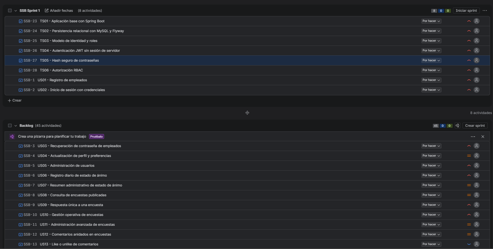
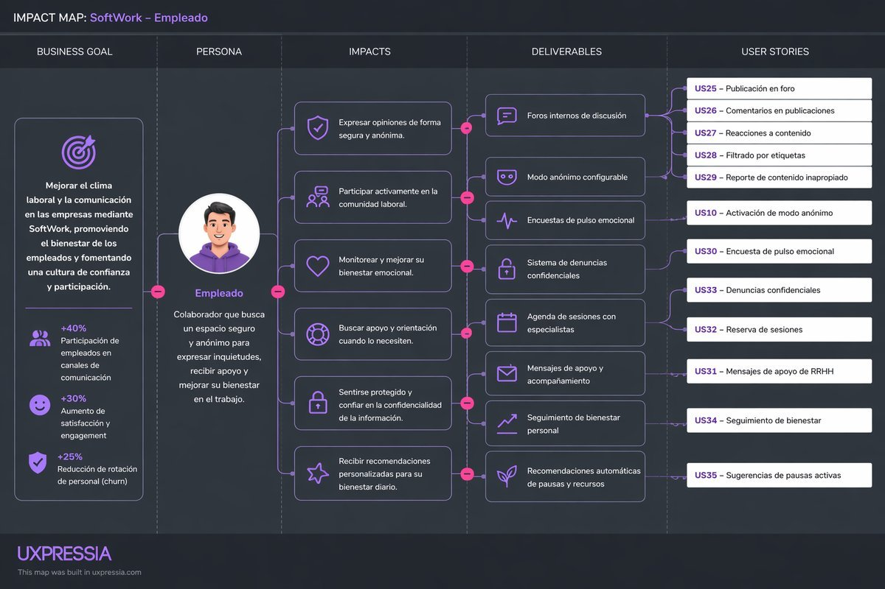
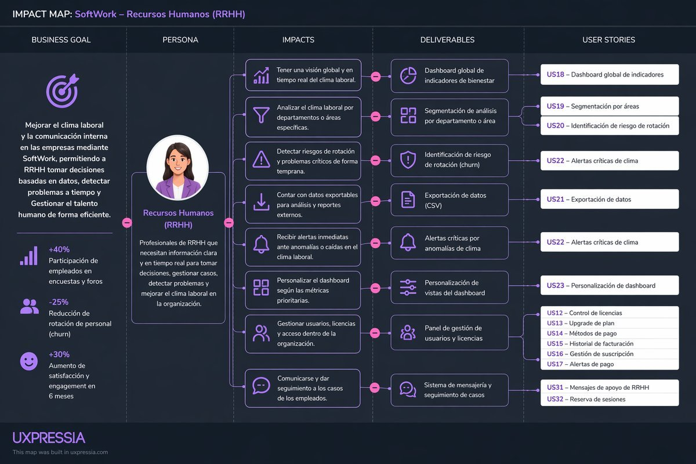

# Capítulo III: Requirements Specification

En este capítulo se detallan los requisitos funcionales de SafeSpace y las User Stories que trazan las capacidades disponibles para empleados, miembros de RRHH y administradores. Se presentan escenarios To-Be, épicas, criterios de aceptación y el Product Backlog para mantener coherencia entre las necesidades del negocio, la implementación y las evidencias del Trabajo Parcial.

## 3.1. To-Be Scenario Mapping

SafeSpace propone flujos trazables para empleados, miembros de RRHH y administradores. Los escenarios se centran en funciones implementadas y documentadas: acceso seguro, registro de bienestar, encuestas, actividades, reportes, gestión de cuentas y asistencia conversacional.

### Escenario To-Be: Empleado

Un empleado crea una cuenta o inicia sesión. Si pierde el acceso, solicita la recuperación de contraseña. Ya autenticado, actualiza sus preferencias, registra su estado de ánimo diario y consulta las encuestas y actividades disponibles. Puede responder una encuesta una sola vez, participar mediante comentarios y votos, reportar una situación de forma identificada o anónima y utilizar el asistente conversacional en un espacio privado.

| Momento | Resultado esperado | User Stories relacionadas |
| :--- | :--- | :--- |
| Acceso y recuperación | El empleado obtiene o recupera acceso mediante credenciales protegidas. | US01, US02, US03, US04 |
| Bienestar y participación | Registra su mood, responde encuestas, comenta y vota en actividades abiertas. | US06, US08, US09, US12, US13, US14, US15 |
| Comunicación y apoyo | Envía reportes con el nivel de identificación que elija y usa conversaciones privadas de asistencia. | US17, US18, US21, US22 |

### Escenario To-Be: Miembro de RRHH

Un miembro de RRHH inicia sesión y consulta el resumen diario de estados de ánimo para conocer el nivel de participación. Gestiona encuestas y actividades, y revisa los reportes recibidos para darles seguimiento según su estado. Las acciones disponibles se restringen de acuerdo con su rol.

| Momento | Resultado esperado | User Stories relacionadas |
| :--- | :--- | :--- |
| Consulta de bienestar | Accede a la distribución diaria de moods y a la tasa de respuesta. | US07 |
| Gestión de participación | Crea, publica, cierra o reabre encuestas y actividades. | US10, US16 |
| Seguimiento de casos | Consulta y actualiza el estado de los reportes registrados. | US19 |

### Escenario To-Be: Administrador del sistema

El administrador mantiene las cuentas, controla las operaciones administrativas de encuestas y actividades y registra planes y comprobantes de pago. Las reglas de autorización protegen la cuenta propietaria y evitan que el sistema quede sin una cuenta administrativa activa.

| Momento | Resultado esperado | User Stories relacionadas |
| :--- | :--- | :--- |
| Administración de cuentas | Gestiona usuarios, roles, estados y restablecimientos de contraseña. | US05 |
| Administración avanzada | Edita, elimina o reabre encuestas y administra actividades según las reglas del sistema. | US11, US16 |
| Gestión de pagos | Consulta planes y registra comprobantes de pago válidos. | US20 |

Estos escenarios permiten relacionar las necesidades de cada rol con las 22 User Stories y con las evidencias de implementación y prueba del Trabajo Parcial.

## 3.2. User Stories

Las historias de usuario se agrupan en épicas y mantienen criterios de aceptación observables. La relación entre historias, actores y funcionalidades implementadas permite seguir la evolución desde el escenario To-Be hasta el Product Backlog.

### Epics

En esta sección se presentan los Epics definidos para organizar y agrupar las funcionalidades principales del sistema. Cada Epic representa un conjunto de funcionalidades relacionadas que contribuyen a un objetivo común dentro de la aplicación SafeSpace.

| Epic / ID | Nombre | Objetivo | Historias relacionadas |
| :-------- | :----- | :------- | :--------------------- |
| EP01 | Acceso, identidad y administración de usuarios | Permitir el registro, autenticación, recuperación de acceso, configuración de perfiles y administración de cuentas según el rol. | US01, US02, US03, US04, US05 |
| EP02 | Bienestar y estado de ánimo | Registrar el estado de ánimo de los empleados y ofrecer a RR. HH. un resumen del bienestar del equipo. | US06, US07 |
| EP03 | Encuestas y participación | Publicar y responder encuestas, gestionar sus estados y facilitar comentarios, respuestas y reacciones. | US08, US09, US10, US11, US12, US13 |
| EP04 | Actividades y votaciones semanales | Proponer actividades grupales y permitir que los empleados voten y cambien su elección. | US14, US15, US16 |
| EP05 | Reportes laborales | Registrar situaciones identificadas o anónimas y permitir su consulta y seguimiento administrativo. | US17, US18, US19 |
| EP06 | Planes y pagos | Consultar planes y registrar comprobantes de pago asociados a la plataforma. | US20 |
| EP07 | Asistencia conversacional con IA | Crear conversaciones privadas y recibir orientación breve de bienestar mediante el asistente. | US21, US22 |

### User Stories

| User Story / ID | Título descriptivo | Descripción | Criterios de aceptación | Épica |
| :--------------- | :----------------- | :----------- | :---------------------- | :---- |
| US01 | Registro de empleados | Como empleado de una organización, quiero registrar una cuenta con username, email, nombre visible y contraseña, para acceder de forma segura a las funcionalidades de bienestar. | Escenario 1: con username y email disponibles, una contraseña de al menos 8 caracteres y confirmación correcta, se crea un usuario `EMPLOYEE`. Escenario 2: un registro válido devuelve un JWT y los datos básicos. Escenario 3: un username o email repetido se rechaza. | EP01 |
| US02 | Inicio de sesión con credenciales | Como usuario registrado, quiero iniciar sesión usando mi username o email y mi contraseña, para obtener acceso autenticado al backend. | Escenario 1: un usuario habilitado con credenciales correctas recibe un JWT con su identidad y rol. Escenario 2: un identificador o contraseña incorrectos rechazan el acceso. Escenario 3: un usuario deshabilitado no puede iniciar sesión. | EP01 |
| US03 | Recuperación de contraseña de empleados | Como empleado habilitado que olvidó su contraseña, quiero solicitar un enlace temporal y definir una contraseña nueva, para recuperar el acceso a mi cuenta. | Escenario 1: al solicitar recuperación para una cuenta habilitada se genera un token temporal protegido. Escenario 2: un token válido, no usado y no expirado permite actualizar la contraseña. Escenario 3: una cuenta desconocida recibe el mismo mensaje genérico que una cuenta válida. Escenario 4: las solicitudes se limitan por identificador. | EP01 |
| US04 | Actualización de perfil y preferencias | Como usuario autenticado, quiero actualizar mi username, email, nombre visible, idioma y tema, para mantener configurada mi cuenta según mis necesidades. | Escenario 1: un username disponible permite guardar los cambios y renovar el JWT si corresponde. Escenario 2: un email utilizado por otra cuenta se rechaza. Escenario 3: un empleado no puede eliminar su email. Escenario 4: un idioma y tema válidos se almacenan en preferencias. | EP01 |
| US05 | Administración de usuarios | Como administrador del sistema, quiero listar, crear, actualizar, habilitar, deshabilitar, eliminar usuarios y restablecer contraseñas, para controlar las cuentas y permisos de la plataforma. | Escenario 1: un administrador autenticado consulta datos básicos, rol, estado y propietario. Escenario 2: las contraseñas nuevas se codifican con BCrypt. Escenario 3: no se elimina ni deshabilita al último administrador. Escenario 4: la cuenta propietaria no puede ser modificada por otro administrador. Escenario 5: un usuario con encuestas o actividades se deshabilita en vez de eliminarse. | EP01 |
| US06 | Registro diario de estado de ánimo | Como usuario autenticado, quiero registrar mi estado de ánimo del día, para dejar constancia de mi percepción diaria de bienestar. | Escenario 1: si no existe una entrada para la fecha actual, se guarda un mood válido. Escenario 2: un segundo registro del mismo día se rechaza. Escenario 3: la consulta devuelve el valor y la fecha. Escenario 4: los valores permitidos son `VERY_BAD`, `BAD`, `GOOD` y `VERY_GOOD`. | EP02 |
| US07 | Resumen administrativo de estado de ánimo | Como miembro de RRHH o administrador del sistema, quiero consultar la distribución diaria de estados de ánimo y la tasa de respuesta, para conocer el pulso general de los empleados. | Escenario 1: para una fecha se devuelve el total de respuestas y la cantidad por mood. Escenario 2: se informa el número de empleados activos y la tasa de participación. Escenario 3: sin empleados activos, la tasa es 0 %. Escenario 4: los roles permitidos son `HR_MEMBER` y `SYSTEM_ADMIN`. | EP02 |
| US08 | Consulta de encuestas publicadas | Como usuario autenticado, quiero consultar las encuestas publicadas, para conocer las preguntas activas y saber si ya participé. | Escenario 1: una encuesta `PUBLISHED` aparece con título, pregunta, tipo, estado y cantidad de respuestas. Escenario 2: si el usuario ya respondió, `answered` es verdadero. Escenario 3: las encuestas `DRAFT` o `CLOSED` no aparecen en el listado público. | EP03 |
| US09 | Respuesta única a una encuesta | Como usuario autenticado, quiero responder una encuesta publicada una sola vez, para aportar mi opinión sin duplicar mi participación. | Escenario 1: una respuesta no vacía se almacena asociada al usuario y a la encuesta. Escenario 2: una encuesta cerrada o en borrador no puede responderse. Escenario 3: una segunda respuesta para la misma encuesta se rechaza. | EP03 |
| US10 | Gestión operativa de encuestas | Como miembro de RRHH o administrador del sistema, quiero crear, consultar, publicar y cerrar encuestas, para administrar las preguntas de bienestar. | Escenario 1: un título, pregunta y tipo válidos crean una encuesta en `DRAFT`. Escenario 2: una encuesta pasa a `PUBLISHED` o `CLOSED`. Escenario 3: el listado gestionado incluye todos los estados. Escenario 4: los roles permitidos son `HR_MEMBER` y `SYSTEM_ADMIN`. | EP03 |
| US11 | Administración avanzada de encuestas | Como administrador del sistema, quiero editar, reabrir, eliminar encuestas y consultar sus respuestas detalladas, para realizar la gestión administrativa completa. | Escenario 1: se actualizan título, pregunta, tipo y comentarios. Escenario 2: una encuesta puede reabrirse y volver a `DRAFT`. Escenario 3: al eliminarla, se eliminan sus respuestas y comentarios. Escenario 4: las respuestas incluyen usuario, email, nombre, texto y fecha. Escenario 5: el rol requerido es `SYSTEM_ADMIN`. | EP03 |
| US12 | Comentarios anidados en encuestas | Como usuario autenticado, quiero publicar comentarios y respuestas sobre una encuesta que permita comentarios, para participar en una conversación relacionada con la pregunta. | Escenario 1: un contenido no vacío crea un comentario asociado al usuario. Escenario 2: un `parentId` existente crea una respuesta anidada. Escenario 3: una encuesta con comentarios deshabilitados no acepta comentarios. Escenario 4: el listado devuelve comentarios raíz, respuestas, fecha y likes. | EP03 |
| US13 | Like o unlike de comentarios | Como usuario autenticado, quiero marcar o desmarcar un comentario con un like, para expresar si considero útil su contenido. | Escenario 1: al pulsar like sobre un comentario sin like propio, se crea una interacción única. Escenario 2: al pulsar nuevamente sobre un comentario ya marcado, se elimina la interacción. Escenario 3: un comentario inexistente no acepta la operación. | EP03 |
| US14 | Consulta de actividades abiertas | Como usuario autenticado, quiero consultar las actividades semanales abiertas y sus opciones, para elegir en cuál participar. | Escenario 1: una actividad `OPEN` devuelve título, descripción, estado, opciones y estadísticas. Escenario 2: las actividades cerradas no aparecen en el listado público. Escenario 3: una actividad sin votos devuelve porcentajes en 0. | EP04 |
| US15 | Votación y cambio de voto | Como usuario autenticado, quiero votar por una opción de una actividad abierta y poder cambiar mi voto, para participar en la decisión semanal. | Escenario 1: un voto sobre una opción de una actividad abierta se registra. Escenario 2: un nuevo voto reemplaza el anterior. Escenario 3: no se vota en actividades cerradas ni con opciones de otra actividad. | EP04 |
| US16 | Gestión de actividades semanales | Como miembro de RRHH o administrador del sistema, quiero crear, consultar, cerrar y reabrir actividades semanales, para administrar las dinámicas participativas. | Escenario 1: un título y opciones válidos crean una actividad abierta. Escenario 2: una actividad puede cerrarse y dejar de aceptar votos. Escenario 3: una actividad cerrada puede reabrirse. Escenario 4: si ya tiene votos, sus opciones no cambian. Escenario 5: las rutas `/admin` requieren `SYSTEM_ADMIN`. | EP04 |
| US17 | Creación de reportes anónimos o identificados | Como usuario autenticado, quiero enviar un reporte con categoría, título, descripción, prioridad y opción de anonimato, para comunicar una situación que requiere atención. | Escenario 1: un reporte identificado se guarda asociado al usuario. Escenario 2: un reporte anónimo no guarda la relación con el usuario ni expone su nombre. Escenario 3: todo reporte inicia con estado `NEW`. | EP05 |
| US18 | Consulta de reportes propios | Como usuario autenticado, quiero consultar mis reportes identificados, para revisar los casos que envié y su estado. | Escenario 1: los reportes asociados al usuario se devuelven ordenados por ID descendente. Escenario 2: los reportes anónimos no aparecen porque no conservan relación con la cuenta. | EP05 |
| US19 | Revisión y actualización de reportes | Como miembro de RRHH o administrador del sistema, quiero consultar todos los reportes y cambiar su estado, para realizar el seguimiento administrativo de los casos. | Escenario 1: un usuario autorizado recibe el listado completo. Escenario 2: un reporte existente puede cambiar de estado. Escenario 3: usuarios sin rol `HR_MEMBER` o `SYSTEM_ADMIN` reciben acceso denegado. | EP05 |
| US20 | Registro de planes y comprobantes de pago | Como administrador del sistema, quiero consultar los planes disponibles y registrar un pago con beneficiario, plan y comprobante PDF, para administrar los registros de pago de la plataforma. | Escenario 1: la consulta devuelve MONTHLY y ANNUAL con duración en meses. Escenario 2: un pago válido guarda sus datos y el comprobante PDF en Firestore, dentro del máximo de 700 000 bytes aplicado por el backend, y calcula la siguiente fecha en America/Lima. Escenario 3: se validan extensión, MIME, firma %PDF- y tamaño. Escenario 4: el rol requerido es SYSTEM_ADMIN. Escenario 5: el registro no procesa cobros con tarjeta ni renovaciones automáticas. | EP06 |
| US21 | Conversaciones con la IA | Como empleado, quiero crear, listar, renombrar y eliminar mis conversaciones con la IA, para organizar mis espacios privados de apoyo emocional. | Escenario 1: un empleado puede crear y listar sus conversaciones. Escenario 2: solo puede renombrar o eliminar conversaciones propias. Escenario 3: eliminar una conversación elimina también sus mensajes. Escenario 4: una conversación ajena se trata como inexistente. Escenario 5: el rol requerido es `EMPLOYEE`. | EP07 |
| US22 | Envío de mensajes al asistente | Como empleado, quiero enviar mensajes al asistente y recibir una respuesta considerando parte del historial, para obtener orientación breve de bienestar emocional. | Escenario 1: un mensaje no vacío dentro del límite guarda el mensaje y la respuesta. Escenario 2: si Gemini está configurado, se envían instrucciones de seguridad, idioma e historial reciente. Escenario 3: sin Gemini se devuelve una respuesta local en español o inglés. Escenario 4: los mensajes que superan el límite no se persisten. Escenario 5: los errores del proveedor se convierten en indisponibilidad controlada. Escenario 6: el rol requerido es `EMPLOYEE`. | EP07 |

## 3.3. Product Backlog

[Jira Board - SafeSpace](https://milenkorvu.atlassian.net/jira/software/c/projects/SSB/boards/4/backlog)

| Jira   | ID   | Historia de usuario                           | Epic |
| ------ | ---- | --------------------------------------------- | ---- |
| SSB-1  | US01 | Registro de empleados                         | EP01 |
| SSB-2  | US02 | Inicio de sesión con credenciales             | EP01 |
| SSB-3  | US03 | Recuperación de contraseña de empleados       | EP01 |
| SSB-4  | US04 | Actualización de perfil y preferencias        | EP01 |
| SSB-5  | US05 | Administración de usuarios                    | EP01 |
| SSB-6  | US06 | Registro diario de estado de ánimo            | EP02 |
| SSB-7  | US07 | Resumen administrativo de estado de ánimo     | EP02 |
| SSB-8  | US08 | Consulta de encuestas publicadas              | EP03 |
| SSB-9  | US09 | Respuesta única a una encuesta                | EP03 |
| SSB-10 | US10 | Gestión operativa de encuestas                | EP03 |
| SSB-11 | US11 | Administración avanzada de encuestas          | EP03 |
| SSB-12 | US12 | Comentarios anidados en encuestas             | EP03 |
| SSB-13 | US13 | Like o unlike de comentarios                  | EP03 |
| SSB-14 | US14 | Consulta de actividades abiertas              | EP04 |
| SSB-15 | US15 | Votación y cambio de voto                     | EP04 |
| SSB-16 | US16 | Gestión de actividades semanales              | EP04 |
| SSB-17 | US17 | Creación de reportes anónimos o identificados | EP05 |
| SSB-18 | US18 | Consulta de reportes propios                  | EP05 |
| SSB-19 | US19 | Revisión y actualización de reportes          | EP05 |
| SSB-20 | US20 | Registro de planes y comprobantes de pago     | EP06 |
| SSB-21 | US21 | Conversaciones con la IA                      | EP07 |
| SSB-22 | US22 | Envío de mensajes al asistente                | EP07 |

## 3.4. Impact Mapping

---

\newpage

