# Capítulo V: Product Implementation

Este capítulo documenta la configuración, implementación y evidencia verificable de SafeSpace durante el Avance 1. La trazabilidad se mantiene entre las historias del Product Backlog, las tareas del Sprint, los cambios en los repositorios, las pruebas y la ejecución de cada producto. Las capturas, enlaces y datos de planificación deben corresponder al trabajo realmente realizado por el equipo.

## 5.1. Software Configuration Management

La gestión de configuración de SafeSpace define las herramientas, repositorios, ramas, convenciones y procedimientos de despliegue utilizados por el equipo. Su propósito es mantener una versión reproducible del producto y permitir rastrear cada cambio hasta la historia o tarea que lo motivó.

### 5.1.1. Software Development Environment Configuration

La siguiente tabla identifica las herramientas y tecnologías del proyecto. Las versiones se deben contrastar con los archivos de configuración de cada repositorio antes de entregar el informe.

| Actividad             | Herramienta o tecnología                                       | Uso en SafeSpace                                                          | Referencia o evidencia                                                                                 | Versión                                    |
| :-------------------- | :------------------------------------------------------------- | :------------------------------------------------------------------------ | :----------------------------------------------------------------------------------------------------- | :----------------------------------------- |
| Gestión del proyecto  | Jira                                                           | Gestión del Product Backlog, Sprint Backlog, historias, tareas y estados. | [Tablero de SafeSpace](https://milenkorvu.atlassian.net/jira/software/c/projects/SSB/boards/4/backlog) | SaaS                                       |
| Control de versiones  | Git                                                            | Registro local de cambios, ramas y etiquetas.                             | [Git](https://git-scm.com/)                                                                            | 2.49.0                                      |
| Repositorios          | GitHub                                                         | Hospedaje del informe y del código; Pull Requests, issues y colaboración. | Organización: https://github.com/TheSuccesfulOnes                                                      | SaaS                                       |
| Diseño UX/UI          | Figma                                                          | Elaboración y revisión de wireframes, mockups, flujos y prototipos.       | https://www.figma.com/design/7CoYj5tfiNTLD8kScA5uTF/Untitled?node-id=0-1&t=8T79jUNWludeTlcC-1          | SaaS                                       |
| Documentación         | Markdown                                                       | Redacción del informe.                                                     | Repositorio del informe: https://github.com/TheSuccesfulOnes/Report                                    | N/A                                          |
| Landing Page          | HTML5, CSS3 y JavaScript                                       | Presentación pública de SafeSpace y acceso a sus acciones de contacto.    | https://github.com/TheSuccesfulOnes/Landing-page-SafeSpace                                              | 1                                            |
| Aplicación web        | React y Vite; TypeScript                                       | Interfaz web para empleados y RR. HH.                                     | https://github.com/TheSuccesfulOnes/Frontend-Web-SafeSpace                                  | 1                                            |
| Aplicación web administrativa | React y Vite; TypeScript                                | Interfaz web para la gestión administrativa de SafeSpace.                  | https://github.com/TheSuccesfulOnes/Frontend-Admin-SafeSpace                            | 1                                            |
| Aplicación móvil      | Kotlin y Jetpack Compose                                       | Aplicación nativa Android para empleados.                                 | https://github.com/TheSuccesfulOnes/Frontend-Movil-SafeSapace                           | 1                                            |
| API REST              | Java 21 y Spring Boot 3.5.9                                    | Reglas de negocio y servicios consumidos por las aplicaciones.            | https://github.com/TheSuccesfulOnes/Backend-SafeSpace                                 | 1                                            |
| Base de datos         | Firebase Firestore                                             | Persistencia no relacional de la información de SafeSpace.                | Evidencia: `../assets/images/cap5/database/firestore-console.jpeg`                                      | N/A                                          |
| Documentación y prueba manual de API | Swagger UI                                  | Consulta de los contratos OpenAPI y ejecución manual de operaciones de la API. | Swagger: https://safespace-backend-q3uv.onrender.com/swagger-ui/index.html | Disponible |
| Despliegue            | Vercel para frontend y landing; Render para backend             | Publicación de la landing, aplicaciones web y API.                         | Landing: https://landing-page-safe-space.vercel.app/; Web: https://safespace-web-nine.vercel.app/; API: https://safespace-backend-q3uv.onrender.com | Vercel / Render                             |

**Stack implementado.** El equipo confirma React + Vite para el frontend, Kotlin para la aplicación Android, Java + Spring Boot para el backend y Firestore como base de datos no relacional. El enunciado del curso especifica Vue/PrimeVue para la aplicación web y ASP.NET Core/C# para la API. Por tanto, el stack implementado no coincide con el stack indicado en el enunciado. Mantener en este informe las tecnologías reales; confirmar con el docente si la desviación está autorizada y documentar esa decisión. No cambiar los nombres de tecnologías para aparentar cumplimiento.

Cada repositorio debe incluir un README con requisitos previos, instalación, ejecución local, pruebas y configuración necesaria. Los secretos se mantienen fuera del repositorio; se incluye un archivo de ejemplo con los nombres de las variables, nunca sus valores reales.

### 5.1.2. Source Code Management

El código y el informe se mantienen en repositorios GitHub públicos. La estructura prevista separa los productos para facilitar su construcción, revisión y despliegue.

| Producto                 | URL del repositorio                                               | Contenido                                                                 |
| :----------------------- | :---------------------------------------------------------------- | :------------------------------------------------------------------------ |
| Informe                  | https://github.com/TheSuccesfulOnes/Report                        | Capítulos Markdown, assets y configuración de exportación del informe.    |
| Landing Page             | https://github.com/TheSuccesfulOnes/Landing-page-SafeSpace.git    | Código de la página informativa de SafeSpace.                             |
| Aplicación web           | https://github.com/TheSuccesfulOnes/Frontend-Web-SafeSpace.git    | Interfaz web para empleados y RR. HH.                                     |
| Aplicación móvil Android | https://github.com/TheSuccesfulOnes/Frontend-Movil-SafeSapace.git | Aplicación nativa y configuración de compilación.                         |
| API REST                 | https://github.com/TheSuccesfulOnes/Backend-SafeSpace.git         | Servicios, persistencia y pruebas unitarias, de integración y aceptación. |
| Aplicación web administrativa | https://github.com/TheSuccesfulOnes/Frontend-Admin-SafeSpace | Interfaz web para la gestión administrativa de SafeSpace.             |

#### GitFlow Workflow

El flujo de ramas usado por el equipo es el siguiente. La captura y los enlaces a ramas y Pull Requests deben probar que este flujo se aplicó durante el Sprint.

| Rama                      | Propósito                                                      | Regla                                                                          |
| :------------------------ | :------------------------------------------------------------- | :----------------------------------------------------------------------------- |
| main                      | Versión estable revisada para entrega o despliegue.            | Recibe cambios mediante Pull Request aprobado desde una rama release o hotfix. |
| develop                   | Integración del trabajo aceptado para el siguiente incremento. | Recibe ramas feature después de revisión y validación.                         |
| feature/US-ID-descripcion | Implementación de una historia de usuario o tarea.             | Se crea desde develop y se integra por Pull Request.                           |
| release/vX.Y.Z            | Preparación de una versión.                                    | Se usa para estabilizar y validar el incremento antes de integrarlo a main.    |
| hotfix/vX.Y.Z-descripcion | Corrección urgente en una versión estable.                     | Se crea desde main y luego se sincroniza con develop.                          |

Las ramas se nombran en inglés y se relacionan con una historia o tarea cuando corresponde. Cada Pull Request describe el cambio, referencia su historia, identifica pruebas ejecutadas y adjunta evidencia visual cuando modifica una interfaz.

#### Semantic Versioning

El equipo identifica las versiones mediante el formato MAJOR.MINOR.PATCH:

| Componente | Se incrementa cuando…                                        |
| :--------- | :----------------------------------------------------------- |
| MAJOR      | Se introduce un cambio incompatible con la versión anterior. |
| MINOR      | Se añade funcionalidad compatible.                           |
| PATCH      | Se corrige un defecto o se realiza una mejora compatible.    |

Versión entregada en AV1: versión 1 para landing, frontend web, frontend administrativo, aplicación móvil y API. El informe se registra como V1.0.0.

#### Conventional Commits

Los commits usan el formato tipo(scope): descripción breve. Se emplean, entre otros, los tipos feat para funcionalidades, fix para correcciones, docs para documentación, test para pruebas, refactor para cambios internos y chore para mantenimiento.

Ejemplos de formato:

- feat(web): add employee mood check-in
- fix(api): reject duplicate daily mood entry
- test(api): cover anonymous report creation
- docs(report): document sprint evidence

Los ejemplos anteriores describen el formato; reemplázalos por enlaces a commits reales al documentar el Sprint.

#### Pull Requests

Cada Pull Request debe identificar las historias o tareas relacionadas, resumir el cambio, incluir el resultado de las pruebas y tener revisión de otro integrante antes de integrarse. 

#### Commits de referencia observados en los repositorios

Los siguientes commits fueron obtenidos de los historiales públicos de los repositorios. Se registran como evidencia técnica del estado revisado; la autoría visible corresponde al nombre de GitHub mostrado en cada repositorio.

| Producto | Commit | Autor visible | Fecha | Descripción |
| :-------- | :----- | :------------ | :---- | :---------- |
| Backend | [4218059](https://github.com/TheSuccesfulOnes/Backend-SafeSpace/commit/42180596587208ca5ba4650d905e1cb4e8a00515) | diegodev-22 | 16/09/26 | Ajuste del resumen de mood según la zona horaria del negocio. |
| Backend | [daca205](https://github.com/TheSuccesfulOnes/Backend-SafeSpace/commit/daca205) | diegodev-22 | 15/09/26 | Commit mostrado en la captura del despliegue de Render. |
| Backend | [277c518](https://github.com/TheSuccesfulOnes/Backend-SafeSpace/commit/277c5187202e7ea34e891fadc19a33ac8e57e5c9) | diegodev-22 | 14/09/26 | Migración de la persistencia a Firestore. |
| Backend | [dd30a88](https://github.com/TheSuccesfulOnes/Backend-SafeSpace/commit/dd30a88283eec9470f711c95dd90666f2e734b20) | diegodev-22 | 14/09/26 | Configuración del despliegue del backend con Firebase en Render. |
| Landing Page | [a60e0bc](https://github.com/TheSuccesfulOnes/Landing-page-SafeSpace/commit/a60e0bcc070ceacf8466627ea67dd4e8bd688b87) | diegodev-22 | 17/09/26 | Implementación del menú móvil y mejoras de accesibilidad. |
| Landing Page | [b68ede7](https://github.com/TheSuccesfulOnes/Landing-page-SafeSpace/commit/b68ede7) | Jose Asto | 15/09/26 | Incorporación de una llamada a la acción de bienestar. |
| Frontend web | [33b18e6](https://github.com/TheSuccesfulOnes/Frontend-Web-SafeSpace/commit/33b18e67a856df88fd5d9644e85832c1f8af2848) | diegodev-22 | 17/09/26 | Localización de placeholders de registro. |
| Frontend web | [1451a2b](https://github.com/TheSuccesfulOnes/Frontend-Web-SafeSpace/commit/1451a2b) | diegodev-22 | 11/09/26 | Commit mostrado en la captura del despliegue de Vercel. |
| Frontend móvil | [ebe0602](https://github.com/TheSuccesfulOnes/Frontend-Movil-SafeSapace/commit/ebe0602e05f197a6af5fe80f625c25a615f01db0) | diegodev-22 | 16/09/26 | Retiro temporal de recuperación de contraseña en autenticación móvil. |
| Frontend administrativo | [b76e3e4](https://github.com/TheSuccesfulOnes/Frontend-Admin-SafeSpace/commit/b76e3e495c76243b8591b29a61d3ee9ca06c49d4) | diegodev-22 | 16/09/26 | Incorporación del control de visibilidad de contraseña. |
| Frontend administrativo | [9ca1253](https://github.com/TheSuccesfulOnes/Frontend-Admin-SafeSpace/commit/9ca1253) | diegodev-22 | 11/09/26 | Commit mostrado en la captura del despliegue de Vercel. |
### 5.1.3. Source Code Style Guide & Conventions

Los nombres de clases, funciones, variables, ramas y archivos de código se escriben en inglés. Cada repositorio debe aplicar un formateador y un analizador estático cuando su stack lo permita; sus configuraciones se conservan junto al código.

| Producto                      | Convenciones aplicadas                                                                                                                                                                                                                                                                                 |
| :---------------------------- | :----------------------------------------------------------------------------------------------------------------------------------------------------------------------------------------------------------------------------------------------------------------------------------------------------- |
| Landing Page                  | HTML semántico; CSS mobile-first; nombres de clases consistentes; JavaScript separado del HTML; validación de formularios y optimización de imágenes.                                                                                                                                                  |
| Aplicación web (React + Vite) | Componentes reutilizables; separación entre páginas, componentes, servicios y rutas; nombres PascalCase para componentes y camelCase para funciones; estados de carga, error y vacío. Si el repositorio usa TypeScript, tipar explícitamente modelos, requests y responses; confirmar en package.json. |
| Aplicación móvil              | Convenciones oficiales de Kotlin; separación entre datos, dominio y presentación; lógica de negocio fuera de las vistas; estados explícitos de carga, éxito, error y vacío; almacenamiento seguro de datos sensibles.                                                                                  |
| API REST (Java + Spring Boot) | Capas o módulos con responsabilidades claras; DTO para entrada y salida; validación de datos; códigos HTTP consistentes; errores controlados; documentación OpenAPI; secretos fuera del código fuente.                                                                                                 |
| Base de datos                 | Colecciones y documentos en Firestore; identificadores y relaciones documentadas; índices y reglas de acceso según las consultas; configuración revisable.                                                                                                                                               |
| Pruebas                       | Nombres que expresen el comportamiento esperado; pruebas vinculadas a historias; datos de prueba no sensibles; ejecución reproducible desde el repositorio.                                                                                                                                            |

Los escenarios de aceptación mantienen una sintaxis uniforme de Gherkin: Feature, Scenario, Given, When, Then y And. Se emplean criterios observables y comprobables; cada escenario se vincula con su historia y con una prueba cuando existe automatización. Referencias de estilo que deben constar también en la bibliografía: [WHATWG HTML Living Standard](https://html.spec.whatwg.org/), [MDN CSS](https://developer.mozilla.org/en-US/docs/Web/CSS), [MDN JavaScript Guide](https://developer.mozilla.org/en-US/docs/Web/JavaScript/Guide), [Microsoft C# coding conventions](https://learn.microsoft.com/en-us/dotnet/csharp/fundamentals/coding-style/coding-conventions) y [Gherkin Reference](https://cucumber.io/docs/gherkin/reference/). Usar las guías que correspondan al stack aprobado y realmente implementado.

### 5.1.4. Software Deployment Configuration

El despliegue debe poder repetirse desde una rama y un commit identificables. La tabla registra la configuración real de cada artefacto.

| Producto                 | Plataforma                                   | Rama/commit                     | Construcción o distribución                 | Variables de entorno                                                      | URL o artefacto                               |
| :----------------------- | :------------------------------------------- | :------------------------------ | :------------------------------------------ | :------------------------------------------------------------------------ | :-------------------------------------------- |
| Landing Page             | Vercel                                      | master / [a60e0bc](https://github.com/TheSuccesfulOnes/Landing-page-SafeSpace/commit/a60e0bcc070ceacf8466627ea67dd4e8bd688b87) | Despliegue Vercel                           | No hay variables de entorno de aplicación identificadas en el repositorio | https://landing-page-safe-space.vercel.app/ |
| Aplicación web           | Vercel                                      | master / [1451a2b](https://github.com/TheSuccesfulOnes/Frontend-Web-SafeSpace/commit/1451a2b) (captura) | Despliegue Vercel                           | `VITE_API_URL`, documentada en `.env.example` | https://safespace-web-nine.vercel.app/       |
| Aplicación web administrativa | Vercel                                  | master / [9ca1253](https://github.com/TheSuccesfulOnes/Frontend-Admin-SafeSpace/commit/9ca1253) (captura) | Despliegue Vercel                           | `VITE_API_URL` aparece en `src/config/env.ts`; el repositorio no incluye `.env.example` | https://safespace-admin-alpha.vercel.app/    |
| Aplicación móvil Android | Android Studio                             | master / [ebe0602](https://github.com/TheSuccesfulOnes/Frontend-Movil-SafeSapace/commit/ebe0602e05f197a6af5fe80f625c25a615f01db0) | Compilación Gradle y generación del APK/AAB | `API_BASE_URL` en `app/build.gradle.kts` para el entorno debug | Pendiente de recibir APK/AAB |
| API REST                 | Render                                      | master / [daca205](https://github.com/TheSuccesfulOnes/Backend-SafeSpace/commit/daca205) (captura) | Dockerfile y despliegue Render               | `FIREBASE_PROJECT_ID`, `GOOGLE_APPLICATION_CREDENTIALS`, `JWT_SECRET`, `LOCAL_ADMIN_USERNAME`, `LOCAL_ADMIN_PASSWORD`, `CORS_ALLOWED_ORIGINS`, `PASSWORD_RESET_URL_BASE` y `GEMINI_API_KEY` | https://safespace-backend-q3uv.onrender.com |
| Base de datos            | Firebase Firestore                          | Configuración del backend / [277c518](https://github.com/TheSuccesfulOnes/Backend-SafeSpace/commit/277c5187202e7ea34e891fadc19a33ac8e57e5c9) | Configuración de Firestore                    | `FIREBASE_PROJECT_ID` y credenciales de Firebase; no se publican valores | Proyecto `safespace-dev-f82ac` |

#### Procedimiento reproducible

1. Clonar el repositorio correspondiente y cambiar al commit documentado.
2. Instalar las dependencias con el comando definido en su README.
3. Configurar las variables requeridas usando valores locales o secretos del proveedor.
4. Ejecutar las pruebas y el comando de compilación del repositorio.
5. Publicar desde la rama configurada o distribuir el artefacto Android.
6. Abrir la URL/artefacto y comprobar los flujos descritos en 5.2.

Comandos exactos revisados en los repositorios para AV1:

- Landing Page: `npm install`, `npm run dev`, `npm run build`, `npm run lint`.
- Frontend web: `npm install`, `npm run dev` y `npm run build`.
- Frontend administrativo: `npm install`, `npm run dev` y `npm run build`.
- Backend: `mvn spring-boot:run` y `mvn -DskipTests package`.
- Aplicación móvil: `\.\gradlew.bat clean app:build`.

No se incorpora una ruta de pruebas automatizadas en este capítulo porque no forma parte del requerimiento actual.

Evidencia del despliegue del backend en Render:

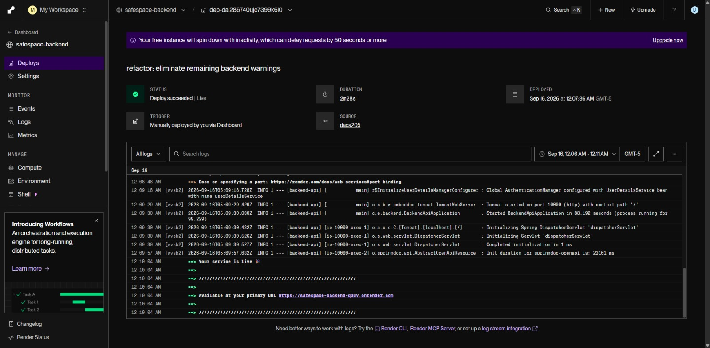

## 5.2. Product Implementation & Deployment

Esta sección presenta solo funcionalidades y productos que el equipo pueda ejecutar y verificar. Para cada evidencia se indica el repositorio, la versión, las historias relacionadas y el resultado observado. Los diseños del capítulo IV sirven como referencia, pero no sustituyen capturas de una aplicación en ejecución.

### 5.2.1. Sprint Backlogs

Como se mencionó previamente en el planeamiento del sprint número 1, el objetivo del mismo es desarrollar y desplegar una primera versión funcional de SafeSpace. Esto conlleva implementar las funcionalidades priorizadas para empleados, miembros de RR. HH. y administradores, relacionadas con el bienestar laboral, la comunicación y el seguimiento de situaciones que requieren atención.

Luego de definir el objetivo del sprint, se identificaron las historias de usuario útiles para este sprint. A continuación, se dividió cada historia de usuario en tareas relacionadas a la implementación y cumplimiento de dicha historia. Para ello, se utilizó la aplicación Jira que nos ayuda a gestionar el progreso del sprint.

[Jira Board - SafeSpace](https://milenkorvu.atlassian.net/jira/software/c/projects/SSB/boards/4/backlog)

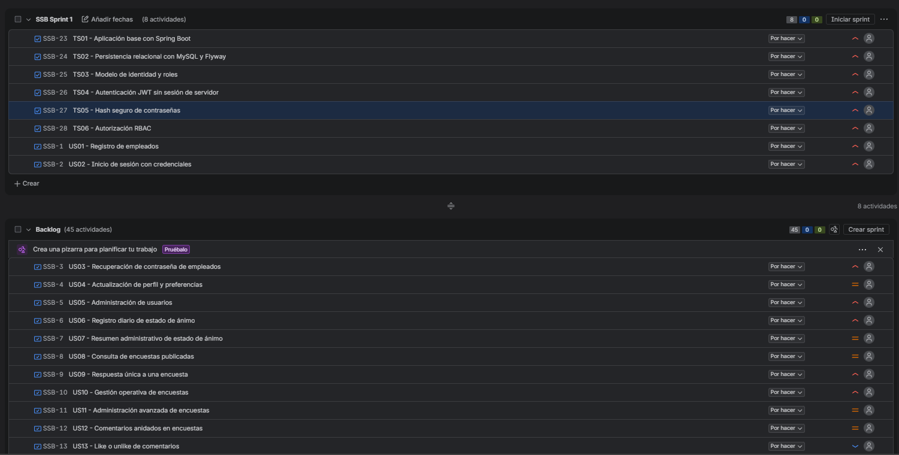

| Jira   | ID   | Historia de usuario                           | Epic |
| ------ | ---- | --------------------------------------------- | ---- |
| SSB-1  | US01 | Registro de empleados                         | EP01 |
| SSB-2  | US02 | Inicio de sesión con credenciales             | EP01 |
| SSB-4  | US04 | Actualización de perfil y preferencias        | EP01 |
| SSB-5  | US05 | Administración de usuarios                    | EP01 |
| SSB-6  | US06 | Registro diario de estado de ánimo            | EP02 |
| SSB-7  | US07 | Resumen administrativo de estado de ánimo     | EP02 |
| SSB-8  | US08 | Consulta de encuestas publicadas              | EP03 |
| SSB-9  | US09 | Respuesta única a una encuesta                | EP03 |
| SSB-10 | US10 | Gestión operativa de encuestas                | EP03 |
| SSB-11 | US11 | Administración avanzada de encuestas          | EP03 |
| SSB-12 | US12 | Comentarios anidados en encuestas             | EP03 |
| SSB-13 | US13 | Like de comentarios                           | EP03 |
| SSB-14 | US14 | Consulta de actividades abiertas              | EP04 |
| SSB-15 | US15 | Votación y cambio de voto                     | EP04 |
| SSB-16 | US16 | Gestión de actividades semanales              | EP04 |
| SSB-17 | US17 | Creación de reportes anónimos o identificados | EP05 |
| SSB-18 | US18 | Consulta de reportes propios                  | EP05 |
| SSB-19 | US19 | Revisión y actualización de reportes          | EP05 |
| SSB-20 | US20 | Registro de planes y comprobantes de pago     | EP06 |
| SSB-21 | US21 | Conversaciones con la IA                      | EP07 |
| SSB-22 | US22 | Envío de mensajes al asistente                | EP07 |

### 5.2.2. Implemented Landing Page Evidence

La landing presenta SafeSpace, explica su propuesta de valor y permite que una organización interesada solicite información o una demostración. La evidencia siguiente debe mostrar la versión realmente publicada y vinculada con sus historias de visitante.

| Evidencia                 | Información                                 |
| :------------------------ | :------------------------------------------ |
| Repositorio               | https://github.com/TheSuccesfulOnes/Landing-page-SafeSpace |
| URL publicada             | https://landing-page-safe-space.vercel.app/                |
| Commit/versión            | [a60e0bc](https://github.com/TheSuccesfulOnes/Landing-page-SafeSpace/commit/a60e0bcc070ceacf8466627ea67dd4e8bd688b87) / versión 1 |
| Historias implementadas   | US-VISITOR-01, US-VISITOR-02, US-VISITOR-03 |
| Interacciones verificadas | CTA, formulario y resultado real            |
| Responsive                | Funciona correctamente en desktop y móvil   |

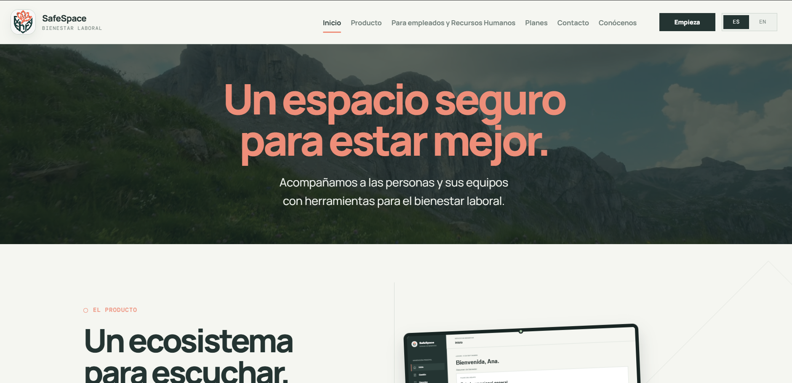

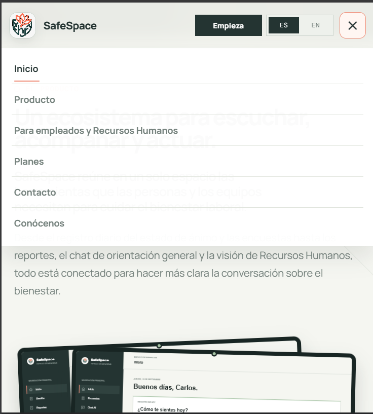

### 5.2.3. Implemented Frontend-Web Application Evidence

La aplicación web brinda acceso a las funciones que el repositorio tenga implementadas para empleados y RR. HH. Según el diseño documentado, estas incluyen estado de ánimo, encuestas, actividades, comentarios, reportes y vistas de resumen. Se debe conservar solo lo que funcione en la versión demostrada.

| Evidencia                     | Información                                                 |
| :---------------------------- | :---------------------------------------------------------- |
| Repositorio                   | https://github.com/TheSuccesfulOnes/Frontend-Web-SafeSpace |
| URL publicada o pasos locales | https://safespace-web-nine.vercel.app/                    |
| Commit/versión                | [33b18e6](https://github.com/TheSuccesfulOnes/Frontend-Web-SafeSpace/commit/33b18e67a856df88fd5d9644e85832c1f8af2848) / versión 1 |
| Tecnología implementada       | React, Vite y TypeScript                                    |
| Historias evidenciadas mediante capturas | US01, US02, US04, US06, US07, US08, US09, US10, US12, US13, US14, US15, US16, US17, US18, US19, US21 y US22 |

Las historias anteriores se identificaron revisando las páginas y servicios del repositorio. Las capturas visuales correspondientes se presentan a continuación, agrupadas por tipo de usuario y flujo.

US05, US11 y US20 se documentan en los contextos administrativos correspondientes del backend y/o del frontend administrativo.

#### Evidencias visuales del frontend web

##### Empleado: mood, encuestas, actividades, reportes y preferencias

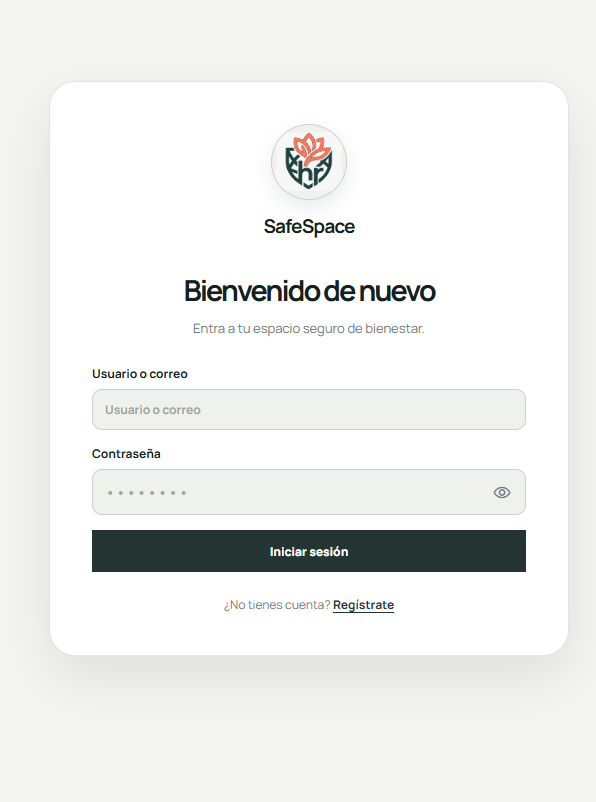

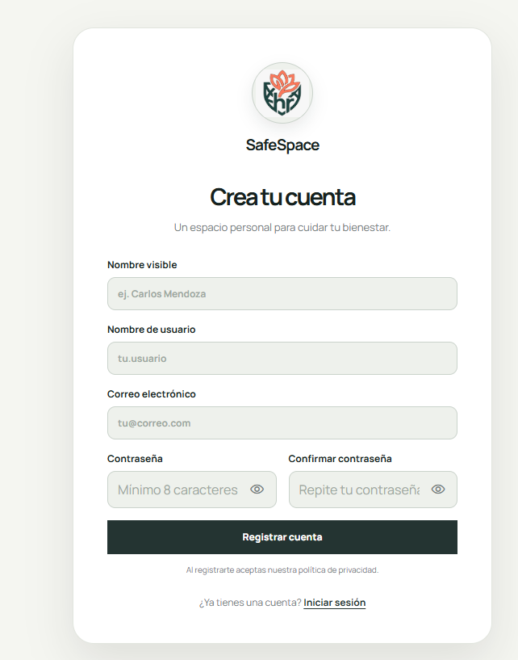

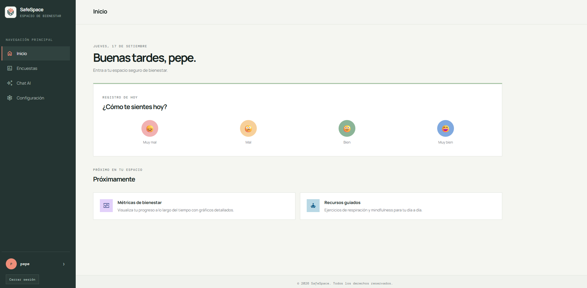

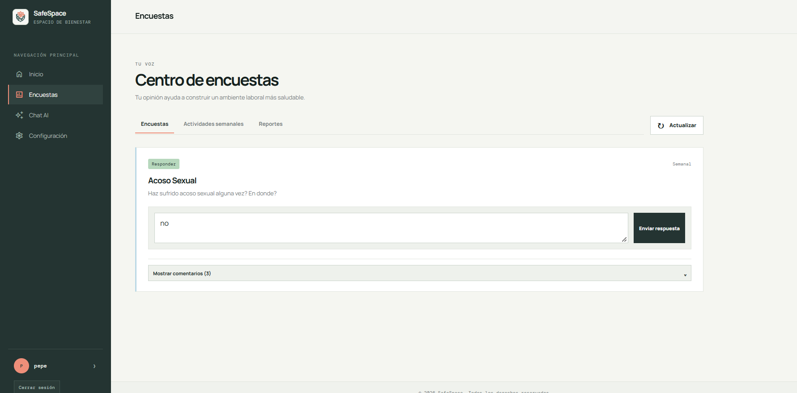

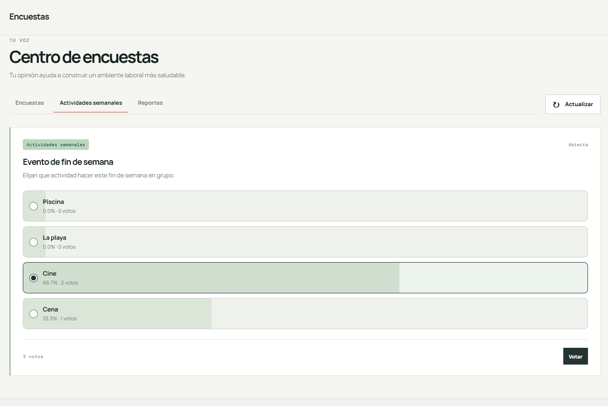

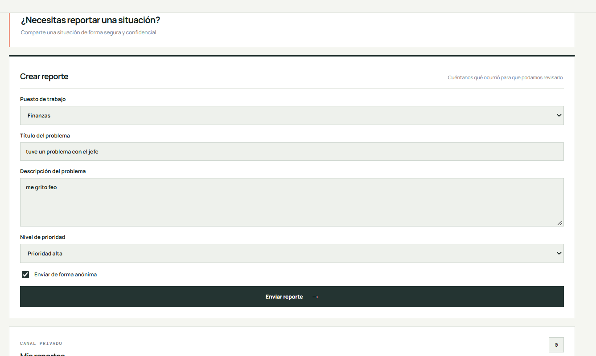

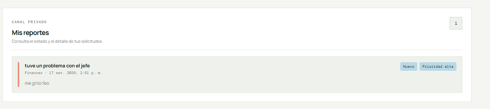

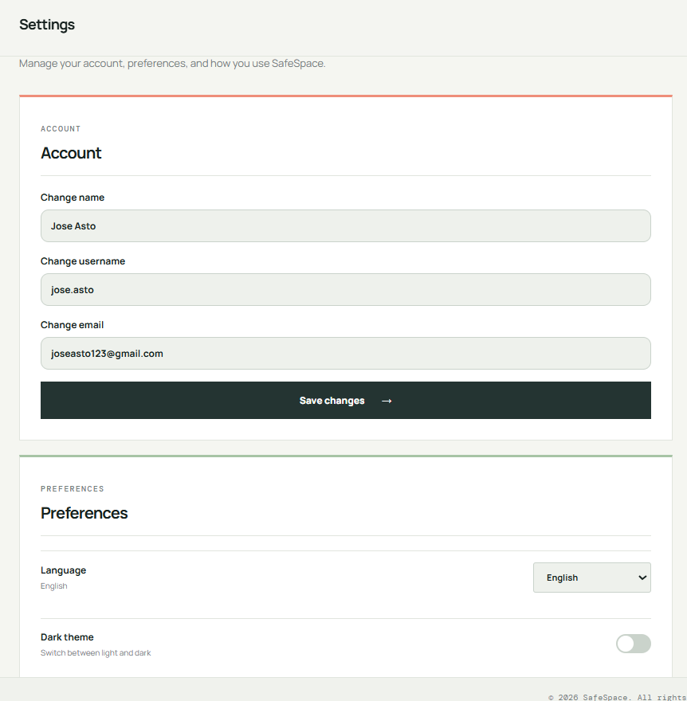

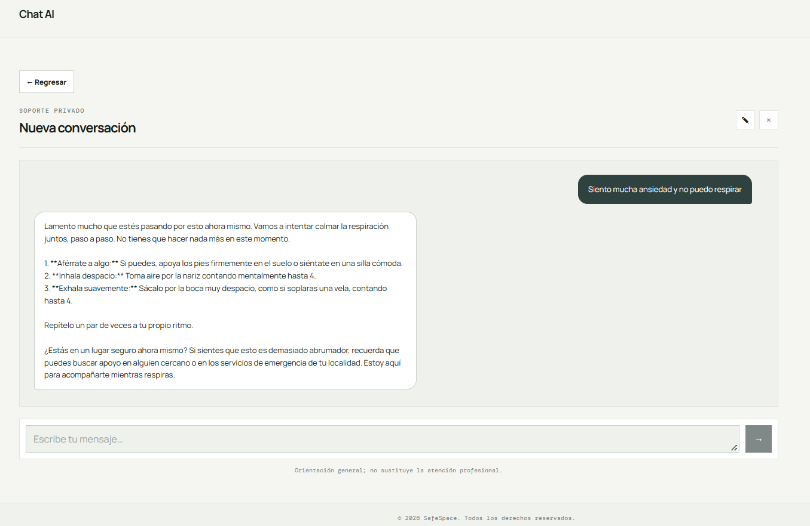

##### RR. HH.: resumen, encuestas, comentarios, actividades y reportes

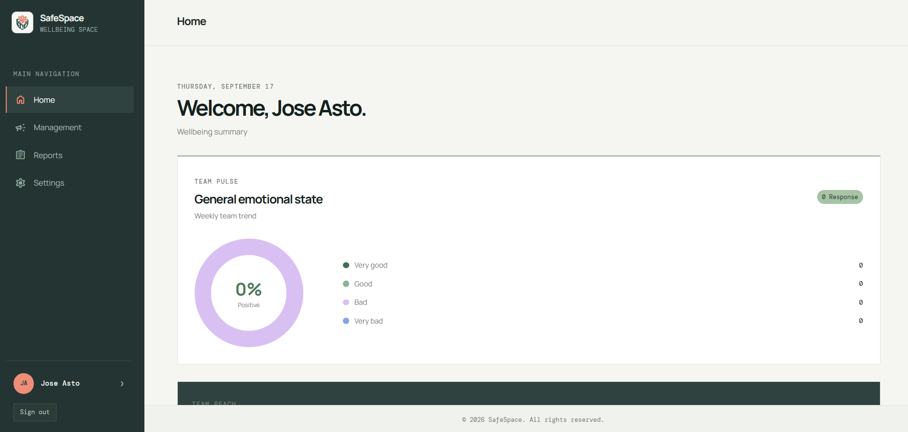

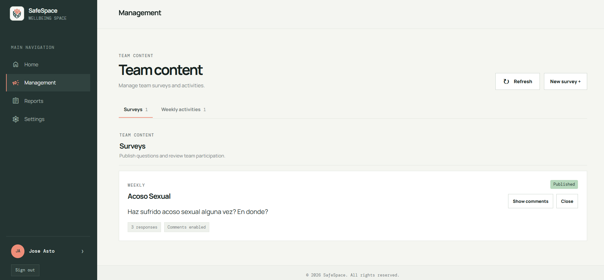

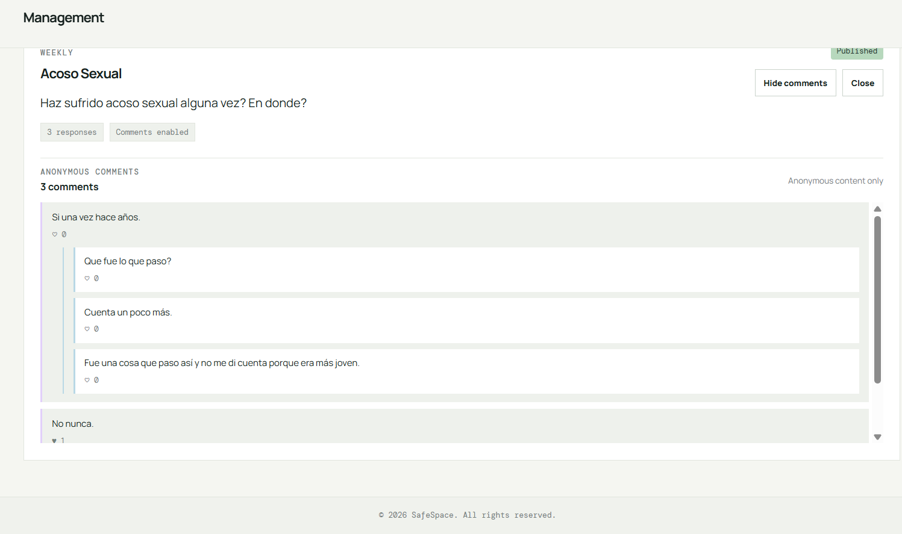

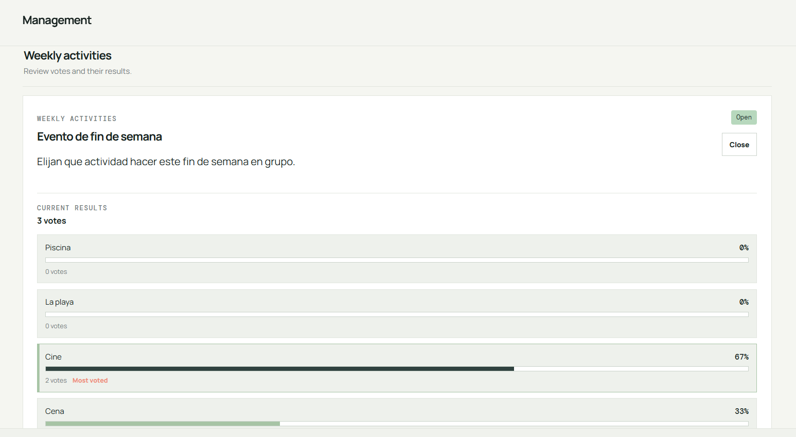

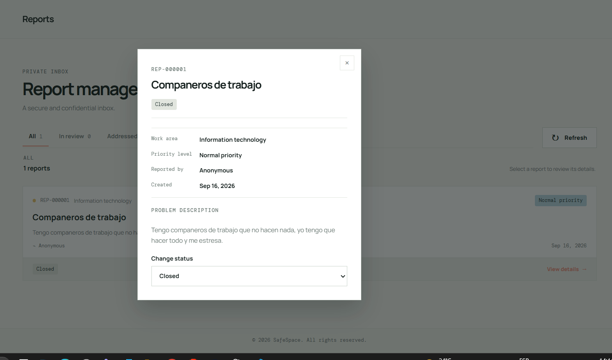

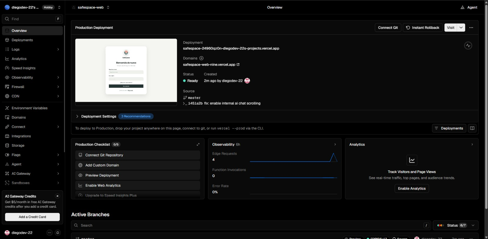

La aplicación administrativa cuenta con un repositorio y despliegue independientes:

| Evidencia                     | Información                                                  |
| :---------------------------- | :----------------------------------------------------------- |
| Repositorio                   | https://github.com/TheSuccesfulOnes/Frontend-Admin-SafeSpace |
| URL publicada                 | https://safespace-admin-alpha.vercel.app/                    |
| Commit/versión                | [b76e3e4](https://github.com/TheSuccesfulOnes/Frontend-Admin-SafeSpace/commit/b76e3e495c76243b8591b29a61d3ee9ca06c49d4) / versión 1 |

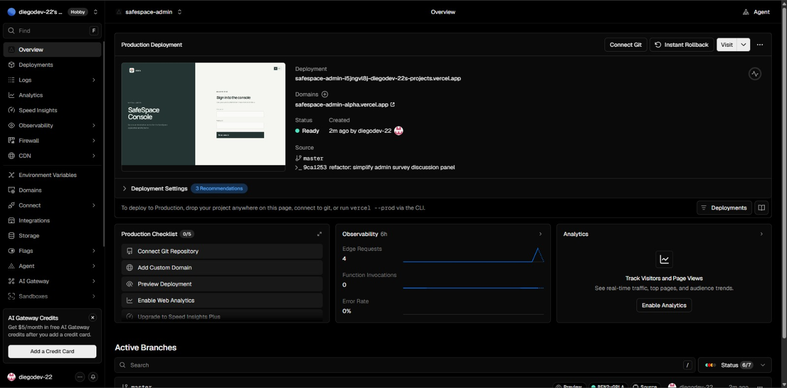

### 5.2.4. Implemented Native-Mobile Application Evidence

La aplicación nativa documentada para SafeSpace es Android con Kotlin y Jetpack Compose. Esta sección demuestra su ejecución en un emulador o dispositivo y relaciona cada función mostrada con una historia implementada.

| Evidencia                | Información                                                   |
| :----------------------- | :------------------------------------------------------------ |
| Repositorio              | https://github.com/TheSuccesfulOnes/Frontend-Movil-SafeSapace |
| Plataforma/dispositivo   | Android; SDK 36 y Java 21                                    |
| Versión de la aplicación | [ebe0602](https://github.com/TheSuccesfulOnes/Frontend-Movil-SafeSapace/commit/ebe0602e05f197a6af5fe80f625c25a615f01db0) / versión 1 |
| Artefacto                | Pendiente de recibir el APK/AAB                              |
| Instalación y ejecución  | Abrir en Android Studio con SDK 36 y Java 21; ejecutar `.\gradlew.bat clean app:build`. |
| Historias declaradas en el README del repositorio | US01, US02, US04, US06, US07, US08, US09, US12, US13, US14, US15, US17, US18, US21 y US22; la evidencia visual queda pendiente del APK. |

| Flujo                                | Estado real | Evidencia         |
| :----------------------------------- | :---------: | :---------------- |
| Acceso y perfil                      | Declarado en el README; falta evidencia visual | Pendiente de APK/capturas |
| Registro de ánimo                    | Declarado en el README; falta evidencia visual | Pendiente de APK/capturas |
| Encuestas, comentarios o actividades | Declarado en el README; falta evidencia visual | Pendiente de APK/capturas |
| Creación de reporte anónimo          | Declarado en el README; falta evidencia visual | Pendiente de APK/capturas |

Evidencia visual de la aplicación Android: pendiente de recibir el APK y sus capturas.

### 5.2.5. Implemented RESTful API and/or Serverless Backend Evidence

La API conecta las aplicaciones con las reglas de negocio y la persistencia de SafeSpace. Esta descripción se limita a módulos y endpoints presentes en el código y comprobados durante el Sprint.

| Evidencia                        | Información                                                                            |
| :------------------------------- | :------------------------------------------------------------------------------------- |
| Repositorio                      | https://github.com/TheSuccesfulOnes/Backend-SafeSpace |
| Stack implementado               | Java 21 y Spring Boot 3.5.9 |
| URL base o instrucciones locales | https://safespace-backend-q3uv.onrender.com |
| Base de datos                   | Firebase Firestore |
| Commit/versión                   | [4218059](https://github.com/TheSuccesfulOnes/Backend-SafeSpace/commit/42180596587208ca5ba4650d905e1cb4e8a00515) / versión 1 |
| Historias soportadas             | US01, US02, US04, US05, US06, US07, US08, US09, US10, US11, US12, US13, US14, US15, US16, US17, US18, US19, US20, US21 y US22 |

| Módulo                  | Método y ruta reales |
| :---------------------- | :------------------- |
| Autenticación           | `POST /api/v1/auth/login` |
| Estado de ánimo         | `GET /api/v1/mood/today` |
| Encuestas y comentarios | `GET /api/v1/surveys`; `GET /api/v1/surveys/1/comments` |
| Actividades             | `GET /api/v1/activities` |
| Reportes                | `GET /api/v1/reports` |

#### Evidencias adicionales de bounded contexts

| Contexto | Método y ruta reales |
| :------- | :------------------- |
| Perfil | `GET /api/v1/profile` |
| IA | `GET /api/v1/ai/conversations` |
| Administración de encuestas | `GET /api/v1/admin/surveys` |
| Administración de actividades | `GET /api/v1/admin/activities` |
| Administración de usuarios | `GET /api/v1/admin/users` |
| Pagos | `GET /api/v1/admin/payments/plans` |

#### Historias soportadas por los controladores del backend

La siguiente relación se obtuvo revisando los controladores y las rutas del repositorio `Backend-SafeSpace`.

| Contexto del backend | Controladores/rutas revisados | Historias relacionadas |
| :------------------- | :---------------------------- | :--------------------- |
| Autenticación | `/api/v1/auth/register`, `/api/v1/auth/login` y recuperación de contraseña | US01, US02 |
| Perfil | `/api/v1/profile`, `/account` y `/preferences` | US04 |
| Administración de usuarios | `/api/v1/admin/users` y `/hr-members` | US05 |
| Estado de ánimo | `/api/v1/mood/today` y `/summary` | US06, US07 |
| Encuestas | `/api/v1/surveys` y `/api/v1/admin/surveys` | US08, US09, US10, US11 |
| Comentarios | `/api/v1/surveys/{surveyId}/comments` y `/{commentId}/like` | US12, US13 |
| Actividades | `/api/v1/activities` y `/api/v1/admin/activities` | US14, US15, US16 |
| Reportes | `/api/v1/reports`, `/mine` y `/{id}/status` | US17, US18, US19 |
| Pagos | `/api/v1/admin/payments/plans` y `/api/v1/admin/payments` | US20 |
| IA | `/api/v1/ai/conversations` y `/messages` | US21, US22 |

Nota de consistencia: la indicación del equipo para este informe es Spring Boot 3.5.9; el `pom.xml` del clon revisado declara 3.5.5. Conviene sincronizar esa versión en el repositorio o confirmar cuál debe figurar como versión oficial antes de la entrega.

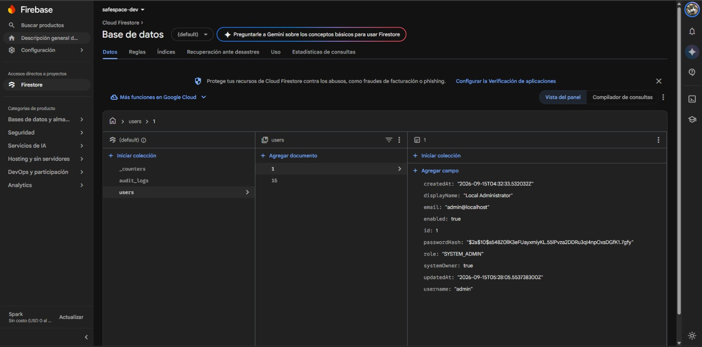

Las capturas siguientes presentan la documentación y las operaciones de los bounded contexts disponibles en Swagger UI.

##### Autenticación

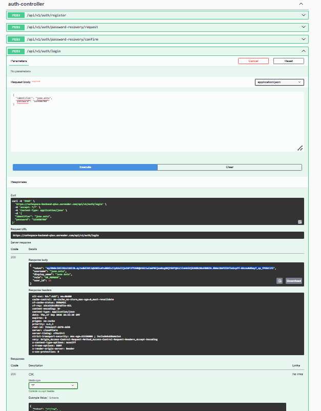

##### Perfil y estado de ánimo

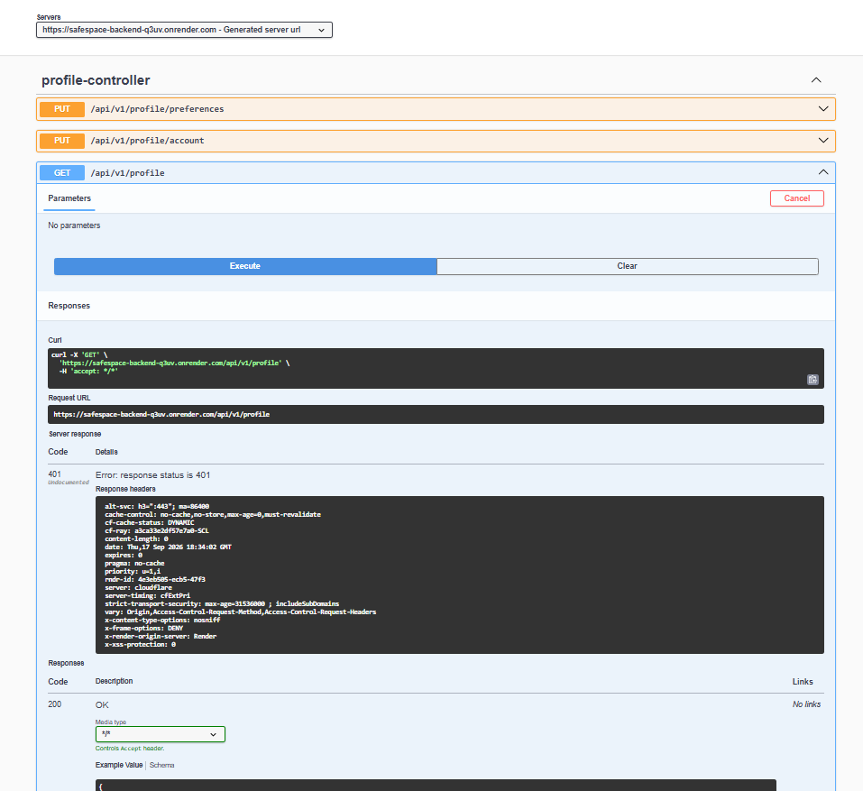

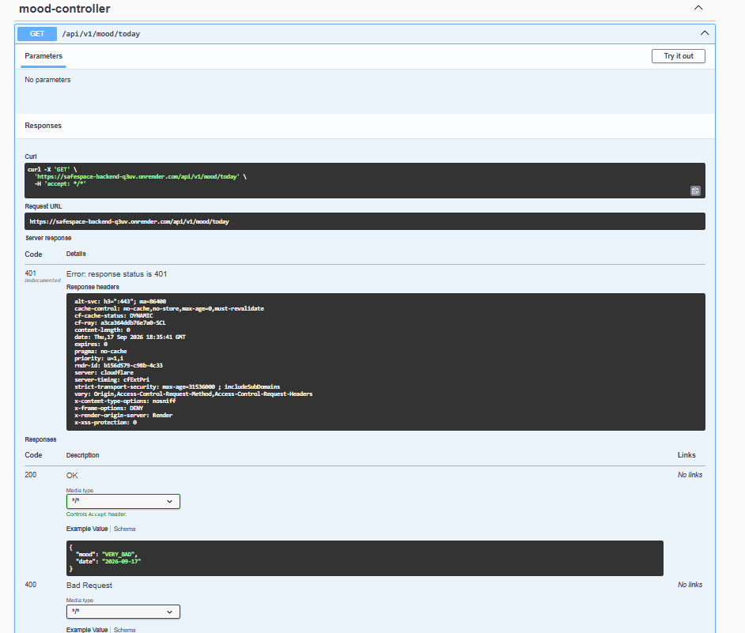

##### Encuestas, comentarios y actividades

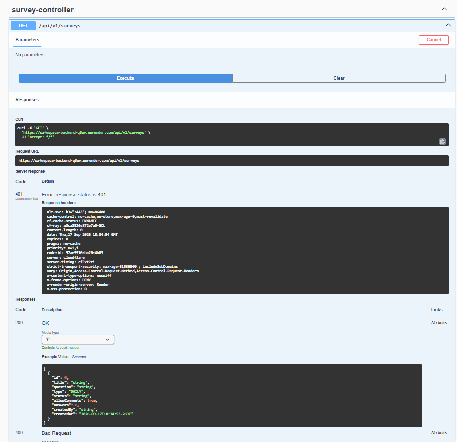

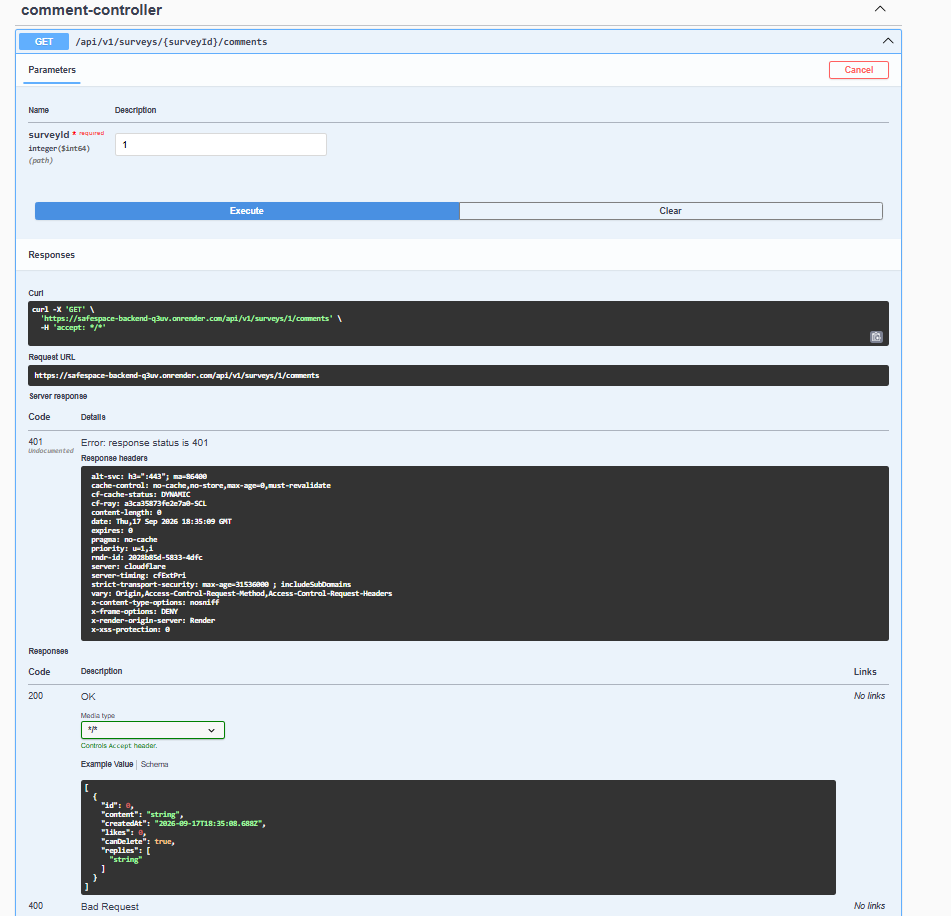

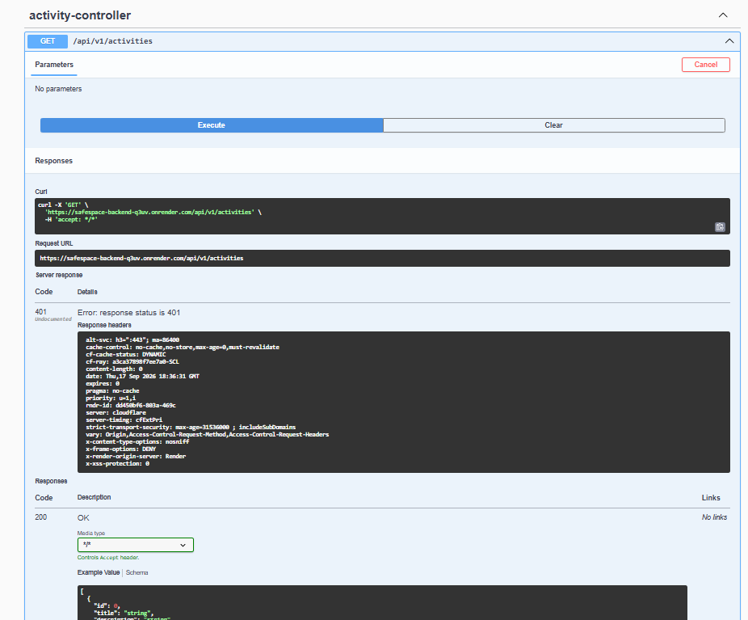

##### Reportes, IA, administración y pagos

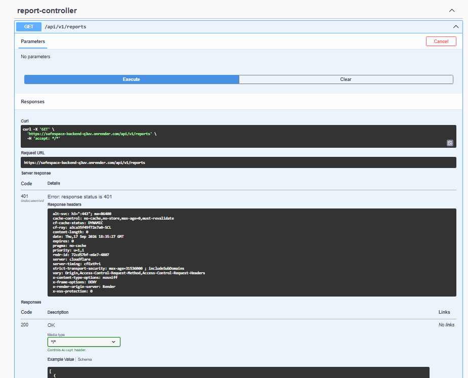

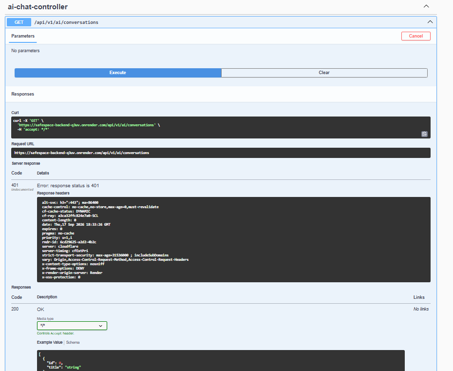

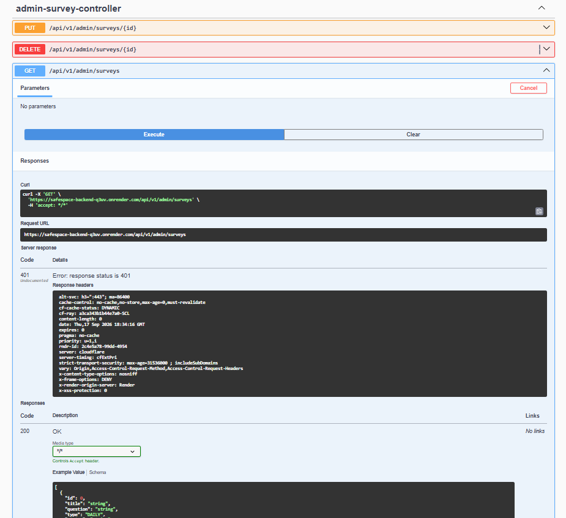

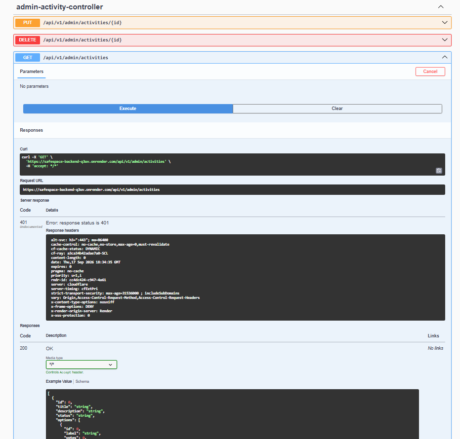

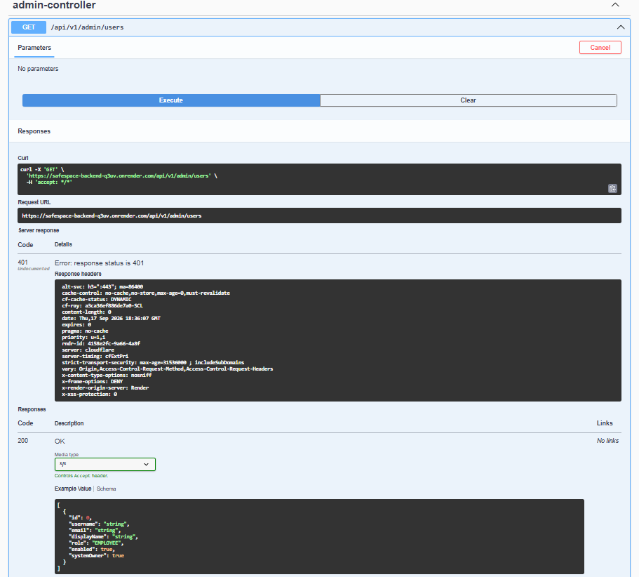

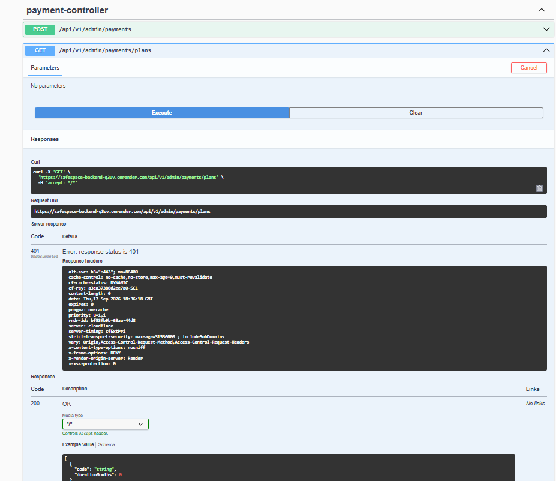

### 5.2.6. RESTful API Documentation

La especificación OpenAPI debe coincidir con los endpoints ejecutables. Para cada operación se documentan método, ruta, propósito, rol requerido, parámetros, cuerpo de solicitud, respuestas y errores.

URL de Swagger/OpenAPI: [https://safespace-backend-q3uv.onrender.com/swagger-ui/index.html](https://safespace-backend-q3uv.onrender.com/swagger-ui/index.html).

| Método | Ruta | Propósito | Parámetros/body | Rol requerido | Historia |
| :-----: | :--- | :-------- | :-------------- | :------------ | :------- |
| `POST` | `/api/v1/auth/register` | Registrar una cuenta de empleado | JSON de registro | Público | US01 |
| `POST` | `/api/v1/auth/login` | Autenticar al usuario | JSON con identificador y contraseña | Público | US02 |
| `GET` | `/api/v1/profile` | Consultar el perfil actual | Sin body | Usuario autenticado | US04 |
| `PUT` | `/api/v1/profile/preferences` | Actualizar preferencias | Idioma y tema en JSON | Usuario autenticado | US04 |
| `GET` | `/api/v1/mood/today` | Consultar el estado de ánimo del día | Sin body | Usuario autenticado | US06 |
| `GET` | `/api/v1/mood/summary` | Consultar el resumen agregado de mood | Sin body | RR. HH. o administrador | US07 |
| `GET` | `/api/v1/surveys` | Consultar encuestas publicadas | Sin body | Usuario autenticado | US08 |
| `POST` | `/api/v1/surveys/{id}/answers` | Registrar una respuesta | `id` de encuesta y respuesta en JSON | Usuario autenticado | US09 |
| `GET` | `/api/v1/surveys/{surveyId}/comments` | Consultar comentarios de una encuesta | `surveyId` en la ruta | Usuario autenticado | US12 |
| `POST` | `/api/v1/surveys/{surveyId}/comments/{commentId}/like` | Registrar un like | `surveyId` y `commentId` en la ruta | Usuario autenticado | US13 |
| `GET` | `/api/v1/activities` | Consultar actividades abiertas | Sin body | Usuario autenticado | US14 |
| `POST` | `/api/v1/activities/{id}/votes` | Registrar o cambiar un voto | `id` y `option_id` en JSON | Usuario autenticado | US15 |
| `GET` | `/api/v1/reports/mine` | Consultar reportes propios | Sin body | Usuario autenticado | US18 |
| `GET` | `/api/v1/reports` | Consultar reportes para seguimiento | Sin body | RR. HH. o administrador | US19 |
| `GET` | `/api/v1/ai/conversations` | Listar conversaciones con la IA | Sin body | Empleado | US21 |
| `POST` | `/api/v1/ai/conversations/{id}/messages` | Enviar un mensaje al asistente | `id` y contenido en JSON | Empleado | US22 |
| `GET` | `/api/v1/admin/users` | Listar usuarios | Sin body | Administrador | US05 |
| `GET` | `/api/v1/admin/surveys` | Consultar encuestas en administración | Sin body | Administrador | US10, US11 |
| `GET` | `/api/v1/admin/activities` | Consultar actividades en administración | Sin body | Administrador | US16 |
| `GET` | `/api/v1/admin/payments/plans` | Consultar planes disponibles | Sin body | Administrador | US20 |

La tabla resume las operaciones documentadas en OpenAPI y las capturas visuales asociadas a los bounded contexts del backend.

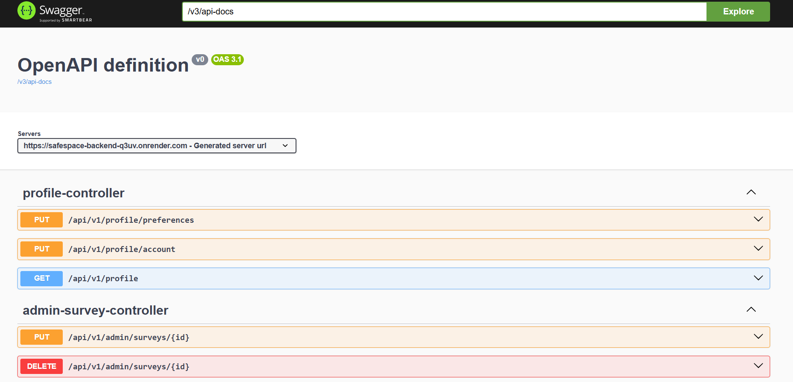

### 5.2.7. Team Collaboration Insights

La participación del equipo durante el AV1 se presenta mediante la captura general de GitHub Insights. La tabla de commits de referencia de la sección 5.1.2 conserva el historial técnico observado en los repositorios.

Captura general de GitHub Insights para AV1:

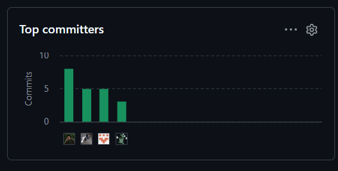

## 5.3. Video About-the-Product

El video presenta el problema de comunicación y bienestar laboral, la propuesta de SafeSpace y una demostración breve de las versiones implementadas. Debe mostrar resultados reales, usar datos ficticios o anonimizados y distinguir las funciones disponibles de las que siguen en desarrollo.

| Campo                   | Información                                                                                          |
| :---------------------- | :--------------------------------------------------------------------------------------------------- |
| Título                  | SafeSpace — bienestar laboral seguro y humano                                                        |
| Duración                | [[COMPLETAR: duración real; objetivo de 1 a 3 minutos]]                                              |
| URL Microsoft Stream    | [[INSERTAR ENLACE]]                                                                                  |
| URL YouTube             | [[INSERTAR ENLACE]]                                                                                  |
| Captura/miniatura       | Pendiente de proporcionar |
| Ubicación en la landing | [[INSERTAR URL O SECCIÓN DONDE SE EMBEBE]]                                                           |

|   Tiempo    | Contenido                                                         |
| :---------: | :---------------------------------------------------------------- |
| 00:00–00:20 | Problema que enfrentan los empleados y RR. HH.                    |
| 00:20–00:45 | Propuesta de valor de SafeSpace y segmentos a los que sirve.      |
| 00:45–01:20 | Demostración de la landing y su acción principal.                 |
| 01:20–02:00 | Flujo implementado de la aplicación web para RR. HH.              |
| 02:00–02:40 | Flujo implementado de la aplicación móvil Android para empleados. |
| 02:40–03:00 | Resultado del flujo y cierre.                                     |

El video incluye al menos una opinión de un representante de cada segmento objetivo. Registrar su autorización para aparecer, utilizar extractos breves y evitar datos personales o información laboral identificable. Si no se cuenta con esas opiniones, no presentar esta fila como cumplida y consultar el criterio de evaluación.

\newpage
