# Capítulo VI: Product Verification & Validation

Este capítulo reúne pruebas del backend y de la aplicación web, escenarios de aceptación vinculados con las historias del Capítulo III y capturas de la interfaz móvil. El backend usa Java 21, Spring Boot 3.5.5, JUnit 5, Mockito y Cucumber; la aplicación web usa React, TypeScript, Vitest y Playwright.

## 6.1. Testing Suites & Validation

Las cifras siguientes provienen de artefactos de ejecución ya disponibles en los repositorios. No se lanzó una nueva ejecución de pruebas durante la revisión de este informe. En backend existen tres registros con totales distintos; se muestran como ejecuciones separadas y no se combinan.

| Producto/evidencia | Fuente | Resultado que declara |
| :--- | :--- | :--- |
| Backend, ejecución documentada | Backend-SafeSpace/TESTING.md | 960 casos en 60 suites; 488 unitarios y 472 de integración local; 0 fallas, errores u omitidos. |
| Backend, inventario JSON actual | src/test/resources/validation-inventory.json | 966 casos en 60 suites; 0 fallas, errores u omitidos. |
| Backend, captura de GitHub Actions | backend-ci-summary.png | 958 pruebas aprobadas en una ejecución anterior, identificada en la captura como 06/10/2026. |
| Frontend web, pruebas unitarias e integración local | Frontend-Web-SafeSpace/TESTING.md | 494 casos aprobados: 489 Vitest y 5 casos Node conservados. |
| Frontend web, pruebas de sistema con Playwright | playwright-report-summary-current.png | 6 casos aprobados; 0 fallidos, inestables u omitidos. |
| Integración continua | Backend-SafeSpace/.github/workflows/ci.yml | Existe un workflow de backend; no se encontró un workflow GitHub Actions en el repositorio conectado del frontend web. |

La documentación del backend, su inventario y la captura de CI no coinciden (960, 966 y 958). Corresponden a distintos artefactos o ejecuciones; no se presenta uno como total consolidado. Para la entrega final se debe ejecutar una corrida limpia, regenerar el inventario y actualizar la captura y la cifra de TESTING.md. El frontend informa 494 casos en su documentación local; sus archivos de prueba y configuración también tienen cambios locales pendientes de integrar al repositorio remoto.


### 6.1.1. Core Entities Unit Tests

Las suites unitarias se organizan por entidad y comportamiento. Cada caso indica qué comprueba y muestra el resultado de su ejecución.

#### Registro e inicio de sesión — AuthServiceTest (US01–US02)

Ubicación: `src/test/java/com/experimentos/backend/authentication/application/AuthServiceTest.java`.

Verifica el registro de empleados, la codificación de contraseñas y el rechazo de contraseñas no coincidentes, débiles o de credenciales inválidas. La ejecución individual terminó con **11 pruebas aprobadas, 0 fallas y 0 errores**.

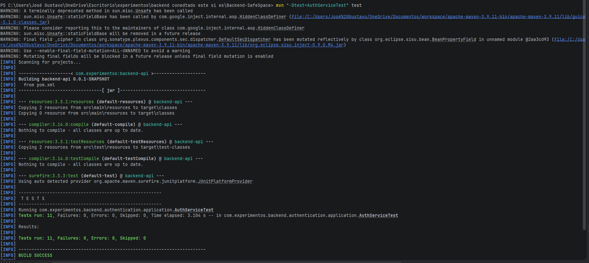

#### Registro diario y resumen de ánimo — MoodServiceTest (US06–US07)

Ubicación: `src/test/java/com/experimentos/backend/mood/application/MoodServiceTest.java`.

Comprueba el registro diario único, el rechazo de registros duplicados y el cálculo del resumen anónimo según la fecha de negocio. La ejecución individual terminó con **4 pruebas aprobadas, 0 fallas y 0 errores**.

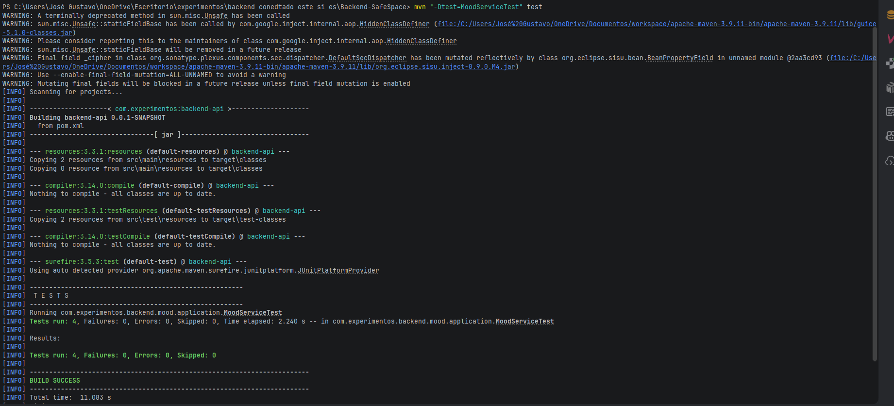

#### Consulta y respuesta a encuestas — SurveyServiceTest (US08–US09)

Ubicación: `src/test/java/com/experimentos/backend/survey/application/SurveyServiceTest.java`.

Comprueba el indicador de respuesta del usuario, la prevención de respuestas duplicadas y la publicación anónima de la respuesta como comentario raíz. La ejecución individual terminó con **3 pruebas aprobadas, 0 fallas y 0 errores**.

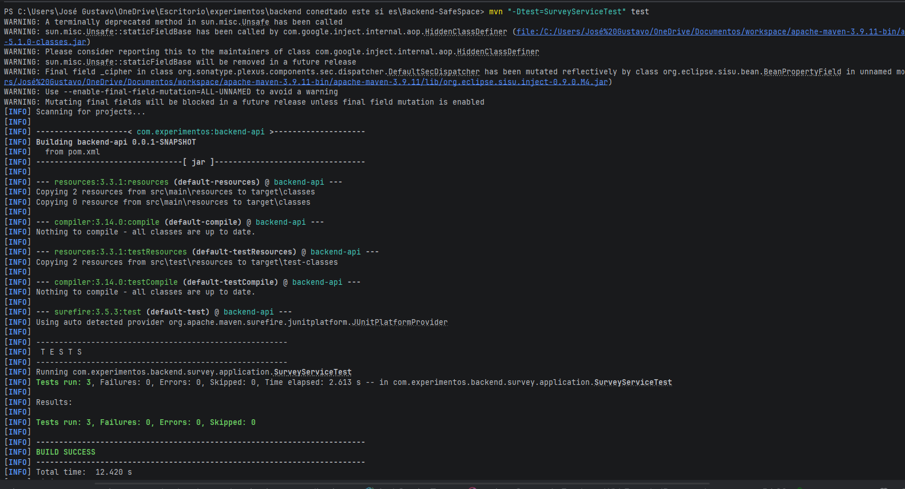

Fragmento representativo de la prueba que impide guardar una segunda respuesta:

```java
assertThatThrownBy(
        () -> service().answer(10L, new SurveyDtos.AnswerRequest("A second answer")))
    .isInstanceOf(IllegalArgumentException.class)
    .hasMessage("Survey has already been answered");
verify(answers, never()).save(any());
verify(comments, never()).save(any());
```

Fuente: `src/test/java/com/experimentos/backend/survey/application/SurveyServiceTest.java`.

#### Privacidad de reportes anónimos — ReportServiceTest (US17–US18)

Ubicación: `src/test/java/com/experimentos/backend/report/application/ReportServiceTest.java`.

Comprueba que el propietario pueda consultar su reporte anónimo sin exponer la identidad del remitente. La ejecución individual terminó con **1 prueba aprobada, 0 fallas y 0 errores**.

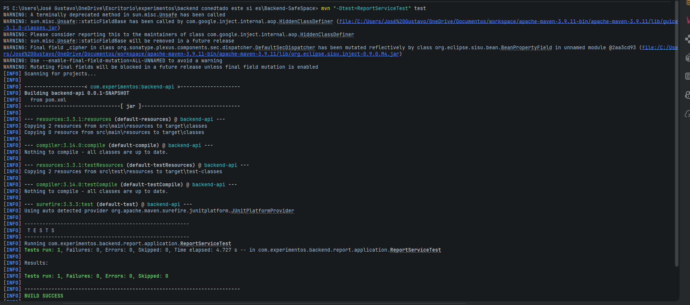

Fragmento representativo de las aserciones de privacidad y propiedad del reporte:

```java
assertThat(created.reporterDisplayName()).isNull();
assertThat(ReflectionTestUtils.getField(saved, "user")).isSameAs(employee);
```

Fuente: `src/test/java/com/experimentos/backend/report/application/ReportServiceTest.java`.

**Resultado de las cuatro suites documentadas: 19 pruebas aprobadas, 0 fallas y 0 errores.**

### 6.1.2. Core Integration Tests

Las pruebas de integración componen módulos en un entorno local para comprobar su comunicación. El inventario del backend clasifica **472 ejecuciones como integración local**. Las suites de esta sección son una muestra representativa de seguridad HTTP, validación de solicitudes, servicios, persistencia y adaptadores externos. Cuando una suite mezcla unitarias e integración, se indica el desglose del inventario; la captura corresponde a la ejecución completa de esa clase.

#### Seguridad de controladores y rutas protegidas

Estas cinco suites usan `MockMvc` y la cadena real de Spring Security/JWT para probar acceso HTTP, roles permitidos, tokens ausentes o inválidos, cuentas deshabilitadas/eliminadas y ausencia de sesión de servidor. Los servicios y el repositorio de usuarios son dobles locales; no se consulta infraestructura desplegada. Cada suite contiene 20 escenarios; juntas aportan **100 casos de integración**.

| Suite | Ruta protegida | Qué comprueba |
| :--- | :--- | :--- |
| `ActivityControllerSecurityTest` | `/api/v1/activities/managed` | Acceso autorizado a actividades administradas y rechazo de identidades/tokens no válidos. |
| `MoodControllerSecurityTest` | `/api/v1/mood/summary` | Protección del resumen de ánimo frente a roles, cuentas y tokens no autorizados. |
| `AiChatControllerSecurityTest` | `/api/v1/ai/conversations` | Control de autenticación y autorización del endpoint de conversaciones. |
| `SurveyControllerSecurityTest` | `/api/v1/surveys/managed` | Control de acceso a la consulta administrativa de encuestas. |
| `ReportControllerSecurityTest` | `/api/v1/reports` | Protección de la consulta de reportes y validación de la identidad vigente. |

Ubicación de las clases: `src/test/java/com/experimentos/backend/validation/`.

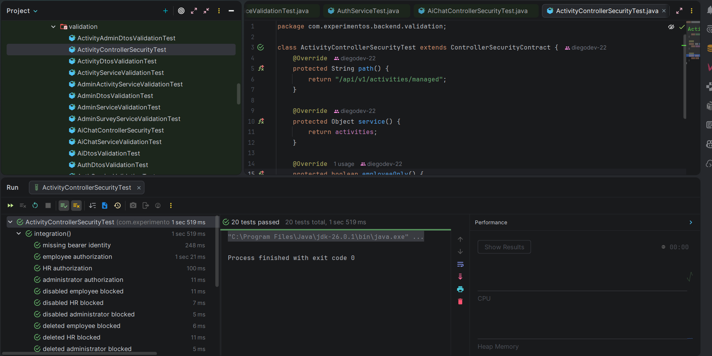

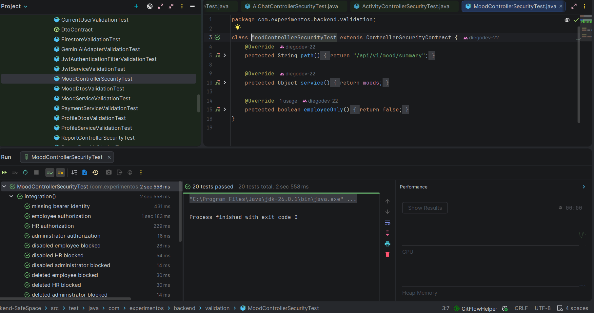

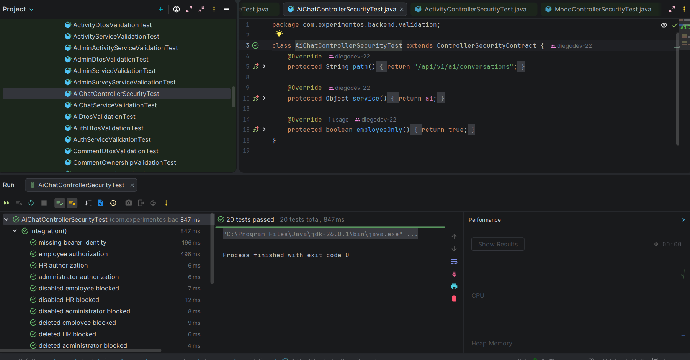

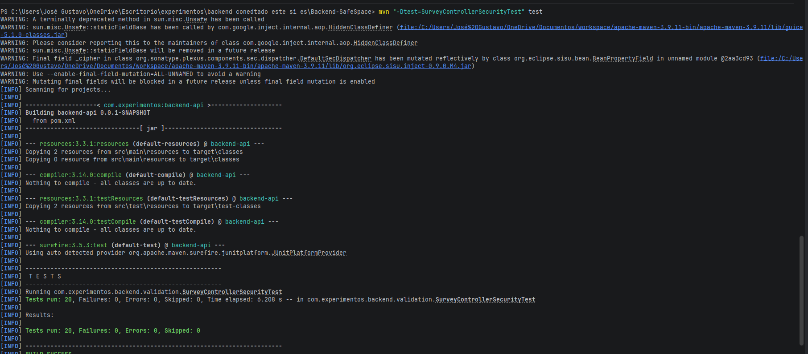

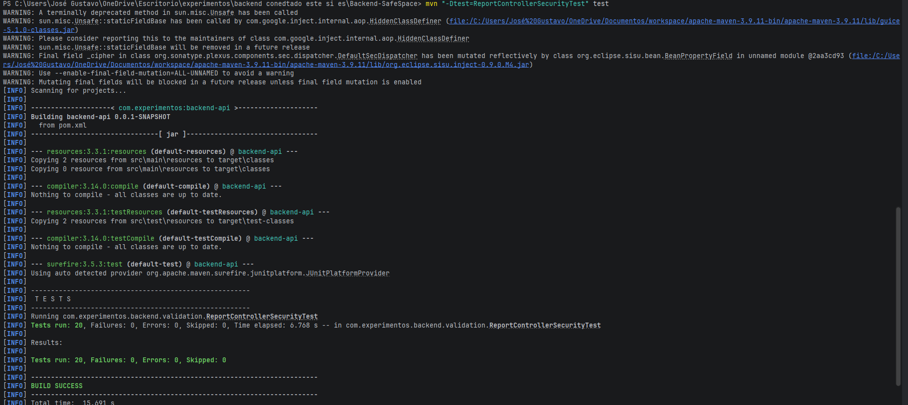

#### Contrato HTTP y reglas del servicio de encuestas

`SurveyDtosValidationTest` prueba solicitudes de creación y respuesta a encuestas: campos obligatorios, valores en blanco, límites de longitud, tipos admitidos y payloads válidos. Combina validación/decodificación HTTP con validaciones unitarias; su desglose es **20 casos (10 unitarios y 10 de integración)**.

`SurveyServiceValidationTest` protege el ciclo de respuesta: encuesta inexistente, no publicada o cerrada, permisos, respuestas vacías/duplicadas, persistencia de respuesta y comentario anónimo, y compensación si falla una escritura. La suite contiene **20 casos (12 unitarios y 8 de integración HTTP)**.

Ambas clases están en `src/test/java/com/experimentos/backend/validation/`.

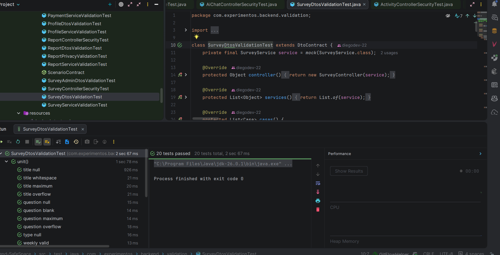

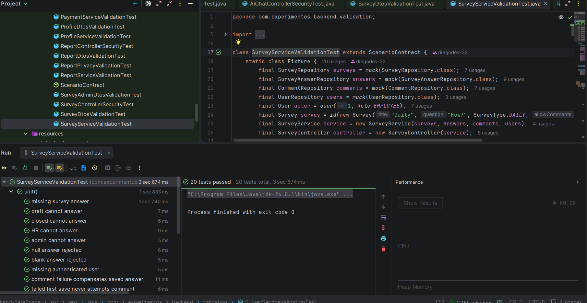

#### Persistencia Firestore y claves compuestas

`FirestoreValidationTest` verifica la traducción de entidades a documentos y su hidratación, la protección de hashes de contraseña en entidades relacionadas y el manejo de lecturas/escrituras fallidas. Usa Firestore simulado: **20 casos, 12 unitarios y 8 de integración local**; no conecta con una base desplegada.

`CompositeIdRepositoryTest` comprueba que los repositorios de votos de actividad y likes de comentarios usen el identificador compuesto correcto al eliminar documentos. Son **2 pruebas de integración local** con el SDK de Firestore simulado.

Ubicaciones: `src/test/java/com/experimentos/backend/validation/FirestoreValidationTest.java` y `src/test/java/com/experimentos/backend/shared/infrastructure/firebase/repositories/CompositeIdRepositoryTest.java`.

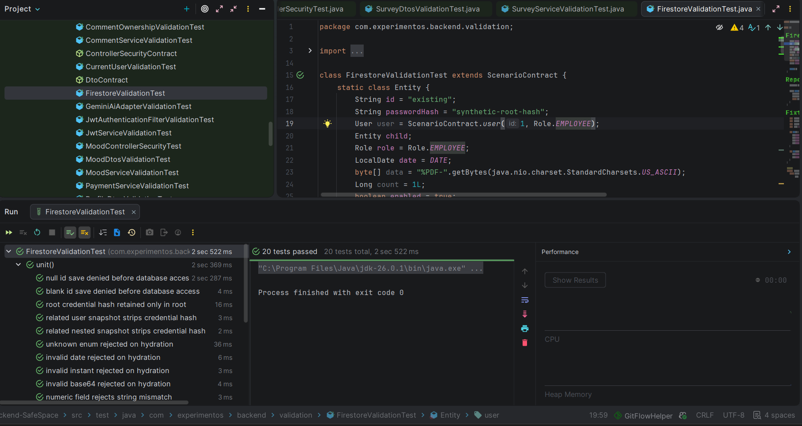

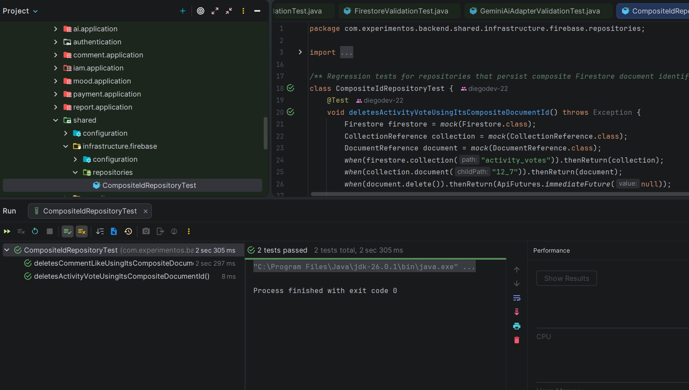

#### Adaptador HTTP del proveedor de IA

`GeminiAiAdapterValidationTest` verifica la solicitud REST del adaptador —URL, método, cabecera y contenido— y el tratamiento de respuestas vacías o malformadas, errores HTTP 429 y fallas de transporte. `MockRestServiceServer` intercepta las llamadas, por lo que no se contacta a Gemini. La suite mostrada contiene **20 casos (2 unitarios y 18 de integración local)**.

Ubicación: `src/test/java/com/experimentos/backend/validation/GeminiAiAdapterValidationTest.java`.

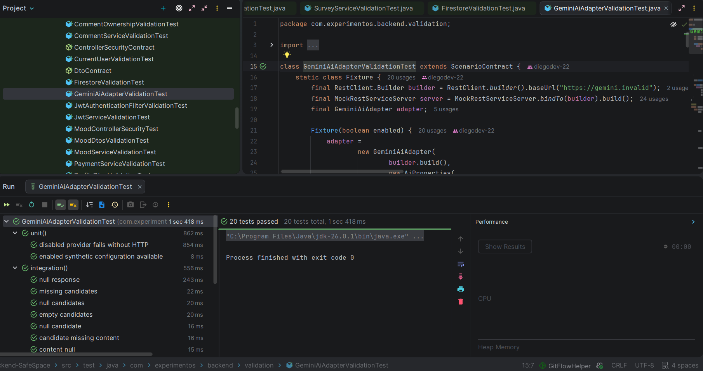

Fragmento del contrato común: crea solicitudes HTTP con `MockMvc`, aplica la cadena de filtros de seguridad y comprueba la respuesta y el carácter stateless de la API.

```java
var result = MockMvcBuilders.webAppContextSetup(context)
        .addFilters(chain)
        .build()
        .perform(request)
        .andReturn();

assertThat(result.getResponse().getStatus()).isEqualTo(expected);
assertThat(result.getRequest().getSession(false)).isNull();
```

Fuente: `src/test/java/com/experimentos/backend/validation/ControllerSecurityContract.java`.

En conjunto, las suites de seguridad mostradas registran **100 pruebas aprobadas**. Las demás capturas muestran ejecuciones completas de suites mixtas o de integración local, con sus conteos separados arriba. Esta evidencia no se presenta como prueba end-to-end ni como conexión a servicios externos desplegados.

### 6.1.3. Core Behavior-Driven Development

Se implementó BDD con **Cucumber JVM 7.20.1**. Cuatro archivos `.feature` expresan criterios de aceptación ejecutables para flujos del producto: respuesta de encuestas, registro diario de ánimo, votación de actividades semanales y privacidad de reportes. Cada escenario se ejecuta como una prueba dinámica de JUnit 5 a través del controlador y el servicio correspondientes, usando `MockMvc` y repositorios simulados. Esto valida el comportamiento HTTP y de aplicación localmente; no se presenta como prueba end-to-end ni como conexión a Firestore.

La suite BDD contiene **8 escenarios y 33 pasos aprobados** en la ejecución documentada. Los pasos se encuentran en clases Java separadas por flujo bajo `src/test/java/com/experimentos/backend/validation/bdd/`; `CoreBehaviorBddTest.java` ejecuta los escenarios de `src/test/resources/features/`. Esta cifra describe los escenarios BDD y no resuelve la discrepancia de totales Maven registrada en la tabla inicial. Los archivos BDD aparecen como cambios locales sin confirmar en el repositorio conectado; su resultado no se atribuye a una ejecución del workflow remoto.

#### Respuesta a encuestas — `survey-answer.feature`

```gherkin
Feature: Answer a weekly wellbeing survey
  Employees can submit one response to an open survey.

  Scenario: An employee submits a response successfully
    Given a published weekly survey is available to an employee
    When the employee submits the response "The app feels clear"
    Then the API responds with HTTP status 200
    And the answer and its root comment are persisted

  Scenario: An employee cannot submit a duplicate response
    Given a published weekly survey is available to an employee
    And the employee has already answered this survey
    When the employee submits the response "The app feels clear"
    Then the API responds with HTTP status 400
    And no additional answer or comment is persisted
```

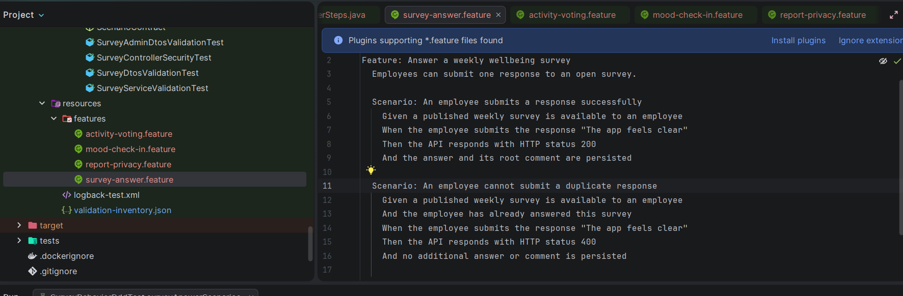

#### Registro de ánimo diario — `mood-check-in.feature`

```gherkin
Feature: Daily mood check-in
  Employees can record how they feel once per business day.

  Scenario: An employee records today's mood
    Given the employee has not recorded a mood today
    When the employee submits the mood "GOOD"
    Then the mood API confirms the submission with HTTP status 200
    And the mood is stored for the current business date

  Scenario: An employee cannot submit a second mood on the same day
    Given the employee has already recorded a mood today
    When the employee submits the mood "VERY_GOOD"
    Then the mood API confirms the submission with HTTP status 400
    And no mood entry is saved
```

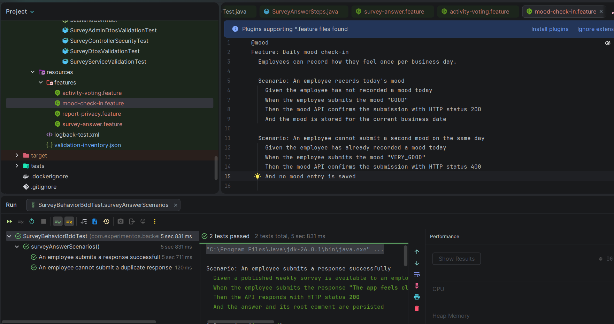

#### Votación de actividades — `activity-voting.feature`

```gherkin
Feature: Vote on a weekly team activity
  Employees can select an option and change their vote while the activity is open.

  Scenario: An employee votes for an open activity option
    Given an employee has not voted on the open activity
    When the employee votes for "Yoga"
    Then the activity vote is accepted with HTTP status 200
    And the selected activity option is persisted

  Scenario: An employee can replace their activity vote
    Given an employee has already selected "Yoga" on the open activity
    When the employee votes for "Walk"
    Then the activity vote is accepted with HTTP status 200
    And the previous vote is replaced by the selected option
```

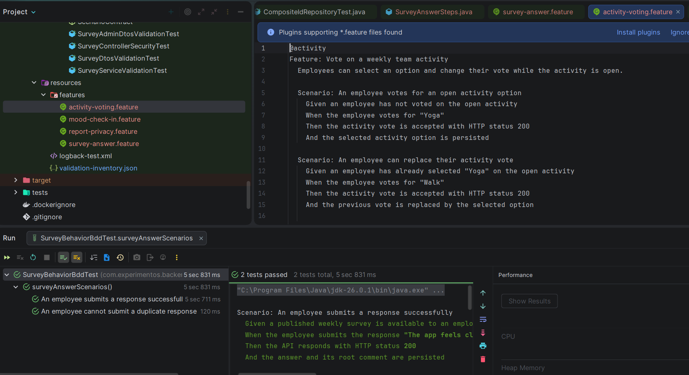

#### Privacidad de reportes — `report-privacy.feature`

```gherkin
Feature: Protect identity when submitting a workplace report
  Employees may choose whether their identity is disclosed in a report.

  Scenario: An anonymous report hides the reporter's identity
    Given the employee chooses to submit the report anonymously
    When the employee submits a workplace report
    Then the report API confirms creation with HTTP status 200
    And the response does not disclose the reporter's identity

  Scenario: An identified report shows the reporter's name
    Given the employee chooses to submit the report with their identity
    When the employee submits a workplace report
    Then the report API confirms creation with HTTP status 200
    And the response includes the reporter's display name
```

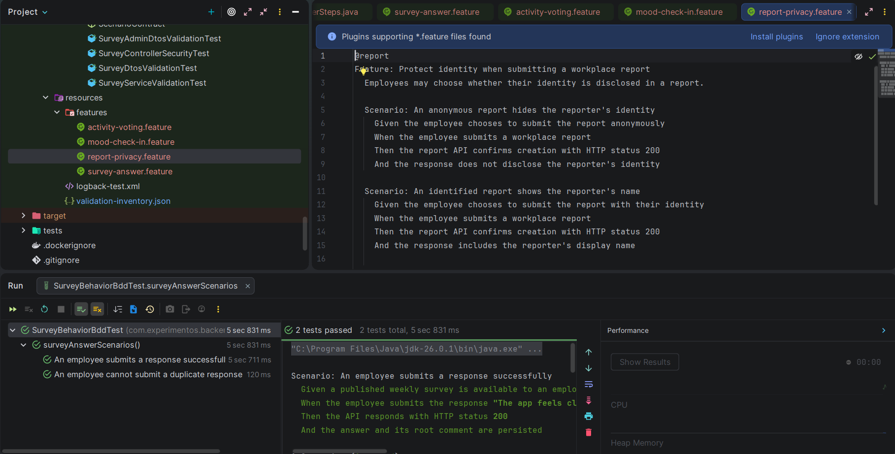

| Feature | Escenarios | Qué valida |
| :--- | ---: | :--- |
| `survey-answer.feature` | 2 | Envío válido y rechazo de respuesta duplicada; persiste respuesta y comentario raíz. |
| `mood-check-in.feature` | 2 | Registro del ánimo del día y rechazo de un segundo registro diario. |
| `activity-voting.feature` | 2 | Voto por una opción abierta y reemplazo del voto anterior. |
| `report-privacy.feature` | 2 | Creación de reportes anónimos e identificados y exposición de identidad según elección. |

En conjunto, los escenarios cubren resultados aceptados y rechazados, persistencia esperada y reglas de privacidad. Las capturas ubicadas junto a cada feature documentan los archivos Gherkin en el IDE; sus paneles inferiores muestran una ejecución previa de solo dos escenarios de encuestas y no se toman como evidencia de la suite ampliada.

#### Evidencia de ejecución

La ejecución de `CoreBehaviorBddTest` muestra los **8 escenarios aprobados** de las cuatro features.

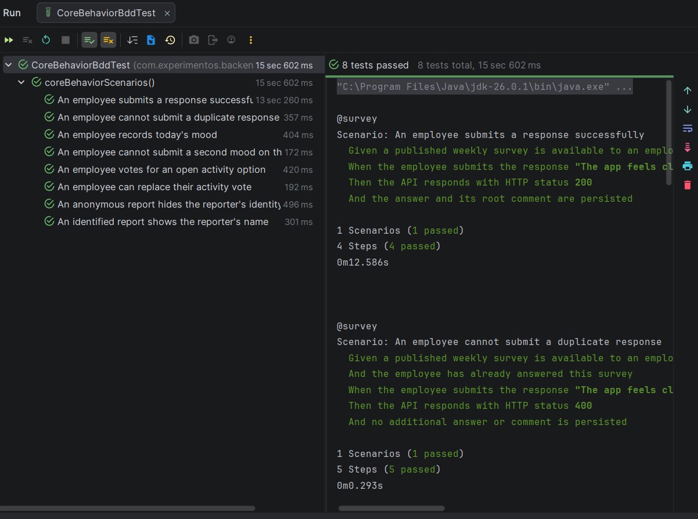

### 6.1.4. Core System Tests

#### Pruebas de sistema web con Playwright

Se ejecutaron seis recorridos de usuario en Chromium. Cada caso parte de una historia de usuario y verifica el flujo en la interfaz, la respuesta visible y la solicitud enviada a la API. La suite está en `Frontend-Web-SafeSpace/tests/e2e/core-system.spec.ts` y se ejecutó con `npm run test:e2e -- --workers=1`.

##### US06 — Registro diario de estado de ánimo

**User story.** Como usuario autenticado, quiero registrar mi estado de ánimo del día, para dejar constancia de mi percepción diaria de bienestar.

**Prueba ejecutada.** El empleado inicia sesión, selecciona “Muy bien” y la interfaz confirma el registro. La prueba verifica la solicitud `POST /api/v1/mood/today` con `mood: VERY_GOOD`.

**Resultado:** aprobada (1/1).

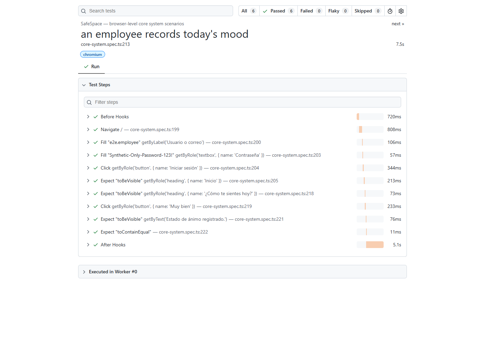

##### US07 — Resumen administrativo de estado de ánimo

**User story.** Como miembro de RR. HH. o administrador del sistema, quiero consultar la distribución diaria de estados de ánimo y la tasa de respuesta, para conocer el pulso general de los empleados.

**Prueba ejecutada.** Un usuario de RR. HH. inicia sesión y consulta un resumen con 8 respuestas, distribución de estados, 12 empleados activos y una tasa de respuesta del 67%; también se verifica la solicitud `GET /api/v1/mood/summary`. La interfaz muestra un 63% de respuestas positivas.

**Resultado:** aprobada (1/1).

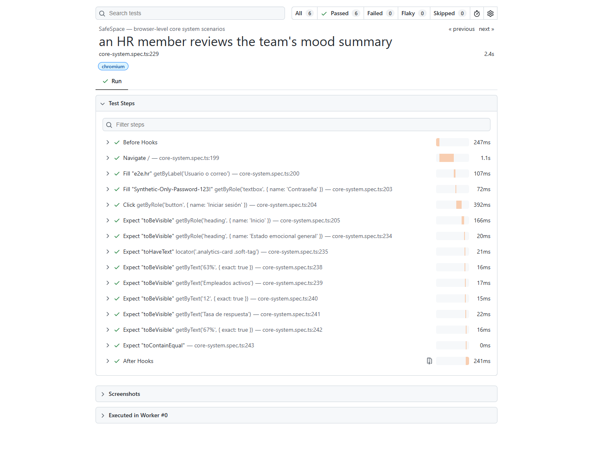

##### US09 — Respuesta única a una encuesta

**User story.** Como usuario autenticado, quiero responder una encuesta publicada una sola vez, para aportar mi opinión sin duplicar mi participación.

**Prueba ejecutada.** El empleado responde una encuesta semanal publicada y la interfaz confirma “Respuesta registrada”. La prueba verifica `POST /api/v1/surveys/11/answers` y el texto enviado. Este escenario cubre el envío exitoso de una respuesta; no ejecuta un segundo envío para comprobar el rechazo de duplicados.

**Resultado:** aprobada (1/1).

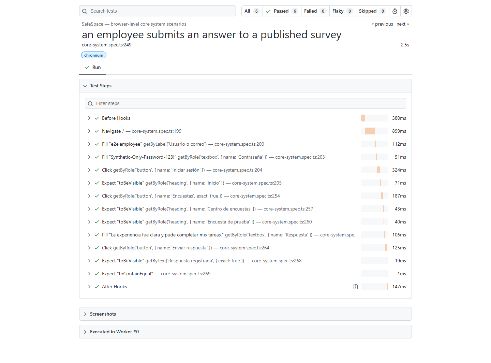

##### US10 — Gestión operativa de encuestas

**User story.** Como miembro de RR. HH. o administrador del sistema, quiero crear, consultar, publicar y cerrar encuestas, para administrar las preguntas de bienestar.

**Prueba ejecutada.** Un usuario de RR. HH. crea una encuesta semanal, verifica que aparezca como borrador y la publica; luego confirma el estado publicado. La prueba valida el payload enviado a `POST /api/v1/surveys` y la llamada a `POST /api/v1/surveys/44/publish`. Este caso cubre creación y publicación, pero no automatiza la consulta completa ni el cierre de una encuesta.

**Resultado:** aprobada (1/1).

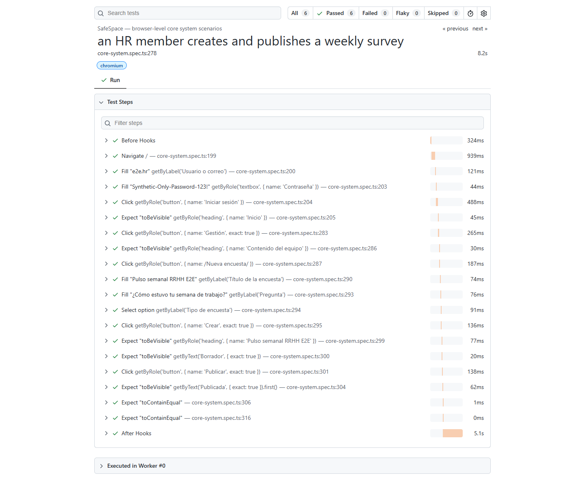

##### US15 — Votación y cambio de voto

**User story.** Como usuario autenticado, quiero votar por una opción de una actividad abierta y poder cambiar mi voto, para participar en la decisión semanal.

**Prueba ejecutada.** El empleado elige una opción de una actividad abierta y la interfaz confirma el voto. La prueba verifica `POST /api/v1/activities/22/votes` con `option_id: 31`. Este escenario cubre el registro del voto inicial; no automatiza el cambio posterior de opción.

**Resultado:** aprobada (1/1).

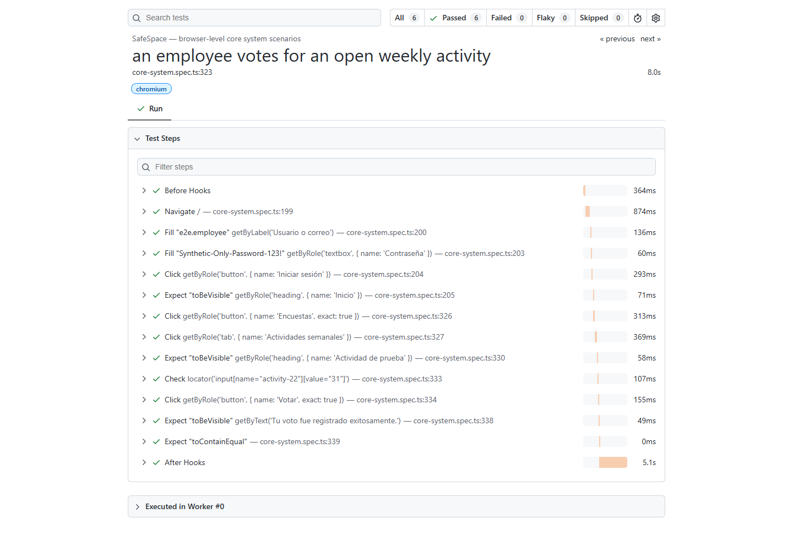

##### US17 — Creación de reportes anónimos o identificados

**User story.** Como usuario autenticado, quiero enviar un reporte con categoría, título, descripción, prioridad y opción de anonimato, para comunicar una situación que requiere atención.

**Prueba ejecutada.** El empleado completa y envía un reporte anónimo. La interfaz confirma el envío; la prueba verifica que la opción anónima esté activa y que `POST /api/v1/reports` lleve `anonymous: true`. Este escenario cubre la variante anónima y no pretende validar la consulta de reportes propios (US18).

**Resultado:** aprobada (1/1).

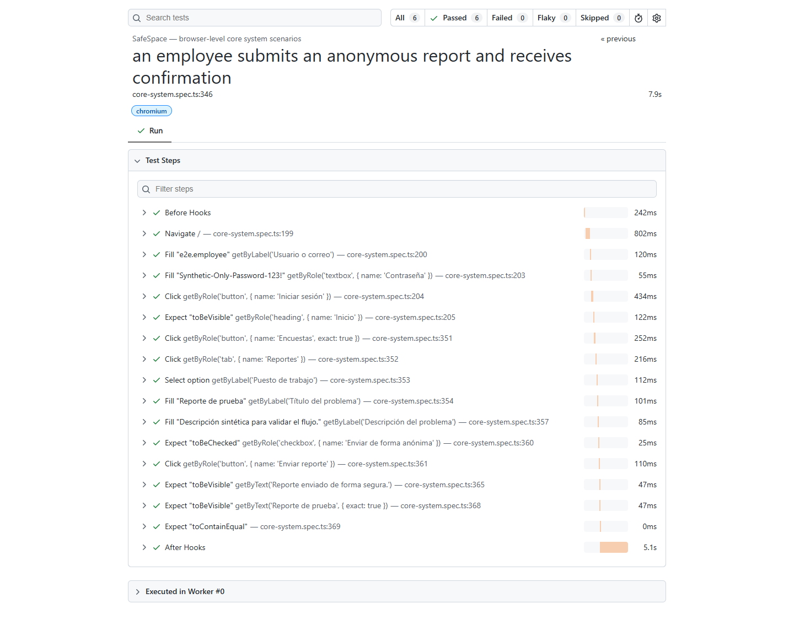

**Resultado de la ejecución.** Playwright reportó **6 pruebas aprobadas, 0 fallidas, 0 inestables y 0 omitidas**.

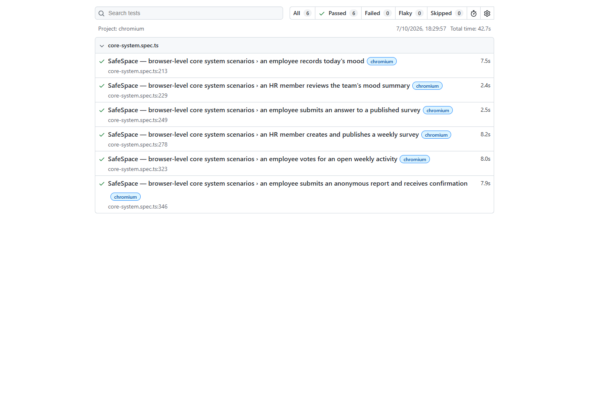

**Alcance de las pruebas.** Durante estos recorridos, Playwright intercepta las solicitudes `/api/v1/` y utiliza respuestas definidas para cada escenario. Así se validan desde el navegador la navegación, los mensajes que ve el usuario y el método, endpoint y contenido de cada solicitud. La integración y las reglas de negocio del backend se comprueban por separado en las secciones 6.1.2 y 6.1.3. Estos seis casos cubren la aplicación web; las capturas móviles del Capítulo V documentan la interfaz móvil. La suite y su configuración están en el repositorio local del frontend; todavía no se han publicado en el remoto.

#### Evidencia visual complementaria del producto web, administrativo y móvil

La siguiente matriz relaciona escenarios de aceptación con capturas de las pantallas del producto. Las imágenes documentan el estado visual de cada pantalla; la ejecución automatizada queda registrada en los reportes de Playwright anteriores.

| Caso | Escenario de aceptación | Evidencia visual |
| :--- | :--- | :--- |
| SYS-01 | Crear cuenta e iniciar sesión | `../assets/images/cap5/web/frontend-web-register.png`; `frontend-web-login.png` |
| SYS-02 | Registrar el ánimo y consultar encuestas | `../assets/images/cap5/web/frontend-web-mood.png`; `frontend-web-surveys.png` |
| SYS-03 | Votar por una actividad semanal | `../assets/images/cap5/web/frontend-web-activities.png`; `../assets/images/cap5/mobile/mobile-activity-vote.png` |
| SYS-04 | Enviar y consultar un reporte desde la experiencia web | `../assets/images/cap5/web/frontend-web-report-form.png`; `frontend-web-my-reports.png` |
| SYS-05 | Revisar encuestas, comentarios, actividades y reportes en RR. HH. | `../assets/images/cap5/web/frontend-hr-management-surveys.png`; `frontend-hr-management-comments.png`; `frontend-hr-management-activities.png`; `frontend-hr-reports.png` |
| SYS-06 | Iniciar una conversación de orientación con IA | `../assets/images/cap5/web/frontend-web-ai-chat.png`; `../assets/images/cap5/mobile/mobile-ai-chat.png` |
| SYS-07 | Consultar perfil y preferencias de cuenta | `../assets/images/cap5/web/frontend-web-settings.png`; `../assets/images/cap5/mobile/mobile-profile.png`; `mobile-settings-es.png` |
| SYS-08 | Consultar la documentación OpenAPI de SafeSpace | `../assets/images/cap5/api/swagger-ui.png`; `../assets/images/cap5/api/auth-login.png` |

Los escenarios enlazan las historias del Capítulo III con las funciones mostradas en el Capítulo V. La suite automatizada aporta cobertura de reglas de negocio, mientras que las capturas sirven como evidencia complementaria de las interfaces.

\newpage
