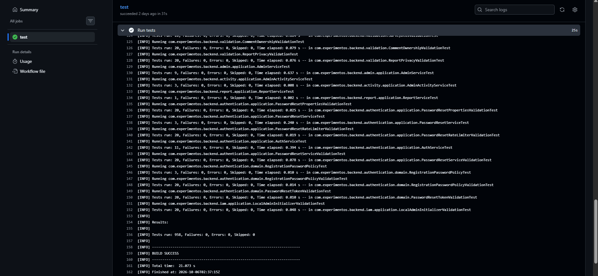
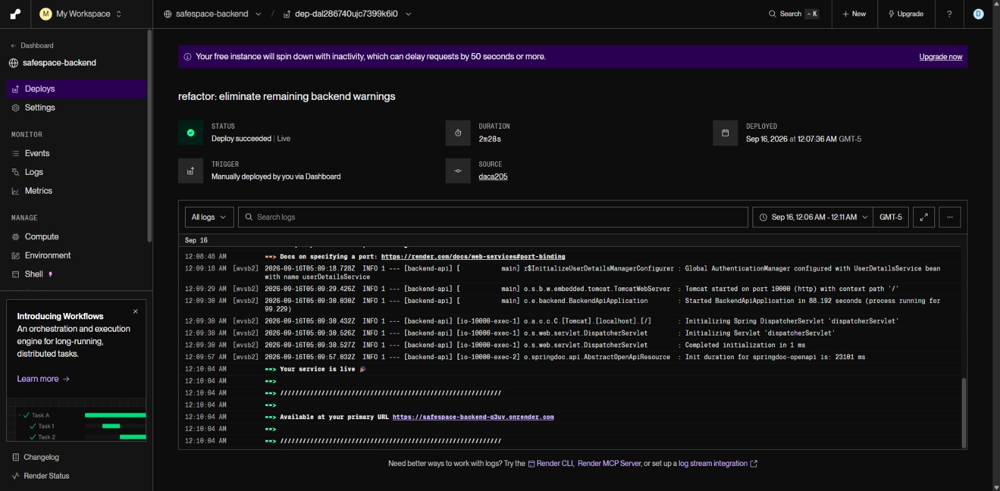
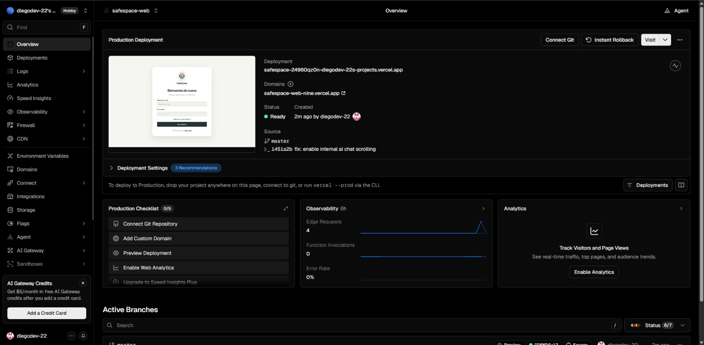
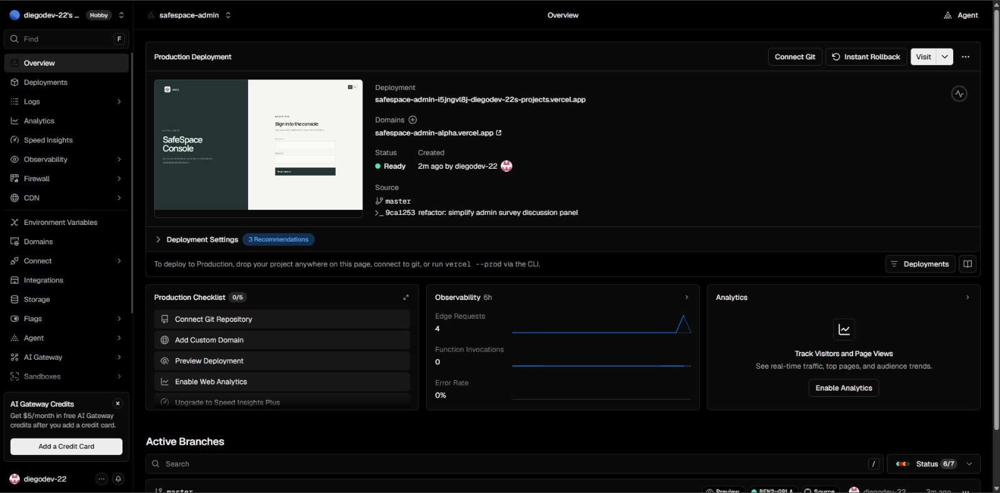

# Capítulo VII: DevOps Practices

Este capítulo documenta las prácticas de integración y despliegue observadas para SafeSpace a partir de sus repositorios y de las evidencias de los proveedores. La configuración de ejecución utiliza Firebase Firestore como persistencia del backend; no utiliza MySQL ni Flyway.

Los logotipos de marca, obtenidos de [Simple Icons](https://github.com/simple-icons/simple-icons), aparecen como imágenes individuales junto a las herramientas correspondientes. Las capturas de ejecuciones y servicios se incluyen en sus apartados como evidencia del proyecto.

## 7.1. Continuous Integration

### 7.1.1. Tools and Practices

El repositorio [Backend-SafeSpace](https://github.com/TheSuccesfulOnes/Backend-SafeSpace) contiene el workflow `Backend CI` en `.github/workflows/ci.yml`. GitHub Actions lo ejecuta ante `push` o `pull_request` dirigidos a `master`, prepara Java 21 con Temurin y caché Maven, y ejecuta `mvn -B test`. La definición del workflow está registrada en el commit [dd30a88](https://github.com/TheSuccesfulOnes/Backend-SafeSpace/commit/dd30a88283eec9470f711c95dd90666f2e734b20).

| Herramienta | Función en el flujo |
| :--- | :--- |
|  GitHub Actions | Orquesta las verificaciones del repositorio del backend. |
| `actions/checkout@v4` | Descarga el commit asociado al evento. |
| `actions/setup-java@v4` | Configura Temurin JDK 21 y la caché de dependencias Maven. |
|  Maven | Ejecuta el conjunto de pruebas del backend con `mvn -B test`. |
| JUnit 5, Mockito y Cucumber | Ejecutan pruebas unitarias, integraciones locales y escenarios BDD definidos en el backend. |

La captura corresponde a una ejecución anterior. El Capítulo VI explica las diferencias entre ese resultado, `TESTING.md` y el inventario JSON.

No se encontró un workflow de GitHub Actions en el repositorio conectado del frontend web. Los comandos de pruebas, análisis estático y construcción del frontend están definidos localmente en package.json, pero no hay evidencia de que se ejecuten automáticamente en cada push o pull request.

### 7.1.2. Build & Test Suite Pipeline Components

| Etapa | Evento o acción configurada | Resultado esperado o evidencia |
| :--- | :--- | :--- |
| Activación | Push o pull request a master en el repositorio del backend. | Inicia el workflow Backend CI. |
| Checkout | `actions/checkout@v4`. | Obtiene el commit que será verificado. |
| Preparación | Ubuntu, Temurin JDK 21 y caché Maven. | Entorno de ejecución configurado. |
| Pruebas | `mvn -B test`. | GitHub Actions informa el resultado del job para ese commit. |

El workflow actual solo verifica; no incluye una etapa de despliegue. La captura de una ejecución observada se presenta en 7.1.1.

## 7.2. Continuous Delivery

La entrega continua mantiene cada cambio aprobado en condiciones de ser publicado. La decisión final de promoverlo a producción puede seguir siendo manual. En SafeSpace se observan artefactos publicados y una verificación automatizada del backend, pero la evidencia disponible no acredita una canalización completa que prepare y autorice cada versión de forma uniforme. Por ello, el estado descrito en esta sección es parcial.

### 7.2.1. Tools and Practices

| Componente | Plataforma | Configuración observada |
| :--- | :--- | :--- |
| API REST |  Docker y  Render | El backend se empaqueta como imagen y está publicado en Render. La captura indica que el despliegue observado se inició manualmente. |
| Aplicación web |  Vercel | Hay una versión de producción en estado Ready. La captura muestra Connect Git, por lo que no acredita conexión automática al repositorio. |
| Consola administrativa | Vercel | Despliegue independiente en estado Ready; la evidencia tampoco demuestra conexión Git automática. |
| Landing Page | Vercel | Sitio publicado en la URL documentada en el Capítulo V. No se encontró evidencia suficiente para afirmar el mecanismo de disparo de cada publicación. |
| Aplicación Android |  Gradle y distribución compartida | Se genera y distribuye un APK; no se identificó una canalización móvil automatizada. |
| Persistencia |  Firebase Firestore | Servicio administrado externo utilizado por el backend. La aplicación se configura con el ID del proyecto y credenciales Firebase; no requiere migraciones SQL/Flyway. |

#### Capturas de las herramientas y plataformas

Los artefactos publicados permiten revisar una versión del producto, pero las capturas disponibles no prueban una promoción automatizada desde cada cambio de código hasta producción. En particular, Render identifica una publicación manual y las capturas de Vercel solicitan conectar Git.

### 7.2.2. Stages Deployment Pipeline Components

| Etapa | Estado comprobado | Evidencia/alcance |
| :--- | :--- | :--- |
| Control de versiones | Repositorios separados en GitHub. | Repositorios y commits de referencia en 5.1.2; configuración de despliegue en 5.1.4. |
| Verificación del backend | Automatizada para push y pull request a master. | Workflow Backend CI; ejecuta pruebas, no despliega. |
| Verificación del frontend | Hay scripts locales de test, typecheck, lint y build; no se halló workflow de CI. | `package.json` y `TESTING.md` del repositorio conectado. |
| Construcción y publicación del backend | Imagen Docker y servicio Render; la captura indica activación manual. El `Dockerfile` compila el JAR con pruebas omitidas, que se ejecutan por separado en CI. | Captura de Render, `Dockerfile` y `render.yaml`. |
| Publicación de interfaces web | Sitios en estado Ready; vínculo automático al repositorio no demostrado por las capturas. | Capturas de Vercel para frontend y consola administrativa. |
| Configuración de datos | Firestore se conecta en tiempo de ejecución mediante configuración Firebase del backend. | No se despliega un servidor SQL ni se ejecutan migraciones relacionales. |
| Comprobación posterior al despliegue | No se encontró evidencia de una prueba smoke automática posterior a cada publicación. | Pendiente documentar si existe un procedimiento manual o añadir evidencia de verificación. |

Las capturas que sustentan estos estados se muestran junto a las herramientas en 7.2.1.

## 7.3. Continuous Deployment

El despliegue continuo publica automáticamente en producción cada cambio que supera las verificaciones configuradas, sin una aprobación manual para cada publicación. En el estado revisado de SafeSpace no hay evidencia de ese comportamiento de extremo a extremo: el backend tiene CI, Render muestra una publicación iniciada manualmente y las capturas de Vercel no demuestran una conexión de despliegue automático al repositorio. Por tanto, esta práctica se presenta como objetivo de evolución y no como una capacidad ya implementada.

### 7.3.1. Tools and Practices

| Herramienta o práctica | Estado observado | Uso para un flujo de despliegue continuo |
| :--- | :--- | :--- |
| GitHub Actions y Maven | Configurados para el backend; ejecutan `mvn -B test` en push o pull request a `master`. | Reutilizar el resultado exitoso como condición obligatoria antes de publicar una versión. |
| Scripts de `package.json` | Disponibles en el frontend, sin workflow de GitHub Actions identificado. | Incorporar instalación reproducible, pruebas, análisis estático y compilación al CI del frontend. |
| Docker y Render | El backend está empaquetado como imagen y la evidencia de Render indica un despliegue manual. | Automatizar la publicación de la imagen solo después de pasar CI y asociarla al commit desplegado. |
| Vercel | Las aplicaciones web aparecen en estado Ready; las capturas muestran Connect Git. | Conectar los repositorios y establecer ramas y condiciones de publicación; verificar la integración antes de describirla como automática. |
| Firebase Firestore | Base de datos administrada utilizada por el backend. | Mantener la configuración y credenciales como variables protegidas del entorno de ejecución; no incluir secretos en el artefacto ni en el repositorio. |
| Verificación y recuperación | No se encontró evidencia de smoke tests automáticos ni de rollback automático tras una publicación. | Añadir comprobaciones de salud y una ruta documentada de reversión antes de considerar completo el flujo. |

Para habilitar esta práctica, el cambio debe pasar revisión y verificaciones antes de activar la publicación. La canalización también debe registrar qué commit produjo la versión y comprobar que el servicio responde después del despliegue. Estas son recomendaciones para completar el proceso; la configuración observada aún no acredita que se ejecuten automáticamente.

### 7.3.2. Production Deployment Pipeline Components

| Componente o etapa | Estado comprobado en SafeSpace | Condición para un flujo automático a producción |
| :--- | :--- | :--- |
| Cambio integrado | El código se mantiene en repositorios GitHub separados para backend y aplicaciones web. | Publicar únicamente cambios integrados en la rama de producción, con revisión registrada. |
| Puerta de calidad del backend | GitHub Actions ejecuta las pruebas del backend en push o pull request a `master`; no publica el servicio. | Bloquear la publicación si el job falla y conservar el vínculo entre resultado, commit y release. |
| Puerta de calidad del frontend | Hay scripts locales, pero no se identificó un workflow conectado que los ejecute automáticamente. | Ejecutar pruebas, typecheck, lint y build en CI antes de permitir la publicación. |
| Construcción del artefacto | Se utiliza una imagen Docker para el backend. | Construir y etiquetar una imagen inmutable con el identificador del commit validado. |
| Activación de la publicación | La evidencia de Render indica activación manual; las capturas de Vercel no acreditan despliegue automático desde Git. | Configurar el disparador de producción después de que todas las verificaciones requeridas terminen correctamente. |
| Configuración de producción | El backend usa Firebase Firestore como persistencia. | Inyectar la configuración y credenciales desde el entorno seguro del proveedor y comprobar el acceso a Firestore. |
| Comprobación posterior | No se encontró evidencia de smoke test automático ni de monitoreo de release ligado al pipeline. | Ejecutar una comprobación de salud y una prueba funcional breve después de publicar; detener o revertir si falla. |
| Reversión | No se encontró un procedimiento de rollback automatizado documentado en las evidencias revisadas. | Mantener disponible una versión estable anterior y definir cómo restaurarla ante una verificación fallida. |
| Aplicación Android | El APK se genera y distribuye por un proceso separado; no se identificó una publicación móvil automatizada. | Mantener documentado el proceso móvil y automatizarlo solo cuando el canal de distribución y sus aprobaciones estén definidos. |

En consecuencia, SafeSpace cuenta con CI automatizada para el backend y servicios publicados, mientras que la publicación de producción todavía depende de acciones manuales o de integraciones no acreditadas por las capturas revisadas. Las etapas de bloqueo por calidad, publicación automática, smoke test y reversión descritas arriba son el diseño propuesto para completar el despliegue continuo.

\newpage
