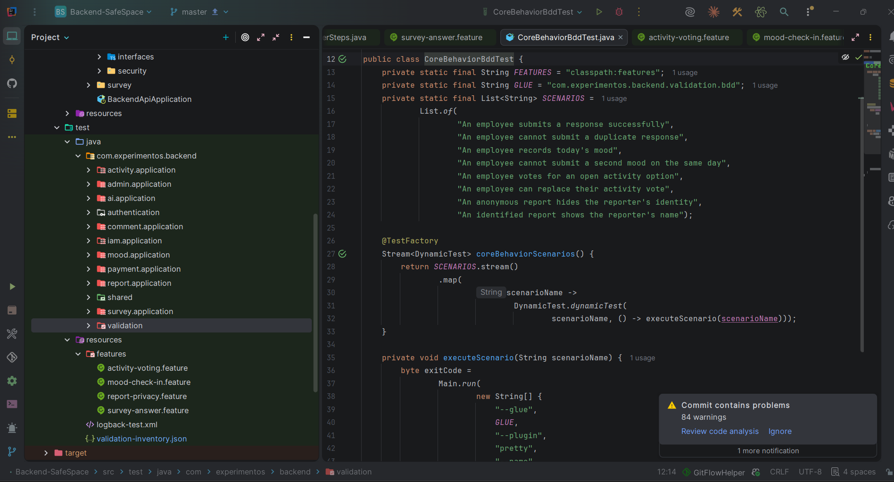
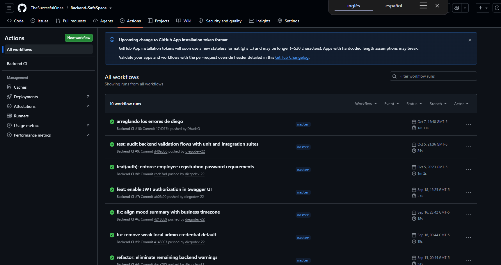
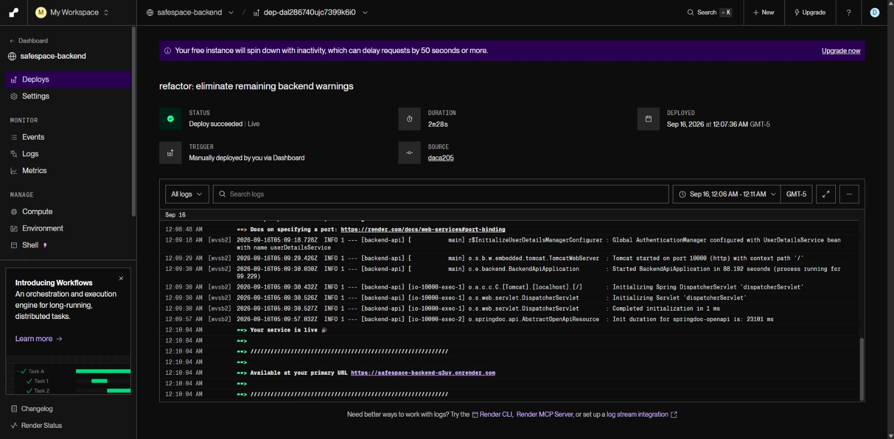
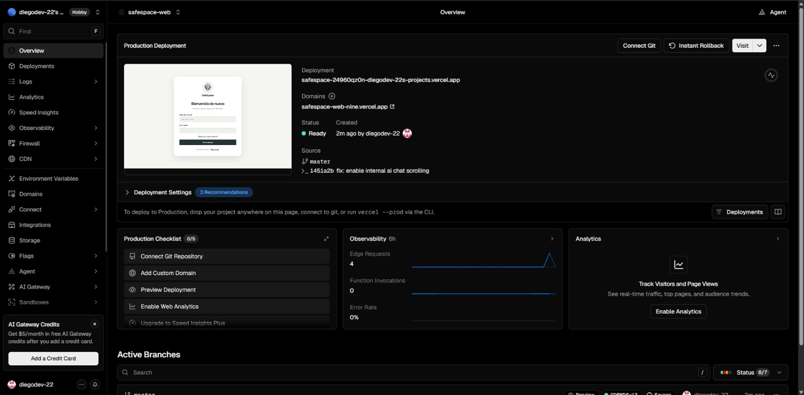
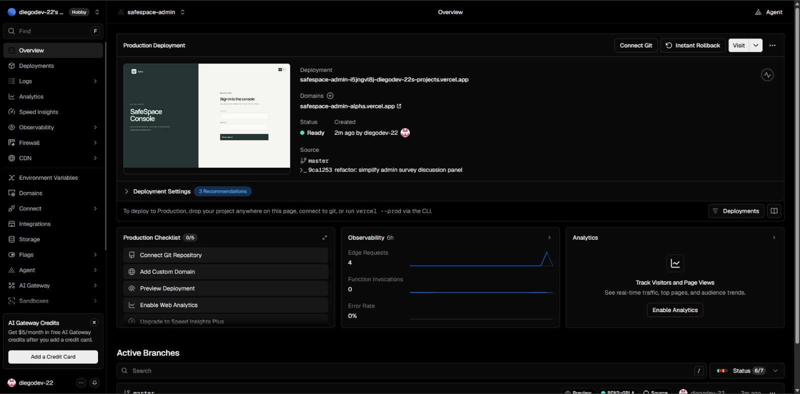
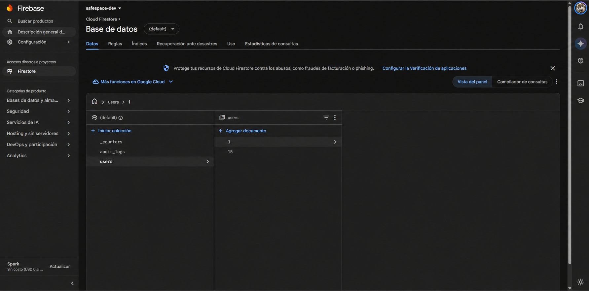

# Capítulo VII: DevOps Practices

Este capítulo presenta las herramientas y etapas que participan en la integración, las pruebas y la publicación de SafeSpace. El backend usa Firebase Firestore como base de datos en tiempo de ejecución. Los símbolos de marca se presentan en imágenes individuales y provienen de [Simple Icons](https://github.com/simple-icons/simple-icons), un proyecto publicado bajo licencia CC0-1.0.

## 7.1. Continuous Integration

### 7.1.1. Tools and Practices

El repositorio [Backend-SafeSpace](https://github.com/TheSuccesfulOnes/Backend-SafeSpace) contiene el workflow `Backend CI`, definido en `.github/workflows/ci.yml`. GitHub Actions lo ejecuta cuando hay un `push` o un `pull_request` hacia `master`; el job prepara Temurin JDK 21 y Maven, y ejecuta `mvn -B test`.

El backend combina pruebas unitarias con escenarios BDD. En el frontend web, `package.json` incluye scripts de Vitest y Playwright, además de comandos para revisar tipos, lint y compilar. Esos comandos están disponibles para ejecución local; no se encontró un workflow de CI en el repositorio del frontend.

| Herramienta | Tipo | Descripción | Propósito |
| :--- | :--- | :--- | :--- |
| GitHub Actions | Plataforma de integración continua | Ejecuta `Backend CI` ante `push` o `pull_request` dirigidos a `master`. | Asociar las verificaciones del backend con cada cambio recibido. |
| Maven | Construcción y ejecución de pruebas | El workflow ejecuta `mvn -B test` con Java 21 y Temurin. | Compilar el backend y ejecutar sus pruebas automatizadas. |
| JUnit 5 | Framework de pruebas | Ejecuta las pruebas Java y los escenarios BDD expuestos como pruebas dinámicas. | Verificar el comportamiento de unidades y servicios del backend. |
| Mockito | Framework de dobles de prueba | Permite sustituir dependencias durante las pruebas Java. | Aislar el componente que se está verificando. |
| Cucumber | Framework BDD | Ejecuta escenarios descritos en Gherkin con Cucumber JVM y JUnit 5. | Comprobar comportamientos mediante ejemplos legibles. |
| Vitest | Framework de pruebas del frontend | Está disponible mediante el script `test:validation` de `package.json`. | Ejecutar pruebas de validación de la aplicación web. |
| Playwright | Framework de pruebas End-to-End | Está disponible mediante el script `test:e2e` de `package.json`. | Verificar recorridos de usuario en el navegador. |

El backend mantiene cuatro archivos `.feature`. La captura de IntelliJ IDEA permite ver `CoreBehaviorBddTest` y esos escenarios; muestra la organización del código de prueba, no el resultado de una ejecución.

### 7.1.2. Build & Test Suite Pipeline Components

**Integración continua del backend:** el workflow descarga la revisión con `actions/checkout@v4`, prepara Ubuntu y Temurin JDK 21 con `actions/setup-java@v4`, y habilita la caché de Maven. Después ejecuta `mvn -B test`; GitHub Actions publica el resultado del job asociado al commit.

**Pruebas del frontend:** los scripts locales permiten ejecutar Vitest, Playwright, typecheck, lint y build. Al no encontrarse un workflow en el repositorio web, estas comprobaciones no se ejecutan automáticamente por cada `push` o `pull_request`.

**Alcance del pipeline:** el workflow `Backend CI` termina al finalizar las pruebas. No construye ni publica una versión en Render, y tampoco coordina el despliegue de Vercel.

{.inline width=100%}

**IntelliJ IDEA.** La captura muestra la clase `CoreBehaviorBddTest` y los archivos `.feature` de los escenarios BDD. IntelliJ es el entorno donde se organizan y editan estas pruebas; la imagen documenta su estructura, no el resultado de una ejecución.

{.inline width=100%}

**GitHub Actions.** El workflow `Backend CI` automatiza la validación del backend para cambios dirigidos a `master`: prepara Java 21 y Maven y ejecuta `mvn -B test`. En la captura se ven varias ejecuciones recientes con estado exitoso; el workflow no publica por sí mismo el backend.

## 7.2. Continuous Delivery

La entrega continua busca mantener una versión probada en condiciones de ser publicada. En SafeSpace, la validación automática está configurada para el backend; la publicación de la API y de las interfaces se gestiona en sus respectivos proveedores.

### 7.2.1. Tools and Practices

**Tools:**

**GitHub Actions y Maven:** el workflow del backend ejecuta las pruebas en cambios hacia `master`. La definición de CI no incluye la publicación del servicio.

**Docker:** el `Dockerfile` construye un JAR con Maven y prepara una imagen de ejecución con Java 21. Las pruebas se ejecutan aparte en GitHub Actions; la construcción de la imagen usa `-DskipTests`.

**Render:** aloja la API REST. `render.yaml` define el runtime Docker, la rama `master`, el perfil `prod`, el puerto 10000 y la ruta de health check `/v3/api-docs`. La captura de despliegue disponible indica que esa publicación se inició manualmente desde el dashboard.

**Vercel:** aloja la aplicación web y la consola administrativa. Las capturas muestran versiones en estado Ready y el control Connect Git; se usan como evidencia del estado visible, no como prueba de una conexión automática con los repositorios.

**Firebase Firestore:** es la base de datos administrada que consulta el backend en ejecución. El servicio se configura con los parámetros de Firebase y las credenciales del entorno; no utiliza migraciones de MySQL o Flyway.

**Gradle:** construye el APK de Android, que se distribuye por separado de la API y de las aplicaciones web. No se identificó una publicación móvil automatizada.

**Practices (Prácticas)**

**Validación antes de publicar:** las pruebas del backend se ejecutan en CI. Para el frontend existen scripts de prueba y compilación, aunque no se encontró una ejecución automática mediante workflow.

**Promoción a producción:** la captura de Render registra una publicación manual. En Vercel, las capturas muestran versiones listas, pero no permiten confirmar el origen de cada publicación.

**Configuración por entorno:** Firestore y los servicios se conectan mediante parámetros y credenciales configurados en el proveedor, separados del código fuente.

**Verificación de la versión:** el estado Ready de Vercel y el estado de servicio de Render permiten revisar la publicación en sus dashboards. Esos estados no sustituyen una prueba funcional de los recorridos de la aplicación.

{.inline width=100%}

**Render.** Render aloja la API REST del proyecto. La captura registra un despliegue completado y el servicio en estado Live; también indica que esa activación se inició manualmente desde el dashboard y muestra los logs de arranque.

{.inline width=100%}

**Vercel — aplicación web.** Vercel aloja la interfaz web de SafeSpace. La captura muestra el proyecto `safespace-web`, su dominio y una publicación en estado Ready al momento de la captura. El control Connect Git visible no confirma por sí solo una conexión automática al repositorio.

{.inline width=100%}

**Vercel — consola administrativa.** La consola se publica como un proyecto separado. La captura muestra su dominio y el estado Ready; sirve como evidencia de disponibilidad en el proveedor, pero no muestra que el despliegue se haya activado automáticamente por un cambio en Git.

### 7.2.2. Stages Deployment Pipeline Components

**Integración continua (CI):** al recibir cambios en el backend, GitHub Actions prepara el entorno Java y ejecuta Maven. El frontend cuenta con scripts locales de validación, pero no con un workflow automático identificado.

**Validación en staging:** no se identificó un entorno de staging ni una etapa de promoción entre ambientes en la configuración revisada. Las versiones Ready de Vercel y el servicio de Render corresponden a publicaciones de los proveedores.

**Construcción y despliegue del backend:** el `Dockerfile` empaqueta la aplicación para ejecución con Java 21. Render aloja el servicio y declara la configuración de producción en `render.yaml`; la captura disponible registra una activación manual.

**Publicación de las interfaces web:** Vercel muestra versiones listas para la aplicación web y la consola administrativa. Las imágenes disponibles no acreditan que cada cambio se integre y publique automáticamente desde Git.

**Monitoreo y feedback:** Render tiene configurada la ruta `/v3/api-docs` como health check del servicio. No se encontró una prueba smoke automatizada que valide después de publicar los flujos funcionales de SafeSpace.

**Aprobación y reversión:** la publicación de Render observada fue iniciada manualmente. En las capturas de Vercel aparece una opción de reversión instantánea; no se muestra una reversión ejecutada ni una aprobación formal en el pipeline.

## 7.3. Continuous Deployment

El despliegue continuo lleva a producción los cambios que superan las verificaciones configuradas sin una activación manual para cada versión. La configuración revisada de SafeSpace todavía no muestra ese recorrido completo: CI verifica el backend, Render registra un despliegue manual y las capturas de Vercel no acreditan la conexión automática de los repositorios.

### 7.3.1. Tools and Practices

En este apartado se describen las herramientas que intervienen en la publicación y las prácticas que permitirían automatizarla de forma controlada.

**Tools (Herramientas)**

- **GitHub Actions y Maven:** validan los cambios del backend con `mvn -B test`. Para utilizarlos como condición de publicación, el despliegue tendría que depender del resultado exitoso del job.
- **Docker y Render:** Docker construye la imagen de la API y Render la aloja. La publicación observada se inició manualmente; no se presenta como despliegue continuo.
- **Vercel:** mantiene versiones publicadas de la aplicación web y de la consola administrativa. La conexión de Git debe verificarse antes de afirmar que publica automáticamente al recibir cambios.
- **Firebase Firestore:** es el servicio de datos usado por el backend. Las credenciales deben permanecer configuradas en el entorno protegido del proveedor.
- **Vitest y Playwright:** los scripts del frontend permiten ejecutar pruebas de validación y End-to-End. Para que sean una puerta de calidad, primero deben incorporarse a un workflow de CI.
- **Gradle:** construye el APK de Android; su publicación permanece separada del flujo de las aplicaciones web y el backend.

**Practices (Prácticas)**

**Despliegue basado en cambios validados:** usar el commit integrado como referencia del artefacto y habilitar la publicación únicamente después de las comprobaciones correspondientes.

**Automatización por componente:** incorporar las pruebas, el análisis y la compilación del frontend al CI; después, vincular el resultado aprobado con el despliegue de Vercel.

**Comprobación posterior:** verificar la disponibilidad del servicio y una operación esencial tras cada publicación. El health check configurado en Render comprueba la ruta declarada, pero no reemplaza estas verificaciones funcionales.

**Recuperación:** conservar una versión anterior identificable y documentar el procedimiento de reversión. La presencia de un control en el dashboard no demuestra que una reversión automática esté configurada.

Estas prácticas describen los pasos que faltan para automatizar la publicación; no se atribuyen al pipeline actual.

### 7.3.2. Production Deployment Pipeline Components

Este apartado detalla los componentes de datos, backend, frontend y Android. En cada uno se describe el flujo que se observa y la etapa que aún requiere automatización.

**Componentes del pipeline de datos (Firebase Firestore)**

Firestore es un servicio administrado y se consulta en tiempo de ejecución desde el backend. La aplicación recibe la configuración y las credenciales desde el entorno de producción; no hay una etapa de migración SQL en el pipeline. La configuración de Render declara `/v3/api-docs` como health check de la API, pero esa ruta no acredita por sí sola que las operaciones sobre Firestore funcionen después de un despliegue.

{.inline width=100%}

**Cloud Firestore.** Firestore es la base de datos documental administrada que consulta el backend en ejecución. La captura muestra las colecciones `_counters`, `audit_logs` y `users`; el panel de detalle se ocultó para no publicar datos del administrador. La imagen acredita la consola y las colecciones visibles, no una prueba de lectura o escritura desde la aplicación.

{.inline width=85%}

**Firebase Firestore.** Firebase proporciona el servicio administrado de datos utilizado por SafeSpace. El backend obtiene la configuración desde el entorno y accede a Firestore durante la ejecución; no se emplean migraciones MySQL o Flyway.

**Componentes del pipeline del backend (GitHub Actions, Docker y Render)**

1. **Integración continua:** un `push` o `pull_request` hacia `master` inicia `Backend CI`, que ejecuta las pruebas Maven con Java 21.
2. **Construcción:** el `Dockerfile` empaqueta el JAR con `-DskipTests` y crea la imagen de ejecución basada en Java 21. Las pruebas se realizan en el job de CI.
3. **Configuración de producción:** `render.yaml` define el servicio Docker, la rama `master`, el perfil `prod`, el puerto y el health check `/v3/api-docs`.
4. **Despliegue:** Render aloja la API. La captura revisada identifica la activación manual de la publicación observada.
5. **Verificación:** el proveedor consulta la ruta de salud configurada. La canalización no muestra un smoke test funcional ni una reversión automática asociados al resultado.

{.inline width=85%}

**GitHub Actions.** Ejecuta el workflow `Backend CI` cuando hay cambios dirigidos a `master`. El flujo configura Java 21, prepara Maven y publica el resultado de las pruebas asociadas al commit; no incluye un paso de despliegue.

{.inline width=85%}

**Apache Maven.** Maven construye y ejecuta las pruebas del backend. En la integración continua se invoca con `mvn -B test` bajo Temurin JDK 21.

{.inline width=85%}

**Docker.** Docker empaqueta el backend para ejecutarlo como servicio. El `Dockerfile` construye el JAR y define una imagen de ejecución con Java 21; omite las pruebas en esa etapa porque estas corren previamente en GitHub Actions.

{.inline width=85%}

**Render.** Render aloja la API en producción. `render.yaml` define el runtime Docker, la rama `master`, el perfil `prod`, el puerto 10000 y la ruta `/v3/api-docs` para el health check; la publicación observada se inició manualmente.

**Componentes del pipeline del frontend (Vercel)**

1. **Validación local:** `package.json` incluye scripts para Vitest, Playwright, typecheck, lint y build.
2. **Integración continua:** no se identificó un workflow que ejecute esas verificaciones automáticamente en el repositorio web.
3. **Publicación:** Vercel muestra versiones Ready para la aplicación web y la consola administrativa. Las capturas muestran el control Connect Git, por lo que la conexión automática con los repositorios no queda confirmada.
4. **Siguiente etapa:** ejecutar las verificaciones en CI y conectar el despliegue a la revisión aprobada antes de describir este flujo como continuo.

{.inline width=85%}

**Vercel.** Vercel aloja la aplicación web y la consola administrativa. Las capturas muestran ambas publicaciones en estado Ready; la conexión automática con Git no queda confirmada por la evidencia disponible.

**Componentes del pipeline de Android (Gradle)**

Gradle construye el APK que se distribuye por separado. No se identificó un workflow que ejecute pruebas y publique el artefacto móvil automáticamente ni una integración de ese proceso con los despliegues de la API y las interfaces web.

{.inline width=85%}

**Gradle.** Gradle construye el APK de Android para su distribución. El proceso móvil permanece separado de los despliegues del backend y de las interfaces web; no se identificó una publicación móvil automatizada.

SafeSpace dispone de integración continua para el backend y de servicios publicados en Render y Vercel. Para completar el despliegue continuo, falta enlazar las comprobaciones de cada repositorio con la publicación, validar la versión en producción y definir su recuperación.

\newpage
